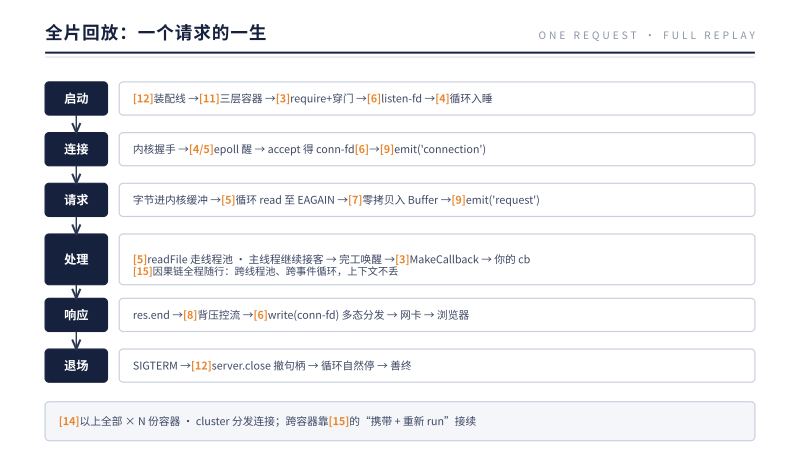

# 第 16 章 万物归一：一个请求的一生

> **本章问题**：不再有新问题。这一章兑现前言的承诺——把十五章的机制放进同一部电影，逐帧播放一个 HTTP 请求从网卡到回调再回到网卡的全过程。

## 16.1 开机（发生在一切之前）

```bash
node server.js
```

［**第 12 章**］ 进程初始化 → 三层容器落成（Isolate/Environment/Realm，**第 11 章**）→ 快照恢复引导堆，process 就位 → 加载 server.js：

```js
// server.js
const http = require('http');
const fs = require('fs');

http.createServer((req, res) => {
  fs.readFile('./greeting.txt', (err, data) => {
    res.end(data);
  });
}).listen(8080);
```

［**第 3 章**］ `require('http')`：CJS 加载器逐级解析，http.js → net.js，最终 `internalBinding('tcp_wrap')` 穿门，`new TCP()` 在 C++ 侧诞生 TCPWrap，与 JS 的 Server 对象通过内部字段互相锁定。

［**第 6 章**］ `listen(8080)`：一路下行到系统调用，内核创建监听 socket——一个 inode、一个 fd。［**第 5 章**］ 这个 listen-fd 被注册进 epoll。［**第 4 章**］ 事件循环启动，poll 阶段抵达 `epoll_wait`，阻塞——

进程睡着了。CPU 占用 0%。一个活跃句柄（listen-fd）让它不退出（**第 12 章**）。

## 16.2 第一帧：连接到达

某个浏览器发起 TCP 握手。内核协议栈完成三次握手，把新连接放进监听 socket 的队列，**listen-fd 变为可读**。

［**第 3、4 章**］ `epoll_wait` 醒来，返回就绪列表。libuv 顺着事件里存的指针直接找到 TCPWrap，调用其连接回调：`accept()` 取出新连接——内核分配 **conn-fd**（**第 6 章**：新的 struct file，指向这条连接的 socket inode）。conn-fd 被设为非阻塞、注册进 epoll。

［**第 3 章**］ MakeCallback 拉起 JS。［**第 9 章**］ `server.emit('connection', socket)`——一个同步 for 循环执行监听器，http 模块在其中给 socket 挂上数据解析器。

## 16.3 第二帧：请求数据到达

浏览器发出 `GET / HTTP/1.1 ...`。字节流经网卡进入内核，堆进 conn-fd 的接收缓冲区，**conn-fd 可读**。

［**第 5 章**］ epoll_wait 再次返回。libuv 循环 `read()` 直到 EAGAIN——［**第 7 章**］ 每次 read 的目的地是一个 Buffer：C++ 拿着 BackingStore 的裸指针递给系统调用，内核字节直接落进 JS 可见的内存，零拷贝。

［**第 9 章**］ `socket.emit('data', buf)` 同步分发。HTTP 解析器逐字节解析出方法、路径、头部，凑齐后：`server.emit('request', req, res)`——**你的回调终于登场**。此刻距离 epoll_wait 醒来，一微秒级的同步链，全程无一次线程切换。若入口处用 AsyncLocalStorage 的 run 包住这次请求，一条因果链就此生根——接下来的每一帧，它都在暗处随行（**第 15 章**）。

## 16.4 第三帧：文件 I/O 的岔路

你的回调调用 `fs.readFile('./greeting.txt', cb)`。

［**第 5 章**］ 磁盘文件不进 epoll——任务被投进线程池。**主线程立刻返回**，继续转事件循环，去服务其他连接（这就是"这段时间它还接了另外 300 个请求"的原因）。

工人线程 `open()` → `read()`（老老实实阻塞在磁盘上）→ 数据进 Buffer → `close()`。完工，向内部管道写一字节唤醒 epoll_wait。

［**第 4 章**］ 事件循环在下一圈把完成事件派回：［**第 3 章**］ MakeCallback → 你的 `cb(null, data)` 执行。［**第 15 章**］ 注意此刻的处境：这个回调是全新的一次栈，与请求回调隔着线程池与一整圈事件循环——但 `getStore()` 依然能拿到本请求的上下文。调用栈断了两次，因果链一次没断。

## 16.5 第四帧：响应离场

`res.end(data)`：http 模块拼好响应头，与 body 一起送进 socket 的 Writable 侧。

［**第 8 章**］ 若 data 很大或对端很慢：write 返回 false，上游暂停；内核发送缓冲满后 TCP 窗口收缩，压力传到浏览器侧——背压全链启动，服务器内存稳如泰山。

［**第 6 章**］ 最终每个 chunk 经 `write(conn-fd)` 交给内核——与写文件是同一个系统调用，f_op 多态分发到协议栈。字节上网卡，离场。

keep-alive 连接回到 epoll 继续待命；连接关闭时，close 回调在 **第 4 章** 的 close 阶段执行，conn-fd 归还，fd 表腾出一个号码牌（**第 6 章**：忘了这步的积累就是 EMFILE）。

## 16.6 全片回放



把同一张图再放映一遍，这次镜头不跟数据，**跟回调**——看它一生穿越的四道边界：

- **封装（第 3 章）**：你的 `(req, res) => {...}` 与 `(err, data) => {...}` 经 EventEmitter 字典与 persistent 引用封存，入场券交给了事件循环——穿越语言边界；
- **放行（第 4 章）**：七个瓣膜按类出闸——连接回调走 poll，定时器回调走 timers，收尾回调走 close，过闸动作都是 MakeCallback 三段式——穿越时间边界；
- **接力（第 5、11 章）**：若这一路经过 child_process 或 cluster，回调的数据来自另一个进程的管道——对端瓣膜放行，对端回调接棒——穿越进程边界；
- **验照（第 15 章）**：每次进场，CallbackScope 换入休眠的上下文帧——栈断了两次，"为谁工作"一次没丢——穿越因果边界。

明线是数据从网卡到网卡，暗线是回调从封装到执行——两条线在每一帧里严丝合缝。

十五章，一个请求，一张图。如果每一帧你都能自己讲出"为什么"，这本书的任务完成了。

## 16.7 回放验证：给电影配三个实测镜头

电影不是插画——它的每一帧都能被仪表拍到。把 16.1 那个 server.js 真跑起来（Node v24.12.0），给全片配三个实测镜头。

**镜头一：看 fd（第 6 章）。** 启动服务，用 lsof 撬开进程的 fd 表：

```
$ lsof -nP -p <pid> | grep LISTEN
node  51106  kel  12u  IPv6  ...  TCP *:8080 (LISTEN)
```

fd 号码牌 12，IPv6、TCP、LISTEN——这就是开机帧里那个 listen-fd，现在亲眼看到了它的编号。同一张 fd 表里还躺着 KQUEUE（macOS 上的 epoll，第 5 章）和一对 PIPE（线程池的唤醒管道，第 5 章）。**一个进程的全部家当，摊开就是第 6 章那张表。**

**镜头二：看 GC 的静默（第 2 章）。** 用 `--trace-gc` 重启，发一个请求：

```
$ node --trace-gc server.js &
$ curl http://127.0.0.1:8080/
hello from greeting.txt
（GC 输出：0 条事件）
```

一个请求的完整一生穿过，GC 日志 0 条——新生的垃圾还没攒够一次值得打扫的量。第 2 章说 GC 暂停直接计入延迟；这个镜头补上了另一半：在健康的服务里，绝大多数请求是静默的，GC 是被摊薄到许多请求上的事件，而不是每一帧的固定开销。

**镜头三：看血压（第 4、13 章）。** 给服务装上 `monitorEventLoopDelay`，每秒打印一次循环延迟；再加一个空转 200ms 的 /busy 路由，放它过一次：

```
[bp] p50 = 1.15 ms, p99 = 1.20 ms, max = 1.29 ms     ← 平时
[bp] p50 = 1.14 ms, p99 = 1.18 ms, max = 203.03 ms   ← 一次 /busy 经过
[bp] p50 = 1.14 ms, p99 = 1.19 ms, max = 1.28 ms     ← 恢复
```

一次 200ms 的空转，在 max 上顶出 203ms 的水位，下一秒又完全退回去。这正是第 13 章那台血压计：**它不评判平均，它记录瞬间**。第 2 章那个"循环被占用"的实验，如今成了可常态监测的生命体征。

三个镜头，三章的机制：fd（第 6 章）、GC（第 2 章）、循环（第 4 章）。电影不是思想实验——胶片就在你自己的终端里。

## 16.8 生产案例：把因果链当排障清单用

最后一个故事，把全书的因果链当一次排障清单。

某天夜里告警：文件下载偶发失败，偶尔整个进程被 OOM 杀死。症状指向四面八方。值班工程师刚读完这本书，没有急着重启——他沿着全书的因果链，一环一环地核对。

**第一环，fd（第 6 章）。** lsof 撬开 fd 表：数量远没到上限，没有 EMFILE——排除。但他注意到一批久久不关闭的连接，先记下。

**第二环，Stream 与背压（第 8 章）。** 下载路由被锁定。代码摊开：`readFile` 把整个文件读进内存，再 `res.end()` 一次性推出去——没有 pipe，没有背压。大文件遇上并发下载，内存里同时被扣住的是"文件 × 并发数"份完整拷贝。OOM 有了出处。处置：改 `createReadStream().pipe(res)`。

**第三环，循环（第 4 章）。** 顺手量血压，p99 健康——因为 readFile 走的是线程池（第 5 章），主循环从没被阻塞。这也解释了为什么服务在内存爆掉之前"看起来一切正常"：**血压正常不等于内存安全，两台仪表测的是两种病。**

**第四环，生命周期（第 12 章）。** 为什么 OOM 杀的是整个进程，而不是某一个请求？因为内存是容器级资源（第 11 章）——堆一爆，没有任何请求能幸免。cluster 或编排层的自动拉起能让它复活，但那是心肺复苏，不是治疗。

**第五环，上下文（第 15 章）。** 复盘时还揪出一个暗伤：日志里的 traceId 在下载回调里时有时无，排障时断时续。原因还是那个老断点——下载任务走的是启动期就建好的队列，护照签发日早于请求。用 AsyncResource 补证、入口 run 划域，因果链才重新连贯。到这一步，这台服务的每一环才算都认得清自己。

修复上线：背压找回来了，内存平台期停在几百 MB，下载不再失败，fd 表随连接正常收口，日志的 traceId 一路到底。

这次排障没有搜索过一次"node download OOM"。他只是逐环核对：fd 的号码牌有没有归还、背压的阀门有没有装上、循环有没有被谁占住、容器的边界有没有认清、因果链有没有在哪一环断掉。**因果链不仅是理解 Node.js 的地图，也是排查 Node.js 的清单**——这是全书最后一环，也是最实用的一环。

还有一件事值得带走：他核对的顺序不是随意的。先 fd 与内存这类一锤定音的硬证据，再循环与背压这类要量才知的体征，最后才是上下文这类要靠推理复原的暗线——**从最硬的证据查到最软的假设**。症状千变万化，次序可以不变。愿这条因果链，从此是你手里的清单，而不是书上的插图。

## 16.9 可以带走的东西

合上书之前，把 Node.js 教给我们的普适设计原则带走——它们不只属于 Node：

1. **把约束当公理，而不是当敌人。** Node 没有对抗单线程，而是从它推导出整套架构。好架构不是没有约束，而是与约束共生。
2. **统一抽象是杠杆。** 内核用 fd 统一万物，Node 用 Stream 统一 fd，用 EventEmitter 统一回调——每一层统一都让上层的复杂度坍缩一个量级。
3. **把等待外包，把执行留下。**（事件循环）识别系统里"等"与"做"的边界，是所有高并发设计的第一步。
4. **反馈回路优于无限缓冲。**（背压）任何生产者-消费者系统，没有反向的减速信号，缓冲区就是定时炸弹。
5. **失败要响，不要哑。**（error 铁律）静默吞掉的错误比崩溃贵一百倍。
6. **复制比共享便宜——当协调成本高于复制成本时。**（Worker/Cluster）分布式系统的古老智慧，在单机上同样成立。
7. **给自己留一条不可信任的假设。**（primordials）平台不信任应用，内核不信任用户态——防御性边界是健壮系统的标配。
8. **上下文要跟着因果走，而不是跟着栈走。**（异步上下文）栈会断，因果链不会——把身份附着在因果上，边界处显式交接，任何分布式系统都适用。

## 16.10 终点即起点

本书刻意收窄在"本质"层：核心机制、一条因果链。往外走的方向：

- **读源码**：现在你有了地图——`lib/` 是门内的 JS，`src/` 是门后的 C++，`deps/uv` 是心脏，`deps/v8` 是隔离舱。从 `lib/net.js` 顺着一个 listen 调用往下追一次，胜过十篇文章。
- **上层子系统**：HTTP/2、TLS、crypto、WASI——全是这些机制的组合应用，附录给了映射表。
- **横向对比**：拿本书的框架去审视 Go（协程把"等待"藏进运行时）、Rust/tokio（所有权与异步的另一种答案）——对比之处，正是设计取舍显形之处。

感谢你读到这里。愿你下次面对"进程为什么不退出""内存为什么涨"这类问题时，脑中浮现的不是搜索框，而是那条因果链。

---

[← 上一章：异步上下文](./part-5-container/ch15-async-context.md) | [附录 →](./appendix.md) | [返回目录](./README.md)
