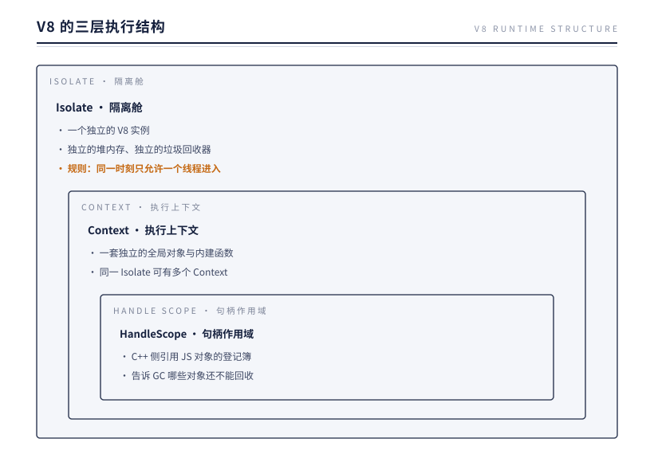
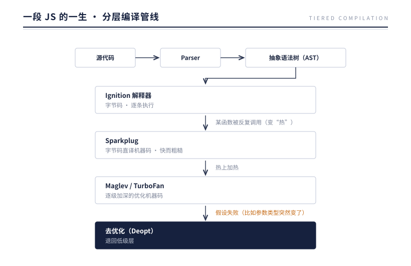
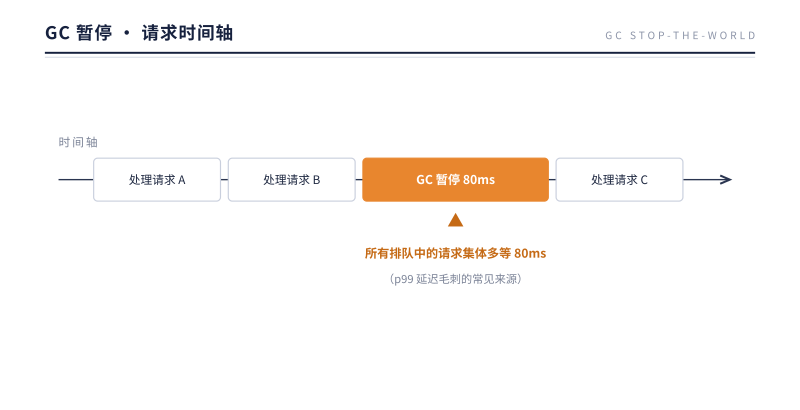

# 第 2 章 单线程的枷锁与馈赠

> **本章问题**：第 1 章把单线程立成了纪律——它不是历史包袱，而是对 C10K 的主动回答。但纪律的具体长相是什么？你的一段 `for` 循环跑着的时候，全世界的网络包在经历什么？这个约束收走了"随便阻塞"的自由，又还回了什么馈赠？

## 2.1 从一个实验开始

打开终端，运行这段代码：

```js
setTimeout(() => console.log('timer!'), 100);

const start = Date.now();
while (Date.now() - start < 3000) { /* 空转 3 秒 */ }
console.log('loop done');
```

输出顺序是：

```
loop done      （3 秒后）
timer!         （紧随其后，而不是 100ms 时）
```

定时器明明设的是 100 毫秒，却等了 3 秒才触发。这个实验揭示了 Node.js 最根本的事实：

**同一时刻，只有一段 JavaScript 在执行。** 只要有代码占着线程，其他一切——定时器、网络回调、Promise——都只能排队。

这不是缺陷，是设计。要理解为什么，得先看看执行 JS 的引擎：V8。

## 2.2 V8：装着 JS 的隔离舱

Node.js 自己不执行 JavaScript，执行者是 Google 的 V8 引擎（源码在 `deps/v8/`）。V8 给 JS 代码提供的运行环境，由三层结构组成：



三层各管一件事：

| 层 | 管什么 | 对 Node.js 意味着什么 |
|----|--------|---------------------|
| Isolate | 内存与执行的隔离边界 | 一个 Node 主线程 = 一个 Isolate；后面第 14 章的 Worker Threads，本质就是"再开一个 Isolate" |
| Context | 全局环境的隔离边界 | `vm` 模块能创建"干净的全局环境"，靠的是新建 Context |
| HandleScope | C++ 引用 JS 对象的生命期 | 第 3 章讲 Binding 时会看到它的作用 |

关键在 Isolate 的那条规则：**同一时刻只允许一个线程进入**。这就是"JS 单线程"的技术根源——不是 Node.js 不想多线程，而是 V8 的执行模型天然如此。

### 为什么 V8 要这样设计？

V8 为浏览器而生。网页脚本要操作 DOM，而 DOM 是一棵巨大的可变树——如果允许多个线程同时改这棵树，就必须给每个节点加锁。加锁意味着：死锁风险、竞态条件、以及程序员心智负担的爆炸。JavaScript 的设计者选择了另一条路：**干脆只让一个线程执行，从根上消灭数据竞争。**

这个选择带来一份意外的馈赠：**JS 程序员从不需要写锁。** 你在 Node.js 里从来不用担心两个回调同时修改同一个变量——因为它们物理上不可能同时执行。单线程是枷锁，也是护栏。

## 2.3 一段 JS 的一生：从文本到机器码

理解了"谁在执行"，再看"怎么执行"。V8 内部是一条流水线：



这是一条"分层编译"管线：越热的代码交给越重的编译器，用编译开销换运行速度。两点值得注意：

1. **JS 不是"慢的解释型语言"**。热点函数最终会被 TurboFan 编译成高度优化的机器码，速度接近原生。这是 Node.js 敢承接服务端负载的性能基础。
2. **优化建立在"假设"上**。TurboFan 假设你的函数参数类型稳定（比如一直传数字）。一旦你传了个字符串进去，机器码作废，退回低级层重新爬升。这就是为什么"保持函数参数类型稳定"是真实有效的 Node.js 性能建议。

## 2.4 GC：会暂停世界的清洁工

V8 的堆内存由垃圾回收器（代号 Orinoco）自动管理，采用分代策略：

- **新生代**：存活时间短的对象（绝大多数临时对象），用 Scavenge 算法频繁小规模回收；
- **老生代**：活得久的对象，用标记-清除-整理（Mark-Sweep-Compact）低频大规模回收。

Orinoco 已经把大部分工作做到了并行与并发，但仍有无法避免的 **Stop-The-World（STW）时刻**——GC 必须让 JS 线程停下来才能安全地移动对象。

对浏览器来说，STW 几十毫秒用户几乎无感。但对服务器，这笔账要重新算：



**GC 暂停 = 事件循环暂停 = 所有并发请求的延迟。** 这是单线程模型的第一笔隐性代价：内存管理的开销无法被其他线程分摊，全部计入请求延迟。生产环境中 p99 延迟突然抖动，堆快照里老生代频繁回收，往往就是这个原因。

## 2.5 枷锁的真正代价：CPU 密集任务

回到开头的实验。那个空转 3 秒的 while 循环，换成真实场景就是：同步的大 JSON 解析、复杂的正则、同步加密、大数组排序。只要它们在跑，整个进程的所有请求都在排队。

**单线程模型给 Node.js 划了一条能力边界：**

- 边界内（I/O 密集）：Web 服务、API 网关、代理、实时消息——请求的大部分时间在等数据库、等下游、等磁盘，CPU 是空闲的。单线程 + 异步 I/O 能以极低的资源开销支撑巨大并发。
- 边界外（CPU 密集）：视频转码、机器学习推理、大规模数值计算——CPU 一直在忙，单线程意味着同一时刻只能服务一个任务。

对边界外的场景，Node.js 后来给出了三条逃逸通道：

| 通道 | 原理 | 详见 |
|------|------|------|
| 异步 I/O | 把"等待"从线程上剥离（这是默认路径，其实不算逃逸） | 第 3、4 章 |
| Worker Threads | 再开一个线程 + 一个新 Isolate，真并行 | 第 14 章 |
| Cluster | 复制整个进程，各自独立事件循环 | 第 14 章 |

注意后两条的共同点：**它们都没有打破"一个 Isolate 一个线程"的规则，而是复制了更多的 Isolate。** 单线程约束从未被绕过，只是被水平扩展了。这个思路会贯穿全书，到第 14 章你会看到它的完整形态。

## 2.6 实验：忙循环进入真实服务器

开篇的 3 秒空转是"裸"演示。现在把忙循环放进真实 HTTP 服务器，量它以延迟为单位的代价。服务器两个路由：`/fast` 直接返回，`/busy` 空转 2 秒再返回；客户端用 keep-alive 连接，先量干净期 50 次 `/fast` 的延迟，再触发一次 `/busy`，在它空转期间量中毒期的 50 次 `/fast`：

```js
// 客户端核心
const clean = await phase(50);                 // 干净期
http.get({ port: 8463, path: '/busy' }, ...);  // 触发忙循环
await sleep(100);
const poisoned = await phase(50);              // 中毒期
```

实测输出（Node 24，loopback）：

```
clean   : p99 0.7 ms, max 0.7 ms
poisoned: p99 1900.0 ms, max 1900.0 ms
```

同一批健康请求，p99 从 0.7ms 被抬到 1900ms——**2700 倍**。注意中毒期跑的全是 `/fast`：它们什么错都没有，唯一的罪是与 `/busy` 同处一个进程。这就是 2.1 实验的生产形态：定时器被推迟只是表象，真正被推迟的是"这个进程里所有还没跑完的事"。

**单线程世界里没有"我的代码没问题"这回事——延迟是进程级的共享资源。** 这句话是本章枷锁的生产级表述，也是 13 章那台"血压计"的理论基础。

## 2.7 反方案对比：假如 JS 当初多线程

把"如果"认真推演一遍，能反过来看清手中这条路的形状。

假如 JavaScript 当初像 Java 一样给了线程与锁，Node.js 会怎样？第 1 章的公理二（单线程）无从谈起，回调串行性要靠锁来维持，第 9 章的 EventEmitter 要变成"带锁的分发器"，全书的因果链从第一环起改写。而 JS 程序员将失去那份馈赠：无锁。

历史给了两面镜子，恰好从两个方向向中间收敛：

**镜子一：给 JS 补线程的浏览器。** Web Workers 诞生时，设计者没敢给 Worker 之间共享内存——消息传递是唯一通道。为什么？因为共享即锁，锁即浏览器最害怕的灾难：一个死锁能冻住整个标签页。**于是"给 JS 加并行"的最终姿势，是加更多隔离的执行单元**——这与第 14 章 Node 的 Worker Threads 姿势完全同构。

**镜子二：给线程语言补事件的阵营。** Java 的 CompletableFuture、Python 的 asyncio、C# 的 async/await——线程语言纷纷在应用层重建事件模型，因为线程模型的三本账（栈、切换、锁）在 I/O 密集场景太贵。

两条路在中间会师：**事件模型补复制（Worker/Cluster），线程模型补事件（asyncio）**。会师点的名字叫"事件驱动 + 隔离副本"。Node.js 在 2009 年就站在这个点上——第 1 章说它可推导，这里的证据是：它不需要向任何方向补课。

## 2.8 生产案例：一次 p99 毛刺的破案

某 API 网关，p50 平稳，p99 偶发秒级毛刺。按本章与第 13 章的器械链破案：

**第一步，排除 GC。** `--trace-gc` 与毛刺时间轴对齐：无相关。账单干净，嫌疑转向"循环被谁占了"。

**第二步，量血压。** `monitorEventLoopDelay` 的 p99 曲线与毛刺完美重合——确认循环被占用，而非网络或内核问题。

**第三步，抓现行。** `node --prof` 采样，热点落在某路由：它对一个数 MB 的聚合结果做同步 `JSON.stringify`，旁边躺着一个回溯型正则。两者都是 2.1 实验里那个 `while` 循环的同族：单次几毫秒到数百毫秒的同步占用，全体请求陪等。

**处置**：大序列化移入 Worker（第 14 章），正则改写为线性形态，路由加 CPU 预算告警。上线后 p99 归位。

这个案例是全书器械链的第一次实战预演：血压计发现病了（第 13 章）、账单排除 GC（第 12 章）、profiler 定位凶手（本章凶手 = 同步长任务）。它也预告了第 13 章的诊断口诀：**先量血压，再查账单，最后拍片**。

## 2.9 本质小结

> **一句话本质**：JS 单线程不是 Node.js 的选择，而是 V8（乃至 JavaScript 语言）的选择；Node.js 的全部架构，都是在"不打破这个约束"的前提下，把它的代价降到最低、把它的馈赠放到最大。

要点：

1. **Isolate 是单线程的技术根源**——一个 V8 实例同一时刻只允许一个线程进入，独立堆、独立 GC。
2. **单线程 = 无锁**——JS 代码天然免疫数据竞争，这是 Node.js 编程模型简洁性的来源。
3. **JIT 让 JS 够快**——Ignition 解释、Sparkplug 直译、Maglev/TurboFan 逐级优化的分层编译，性能足以承载服务端；但优化依赖类型稳定的假设。
4. **GC 暂停直接计入请求延迟**——这是单线程的第一笔隐性代价，p99 毛刺的常见元凶。
5. **CPU 密集是硬边界**——逃逸靠复制 Isolate（Worker/Cluster），而非打破单线程。

## 下一章引子

本章有个被刻意回避的问题：V8 是一个纯粹的 JS 执行引擎，它的世界里只有堆、对象和函数——**没有文件，没有网络，没有进程**。`console.log` 要写终端，`fs.readFile` 要碰磁盘，这些能力 V8 一概没有。

那么问题来了：被关在 V8 隔离舱里的 JavaScript，是怎么拿到操作系统能力的？谁给它开的门？

下一章，我们去看那扇门——Binding。

---

[← 上一章：起源](./ch01-origin.md) | [下一章：沙箱之外 →](./ch03-beyond-sandbox.md)
