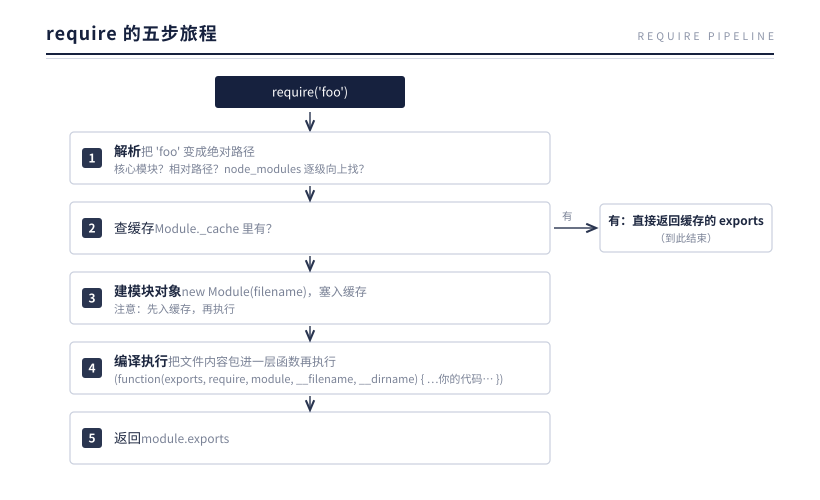
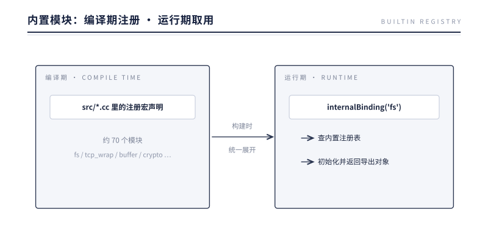
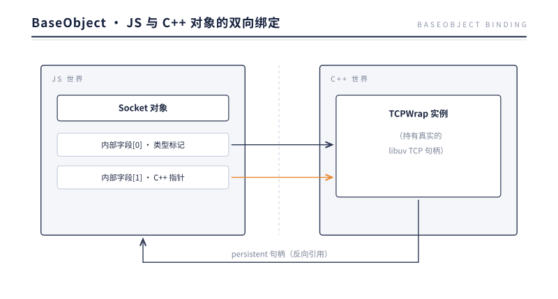
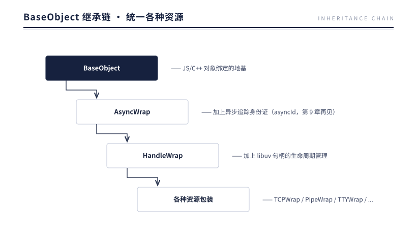
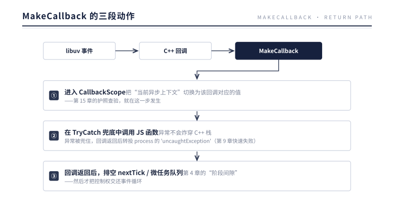
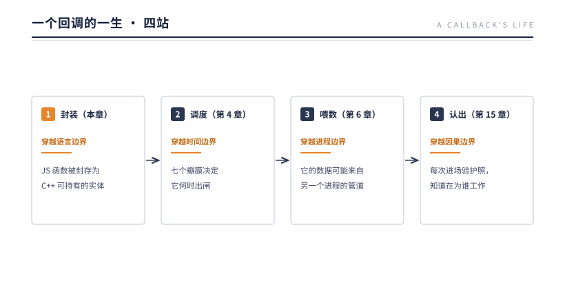
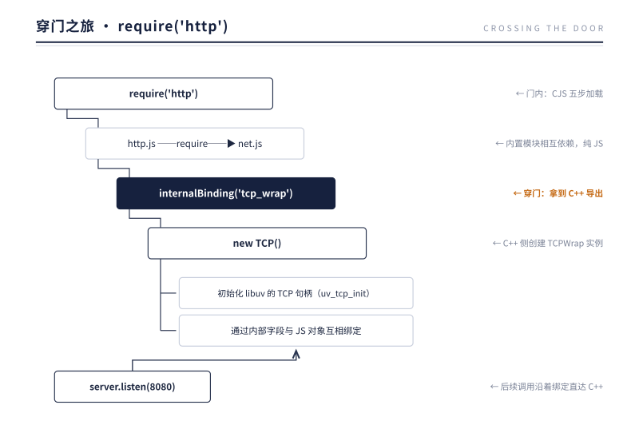

# 第 3 章 沙箱之外

> **本章问题**：V8 的世界里没有文件、没有网络、没有进程。那么当你写下 `require('fs')` 时，那个能读磁盘的 `fs` 对象，到底是从哪来的？

## 3.1 一个悖论

先做个思想实验。打开 Node.js 源码的 `lib/` 目录，找到 `fs.js`——它是纯 JavaScript。再往里追，读文件最终会调用一个叫 `binding.open()` 之类的函数。可是我们刚在第 2 章说过：**JS 没有能力碰操作系统**。

纯 JS 写的 `fs` 模块，却能读磁盘。这个悖论只有一种解法：`fs.js` 里的某些函数，**根本不是 JS 实现的**。它们是 C++ 函数，只是被"包装"成了 JS 函数的样子，挂进了 JS 的世界。

这个包装与挂载的机制，就是 **Binding**——整个 Node.js 架构中最关键的一道门。本章先讲门内的世界（模块系统），再讲门本身（Binding），最后看一次完整的穿门之旅。

## 3.2 门内：模块系统如何组织代码

在讲怎么"出去"之前，先看 JS 代码在门内是如何组织的。Node.js 有两套模块体系：

| | CommonJS（CJS） | ES Modules（ESM） |
|---|---|---|
| 语法 | `require()` / `module.exports` | `import` / `export` |
| 加载时机 | **同步**，运行时按需加载 | **异步**，先静态解析依赖图再执行 |
| 缓存 | `Module._cache`，按解析后的绝对路径缓存 | ModuleMap |
| 顶层 await | 不支持 | 支持 |

### require 的五步旅程

一次 `require('foo')` 在内部经历五步：



两个容易被忽略的细节藏着设计智慧：

1. **"先入缓存，再执行"（第 3 步早于第 4 步）**——这是循环依赖不死锁的原因。A require B，B 又 require A 时，B 拿到的是 A **当时已导出的部分**，而不是无限递归。
2. **那层包装函数**——你以为的"模块顶层作用域"，其实是一个函数作用域。`__dirname` 不是全局变量，是传给这个函数的参数。

### 为什么又搞了一套 ESM？

CJS 的 `require` 是同步的、动态的（可以写在 if 里），这让静态分析几乎不可能——打包工具无法确定哪些导出被用到。ESM 用静态的 `import` 声明换来了三样东西：编译期确定的依赖图、tree-shaking 的可行性、以及顶层 await。代价是加载流程变成异步三段式（解析 → 实例化 → 求值）。两套体系至今并存，Node.js 内部用大量适配代码维持互操作。

## 3.3 门：internalBinding

现在看门本身。`lib/` 下的内置 JS 模块，通过一个用户代码**无法访问**的函数拿到 C++ 能力：

```js
// lib/ 内部代码（用户代码里没有这个函数）
const { open, read } = internalBinding('fs');
```

`internalBinding('fs')` 返回的对象，其成员全是 C++ 函数的 JS 包装。这些 C++ 模块是怎么注册的？

### 编译期注册

Node.js 的每个 C++ 内置模块（约 70 个：`fs`、`tcp_wrap`、`buffer`、`crypto`……）在源码里通过注册宏声明自己。构建时，这些声明被统一展开——**每个模块的元信息在编译期就写进了二进制**。启动时无需扫描、无需动态链接，直接从内置注册表里按名取用。



三个设计意图：

- **快**：注册表是编译期产物，启动时零扫描成本；
- **封闭**：`internalBinding` 只注入给内部模块的包装函数，用户代码摸不到——这是安全边界；
- **唯一**：JS 通往 C++ 的通道只有这一条，所有系统能力都从这道门过。门只有一扇，守门就容易。

> 用户能摸到的 `process.binding()` 是历史遗留的弱化版，正在被逐步废弃。真正的门一直是 internalBinding。

## 3.4 门后的握手：一个 JS 对象如何"变成"一个 C++ 对象

穿过门之后，一个更精妙的问题出现了：JS 里 `new net.Socket()` 创建的对象，和 C++ 里管理真实 socket 的对象，是怎么对应起来的？

答案是一对一的**双向绑定**，核心机制叫 BaseObject：



V8 允许 JS 对象携带若干"内部字段"（Internal Field）——对 JS 代码不可见的槽位。Node.js 约定：字段 0 存类型标记，**字段 1 存 C++ 对象的 this 指针**。于是：

- **JS → C++ 方向**：C++ 函数被调用时，从 JS 对象的内部字段里取出指针，还原成 C++ 对象（源码里的 `Unwrap<T>()`）；
- **C++ → JS 方向**：C++ 对象持有对 JS 对象的 persistent 引用，当底层事件发生（比如连接到达），通过 `MakeCallback()` 找到 JS 对象上的回调函数并调用。

`MakeCallback` 这个名字值得记住——它就是"底层世界向 JS 世界喊话"的话筒。第 4 章讲事件循环时，所有 I/O 事件回到 JS，走的都是它；3.5 节会拆开它的完整动作。

### 生死问题：两个对象，谁拥有谁？

双向绑定引出一个不能回避的问题：JS 对象随时可能被 GC 回收，C++ 对象必须手动 delete——绑在一起的两者，谁先死？

答案是**各管各的命，临死通知对方**：

- **底层资源活着，JS 壳就不许死。** C++ 侧持有的是 persistent 强引用——只要 libuv 句柄还活着（比如一个 listen 中的 server），GC 就动不了对应的 JS 对象。这就是为什么代码里哪怕不"持有" server 变量，它也不会凭空消失。
- **JS 壳死了，C++ 对象跟着自杀。** 当底层句柄关闭、JS 侧也不再有引用，persistent 会被转为弱引用；GC 回收 JS 对象时触发弱引用回调，C++ 对象在其中 delete 自己。

这套生死协议与第 4 章"活跃句柄让进程不退出"是一体两面：**句柄活着 ↔ JS 壳被保住 ↔ 事件循环有活干**——资源、对象、循环，三者的寿命绑在同一根绳上。

这套机制上还长着一条继承链，把各种资源统一起来：



看到 TCPWrap 和 PipeWrap 是亲兄弟了吗？这个"不同资源被统一抽象"的伏笔，第 6 章会彻底展开。

## 3.5 回调的封装与执行：暗线的第一站

对象握手解决了"数据怎么对应"，还剩最后一个问题：你写的那个回调函数——`socket.on('data', cb)` 里的 `cb`——是怎么被存起来，又将在未来的哪一刻被谁执行？

这是一个回调一生的第一站：**封装**。

### 函数如何铸成：FunctionTemplate

先看门出口处的铸造车间。`internalBinding('tcp_wrap')` 返回对象上的每个方法，都出自同一套模具：C++ 侧把函数写成统一签名（收一个参数包，内含 this、实参列表与调用信息），经 V8 的 **FunctionTemplate** 铸成函数模板，再实例化挂到导出对象上。同理，`new TCP()` 的 JS 对象出自一个声明了"内部字段计数"的 ObjectTemplate——3.4 节那两个藏指针的槽位，就是铸模时预留的。

所以你调用的每个 C++ 方法，从 JS 侧看与普通函数毫无区别——**差异只存在于铸模车间，不存在于调用现场**。

### 封存：把回调托付给比栈活得久的结构

注册一个回调时发生了什么？分两层看：

- **JS 侧**：`on('data', cb)` 把函数塞进 EventEmitter 的字典（第 9 章），`setTimeout` 把函数挂上 Timeout 对象——回调住进了 JS 对象；
- **C++ 侧**：libuv 句柄上登记的是 C++ 回调指针，而 C++ 对象经 2.4 的 persistent 引用反握着 JS 对象——回调被间接锁定，不会被 GC 带走。

两层合起来的本质：**把"将来要执行的函数"的引用，托付给比调用栈活得久的结构**。注册动作会结束、栈会退，但封装完成的回调已经拿到了未来的入场券。

### 执行：MakeCallback 的三段动作

未来的某一刻，底层事件发生：libuv 唤醒 C++ 回调，C++ 经 persistent 引用找到 JS 函数——回程的最后一跃由 MakeCallback 完成。它每次进场做三件事：



第 4 章会看到：事件循环的每个阶段放行回调，走的都是这同一段动作。

穿门不是免费的——每次 JS↔C++ 往返都有 scope 进出与参数封送的固定开销。所以热路径上的设计都在**批量穿门**：一次 read 尽量收割、数据按 chunk 分发，而不是每字节往返一次。第 7 章 Buffer 的零拷贝设计，也是在给这道门减负。

### 暗线：一个回调的一生

至此，一个回调走完了第一站。它的一生还要穿越三道边界：



下一章，先去看调度它的那颗心脏。

## 3.6 穿门之旅：require('http') 到底发生了什么

把本章的所有零件串起来，看一次完整的旅程：



你写的每一个 `http.createServer()`，都在无形中完成了：模块解析与缓存、一次穿门（internalBinding）、一次 JS/C++ 握手（BaseObject 绑定）、一个操作系统资源的创建（libuv 句柄）。抽象的每一层都在，只是被藏得很好。

## 3.7 实验：量一量"穿门"

3.5 说穿门不是免费的。到底有多贵？称一下。对比两个函数：纯 JS 空函数，与 `process.hrtime.bigint()`——后者每次调用都要穿过 C++ binding：

```js
const N = 5e6;
function noop() {}

let t0 = process.hrtime.bigint();
for (let i = 0; i < N; i++) noop();
const t1 = process.hrtime.bigint();
for (let i = 0; i < N; i++) process.hrtime.bigint();
const t2 = process.hrtime.bigint();
```

实测输出（Node v24）：

```
纯 JS 空函数   × 5000000: 3 ms，每次 0.6 ns
hrtime.bigint × 5000000: 121 ms，每次 24.2 ns
倍数差: 38×
```

实验里有一处不起眼的正确：预热。先跑一批调用，让 JIT 把两位选手都优化到位，再开始计时——量的是稳态成本，不是编译成本。这也是热路径计量的基本礼仪，与 2.3 那条"保持参数类型稳定"的建议同一个逻辑：让引擎的假设成立，测量才有意义。

约 24 纳秒，就是那道门的过路费：参数封送、scope 进出、两套世界调用约定的交接。单次微不足道，乘以热路径的频率就是账单——这正是 3.5 的设计强调"批量穿门"、第 7 章的零拷贝有存在意义的原因。门不贵，但门不是免费的。

为什么对 24 纳秒这么认真？因为这个数字会到处乘。别忘了回程：每一次 I/O 回调的归来也是一次穿门——MakeCallback 的三段动作（3.5）从 C++ 侧进场、在 JS 世界落脚，CallbackScope 的进出一分不省。像 Stream 的 data 事件（第 8 章）这类高频路径，每秒放行几十万次，门费就从一次性账单变成持续性账单。热路径上那些看似不相干的优化——数据按 chunk 收割、Buffer 零拷贝（第 7 章）——追到根上都是在给穿门次数做减法。

再称门的另一个属性：不可见。用户代码试着摸一下门：

```js
typeof internalBinding;                  // undefined
require('internal/fs');                  // MODULE_NOT_FOUND
require('module').builtinModules.length; // 72
```

72 个用户可见的内置模块，没有一个以 `internal/` 开头——内部模块整体不在白名单里。注意失败的方式：用户作用域里根本没有 `internalBinding` 这个名字；强行 require 内部模块，得到的不是"拒绝访问"，而是"不存在"。**守门人连钥匙孔都没留——白名单不是查验证件，而是让名单之外的东西根本不存在。** 你还能摸到 `process.binding`，那是历史遗留的弱化版（3.3）；真正的门，对用户一直是不可见的。

再看一眼那 72 个名字：fs、net、child_process、http——Node.js 承诺给用户的每一项系统能力都在名单上，名单之外一无所有。这就是白名单与黑名单的根本区别：黑名单说"你不能用什么"，白名单定义"你能用什么"的全部。3.3 说的"封闭"，到这里才算看清全貌。

## 3.8 反方案对比：假如脚本能直接摸到操作系统

把镜像方案认真推演一遍：不设白名单，JS 直接暴露系统调用。`fs.open` 就是无条件的 syscall 入口，脚本能力与进程权限完全一致——API 更直白，Node.js 也许出生得更快。

历史上这个实验做过不止一次，结局都一样。

**镜子一：ActiveX。** 1996 年，微软让网页脚本通过 ActiveX 直接调用 COM 能力——读写文件、操作注册表、启动程序。能力不设名单地授予，结果是漏洞被成建制利用：访问一个网页就能格式化磁盘，上世纪末的恶意软件泛滥大半源于此。教训不在 COM 写得差，而在**能力一旦不设名单地授予，攻击面就等于操作系统的全部表面**。

**镜子二：浏览器插件。** Flash 与 NPAPI 时代的插件把硬件与系统钩子直接交给第三方代码，任何一个插件的崩溃或漏洞都带走整个浏览器。Chrome 后来彻底废除 NPAPI、把插件关进沙箱——先收回能力，再谈功能。

把两面镜子并排，再加一个同时代的参与者——Java Applet，三代设计的剧情惊人一致：平台把系统能力直接授予第三方脚本，能力跟着产品需求走，不跟着安全架构走；漏洞出现时没有名单可以收回，只能整个平台买单。ActiveX 拖垮了 IE 的安全信誉，Applet 与 Flash 先后被浏览器废除。**灾难的根源从来不是某段代码写得差，而是"能力不设名单"这个前提本身。**

这些灾难的镜像设计有个名字：能力安全（capability-based security）——能力按名单授予，名单之外不存在。Node.js 的 internalBinding 正是这套哲学在运行时里的实现：约 70 个 C++ 模块是能力的全部名单，名单之外无物存在。第 1 章说 Node.js 继承了 Web 的安全模型，这里补上了反证：不是 JS"不能"碰操作系统，而是 Node.js"不肯"把门的钥匙交出去。3.3 的三个设计意图在此闭环：**唯一，不只是为了性能，还因为只有唯一的门才守得住**。

这套哲学也付出了明码标价的代价。用户想要一种名单之外的系统能力，只有两条路：等上游把那 70 个 C++ 模块扩充，或者自己写 addon 开一道侧门。灵活性被牺牲了，换来的是运行时安全边界的清晰与可枚举——世界上没有白拿的门。

也要诚实地承认边界：白名单只守这一道门。用户自己放进来的代码——下一节的 addon——站在白名单的保护之外。

## 3.9 生产案例：一个 .node，一条进程

某网关服务用一个原生插件（`.node` 文件，require 加载）解析上游的私有协议报文。服务长期平稳，某天起进程开始随机消失，一天数次。

**第一步，看退出方式。** 监控记录到进程以信号 11（SIGSEGV）退出，`uncaughtException` 日志完全空白。这本身就是证据：JS 异常会被 MakeCallback 里的 TryCatch 兜住（3.5），转成事件；能绕过这层网直接杀死进程的，只能是 C++ 层的东西。这是本案的第一课：**进程怎么死的，本身就是诊断信息。**

**第二步，读崩溃栈。** core dump 的出错位置在那个解析插件内部，栈上的函数正在处理一个网络报文缓冲区。插件是编译进来的 C++ 代码——白名单、TryCatch、异常转事件，Node.js 的全部保护机制对它一概不存在。

**第三步，找触发条件。** 抓包比对后发现，上游某服务偶发发送一种畸形的截断报文。插件假设报文完整，直接拿长度字段当偏移读缓冲——越界，段错误。同样的逻辑用 JS 写，最坏抛一个 RangeError；用 C++ 写，代价是进程的命。

**处置**：把插件解析移进子进程，主进程只通过管道（第 6 章）收发结果——插件再崩，死的是子进程，主进程重新拉起一个即可；配合快速重启与健康检查兜底（第 14 章的进程隔离思想在这里第一次登场）。长期方案：插件补上长度校验，同时备好纯 JS 实现降级。

为什么只有进程边界兜得住？回到第 2 章找答案。V8 的 Isolate 隔离的是执行环境，不是内存安全——所有 JS 对象住在同一个堆里，BaseObject 内部字段里的指针（3.4）直指原生内存，addon 写坏的正是 Isolate 管不到的这一层。而进程是操作系统给的边界：独立地址空间、独立 fd 表，一侧塌了不波及另一侧。所以"以进程为隔离单位"不是保守，而是唯一——第 14 章的 Cluster、第 11 章的运行时容器，都建立在这个判断之上。

**Binding 是白名单，但白名单只守门；addon 是用户自己开的侧门，站在保护之外。** JS 的错误止步于回调，C++ 的错误止步于进程——这是逃出沙箱的价码，也是"以进程为隔离单位"成为 Node.js 生产惯例的原因。

## 3.10 本质小结

> **一句话本质**：模块系统在门内组织代码，internalBinding 是门内通往操作系统的唯一一扇门，BaseObject 是门两侧对象的握手协议，MakeCallback 是回调回程的三段式通道——JS 的所有系统能力，都是 C++ 借它的手递进来的，而语言边界的往返由此闭合。

要点：

1. **纯 JS 没有系统能力**——`lib/` 下的内置模块最终都要穿过 internalBinding 这道门。
2. **CJS 五步加载，先缓存再执行**——循环依赖不死锁的秘密；模块顶层其实是函数作用域。
3. **约 70 个 C++ 模块编译期注册**——启动零扫描、用户不可见、通道唯一。
4. **BaseObject 双向绑定**——JS 对象内部字段存 C++ 指针（Unwrap 下行），C++ 持 persistent 引用（MakeCallback 上行）。
5. **继承链统一资源**——BaseObject → AsyncWrap → HandleWrap → TCPWrap/PipeWrap/...，不同资源同一套骨架。
6. **对象生死协议**——底层资源活着就以强引用保住 JS 壳；壳死经弱引用回调通知 C++ 自杀；资源、对象、事件循环的寿命绑在同一根绳上。
7. **回调封装与回程**——FunctionTemplate 铸函数、两层封存拿入场券；MakeCallback 三段式：CallbackScope 换上下文、TryCatch 兜异常转 uncaughtException、返回后排空微任务；穿门有成本，热路径批量往返。

## 下一章引子

门打开了，回调也封存完毕、拿到了未来的入场券。但"未来"是哪一刻？谁决定它何时出闸？

更紧迫的麻烦近在眼前：`read()` 一个还没数据的 socket，调用会**阻塞**——线程停下来干等。而我们只有一个线程。等 1 个连接的数据，其余 9999 个连接就全部冻结。

拿到系统能力只是第一步，**如何在单线程上"同时"等待一万件事、并在事成之时放行对应的回调**，才是 Node.js 真正的生死题。

下一章，心脏登场：事件循环——回调一生的第二站。

---

[← 上一章：单线程的枷锁与馈赠](./ch02-single-thread.md) | [下一章：事件循环：心脏的七个瓣膜 →](../part-2-heartbeat/ch04-event-loop.md)
