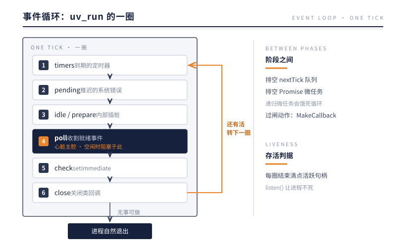
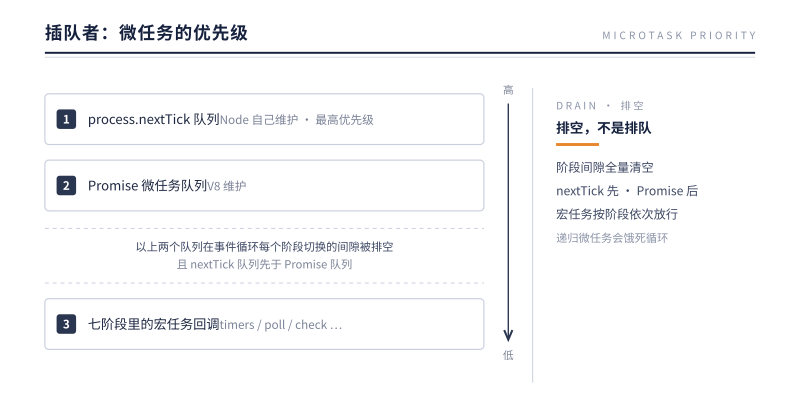
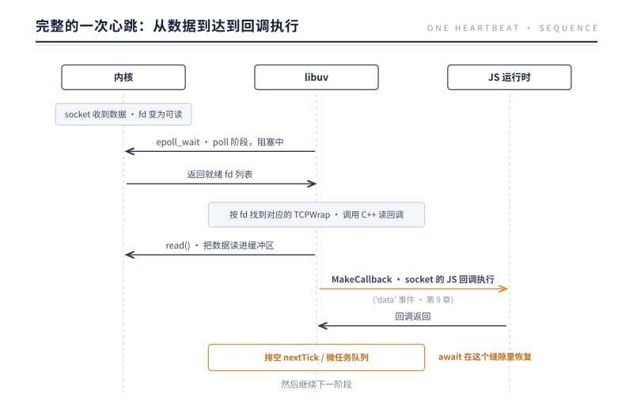

# 第 4 章 事件循环：心脏的七个瓣膜

> **本章问题**：一个线程，一万个连接，每个连接随时可能来数据。线程不能停在任何一个连接上干等——那它到底该干什么？

## 4.1 换一个问法

"单线程怎么处理一万个并发"听起来像不可能的任务，但换个问法就豁然开朗了：

**这一万个连接，同一时刻真正需要 CPU 的有几个？**

答案通常是：个位数。绝大多数连接在任何给定时刻都处于"等待"状态——等对方发数据、等数据库返回、等定时器到期。等待不消耗 CPU。真正的浪费是让线程**陪着等**。

于是解法浮出水面：把"等待"externalize——线程从不等待任何具体的事，它只做一件事：**循环询问"现在有哪些事已经就绪了？"，然后处理就绪的事。**

这个循环，就是事件循环。它由 libuv 库实现（`deps/uv/`），入口函数是 `uv_run()`。第 3 章 Binding 创建的那些 libuv 句柄（TCP、定时器……），全都注册在这个循环上。

## 4.2 七个瓣膜：uv_run 的一圈

事件循环每转一圈，按固定顺序经过七个阶段——像心脏收缩一次要依次通过几个瓣膜：



图中 ③ 把 idle 与 prepare 合在一行——它们实为两瓣，与其余五瓣合计七个，"七阶段"由此而来。

接上第 3 章的暗线：**七个瓣膜，就是封装完毕的回调的七个出闸口**。每一瓣放行的回调类别不同、数据来自的世界不同，但过闸动作是同一个——MakeCallback 三段式。逐一拆开看：

### ① timers：放行"到点"的时间回调

- 数据结构：一个**最小堆**，按到期时间排序——每圈只查堆顶"最近的定时器到没到"，检查成本 O(1)，与定时器总数无关；
- 回调来源：`setTimeout` 时封存在 Timeout 对象上的 JS 函数；
- 一个关键细节：`setTimeout(fn, 0)` 的实际下限是 **1ms**——定时器以毫秒计时，0 会被抬成 1。4.3 节"setTimeout 与 setImmediate 顺序之谜"的一半成因就在这里。

### ② pending：放行"上一圈被推迟"的系统错误回调

某些系统级错误（如 TCP 写操作收到 ECONNREFUSED）在 poll 收割时被发现，但**不在当场派发**——错误处理可能触发新的 I/O，打断就绪清单的收割。于是先记账，推迟到下一圈的 pending 阶段统一清算。瓣膜的含义在此显形：**让错误只朝一个方向流动——先收割完，再清算**。

### ③ idle / prepare：libuv 自留的插桩点

每圈必跑，但对用户不可见——是 libuv 留给嵌入方与内部子系统的挂钩。知道它们存在即可，源码阅读时遇到多出来的两个阶段不会困惑。

### ④ poll：放行"就绪"的 I/O 回调（心脏主腔）

- 它调用操作系统的多路复用接口（Linux 上是 `epoll_wait`），一次性询问"注册的这些 fd，哪些就绪了？"——这是**数据从内核世界来的闸口**；
- 如果没有任何事就绪，它会**计算出最近一个定时器还差多久到期**，就地阻塞那么长时间——这就是 Node 进程空闲时 CPU 占用为 0 的原因。阻塞在 `epoll_wait` 上不是忙等，是把线程交还给内核调度；
- 唤醒源有三类：I/O 就绪、超时到期、`uv_async` 内部信号——第 5 章线程池完工时，就是敲第三扇门把主循环叫醒的；
- 一旦醒来，按就绪清单逐个收割（read/write 都不会卡，因为已就绪），回调经 MakeCallback 进场，然后继续走完这一圈。

### ⑤ check：放行"立刻结算"的 setImmediate 回调

它存在的理由：poll 醒来处理完就绪事件后，常常想**紧接着再做一件事**（比如把刚读到的数据继续写出去）。check 就是 poll 之后立刻开启的窗口——没有它，"I/O 之后马上"这个诉求只能绕到下一圈的 timers，平白迟一整圈。

### ⑥ close：放行"收尾"的关闭回调

句柄关闭不能随到随办：它可能还有在途的未完成事件。于是 libuv 把所有关闭动作攒到这一瓣统一执行——保证 `'close'` 永远是一个句柄一生的**最后一个事件**（第 9 章的事件分发顺序依赖这个保证）。

### 顺序即优先级

为什么偏偏是这个顺序？每个位置都在回答一个调度问题：

- **timers 在最前**：每圈先对表——I/O 再忙，时间不能漂；
- **poll 居中**：它是全循环唯一的等待点，前后的阶段都是"入睡前的安顿"与"醒来后的结算"；
- **check 紧随 poll**：兑现"I/O 之后立刻"；
- **close 殿后**：收尾永远最后。

源码定位：`deps/uv/src/unix/core.c` 的 `uv_run`——`uv__run_timers` → `uv__run_pending` → `uv__run_idle` → `uv__run_prepare` → `uv__io_poll` → `uv__run_check` → `uv__run_closing_handles`，一圈七步，与上图一一对应。`uv_run` 还有三种运行模式：DEFAULT（转到没活为止，Node 用它）、ONCE（转一圈，允许阻塞一次）、NOWAIT（转一圈，绝不阻塞）——后两种留给把事件循环嵌进自己程序的宿主。

"**进程为什么不退出/为什么退出了**"——这个问题也在 poll 阶段有了答案：循环每圈结束时检查"还有没有活跃的句柄或未完成的请求"。一个 `server.listen()` 就是一个活跃句柄，所以服务器进程永不退出；而一个只有 `console.log` 的脚本转完一圈发现无事可做，进程结束。

## 4.3 插队者：不属于任何阶段的微任务

上面七个阶段是 libuv 的地盘。但 JS 世界还有两类"插队者"，它们不属于任何阶段，而是**在每个阶段的间隙**执行：



用一段代码验证：

```js
setImmediate(() => console.log('D: setImmediate'));
setTimeout(() => console.log('C: timeout 0'));
Promise.resolve().then(() => console.log('B: promise'));
process.nextTick(() => console.log('A: nextTick'));
// 输出顺序：A → B → C → D
```

两个实用推论：

1. **nextTick/Promise 能饿死事件循环**。它们在阶段间隙被"排空"——如果回调里又添加新的微任务，循环会一直排下去，poll 阶段永远轮不到。递归 `process.nextTick` 是一种事故写法。
2. **setTimeout(fn, 0) 与 setImmediate 的顺序之谜**。在主模块顶层，两者顺序不确定（取决于进入第一圈时 1ms 定时器是否已到期）；但在 I/O 回调内部，setImmediate **永远先执行**——因为 I/O 回调结束于 poll 阶段，下一站就是 check（setImmediate 的地盘），而 timers 要等下一圈。

## 4.4 完整的一次心跳：从数据到达到回调执行

把第 3 章的 MakeCallback 和本章的循环拼起来，看数据到达时发生的完整链路：



注意最后两行的顺序：JS 回调返回后、进入下一个阶段前，微任务队列被排空。你在 `'data'` 回调里写的 `await`，就是在这个缝隙里恢复执行的。

这个回调至此走完两站：第 3 章被封装，本章被瓣膜放行。但它的数据究竟从哪个世界来——内核缓冲区、线程池，还是另一个进程？后面两章回答。

## 4.5 心跳的健康指标：循环延迟

事件循环给了单线程并发能力，也带来一个独有的健康指标：**循环延迟（loop lag）**——一圈本该立即执行的回调，实际晚了多久。

```js
let last = Date.now();
setInterval(() => {
  const lag = Date.now() - last - 1000;
  if (lag > 100) console.warn(`事件循环延迟 ${lag}ms`);
  last = Date.now();
}, 1000);
```

延迟飙高只有两类原因，都在本书前几章里出现过：

- **某个 JS 回调跑太久**（第 2 章的 CPU 密集陷阱）；
- **GC 暂停**（第 2 章的 STW）。

监控循环延迟，等于给心脏戴上心率表。生产级方案可用 `perf_hooks.monitorEventLoopDelay()`。

## 4.6 实验：优先级与漂移，实测为证

4.3 立下了几条规矩：微任务最先、顶层顺序不定、I/O 回调内 setImmediate 必先、定时器会漂移。规矩要实测过才算数。

**实验一：顶层顺序，连跑五次。** 把这两行交给子进程重复执行：

```sh
node -e "setImmediate(()=>console.log('immediate'));setTimeout(()=>console.log('timeout'),0)"
```

实测输出（Node v24，五次全部相同）：

```
immediate > timeout
immediate > timeout
immediate > timeout
immediate > timeout
immediate > timeout
```

五次全是 immediate 先。为什么不是 timeout 先？答案在 4.2 的 1ms 下限里：这个脚本启动得足够快，进入第一圈 timers 阶段时 1 毫秒还没过完，timers 空手而归，check 先得分。把同样两行放进一个脚本文件用 `node xxx.js` 跑，顺序就稳定翻转成 timeout 先——文件启动路径多走的那几步，恰好跨过了 1ms。**决定顺序的不是代码，而是进入第一圈 timers 阶段时那 1ms 定时器到没到期**——"顺序不定"，不定在启动速度上。

**实验二：I/O 回调内，顺序是定的。**

```js
fs.readFile(__filename, () => {
  setTimeout(() => console.log('timeout'), 0);
  setImmediate(() => console.log('immediate'));
});
```

反复运行，输出恒为 immediate → timeout。原因 4.3 已经讲过：I/O 回调结束于 poll，下一站就是 check，timers 要等下一圈。顶层不定、回调内必——变的不是 API，是所处的阶段。

**实验三：定时器漂移。**

```js
const t0 = Date.now();
setTimeout(() => console.log(`说好 100ms，实际 ${Date.now() - t0}ms 才触发`), 100);
const s = Date.now();
while (Date.now() - s < 500) {}
```

实测输出：

```
说好 100ms，实际 500ms 才触发
```

setTimeout 的 100ms 是"最早"，不是"保证"。timers 阶段每圈检查"到没到点"，但那一刻线程是否有空，是另一回事。这是第 2 章开篇实验的定量版——那里看到定时器被推迟，这里量出推迟了多少。它也正是 4.5 循环延迟的定义：**到点时刻与实际触发时刻的差值，就是这颗心脏的心率**。

**实验四：微任务递归真的能饿死循环。**

```js
const t0 = Date.now();
setTimeout(() => console.log(`10ms 的定时器，实际 ${Date.now() - t0} ms 后才触发`), 10);
let n = 0;
(function rec() {
  if (++n < 2000000) process.nextTick(rec);
})();
```

实测输出（Node v24）：

```
nextTick 递归 2000000 层，耗时 110 ms
10ms 的定时器，实际 111 ms 后才触发
```

递归本身只跑了 110 毫秒，10ms 的定时器就被拖迟了十倍。两行输出讲的是同一件事：定时器第 10 毫秒就到期了，但微任务队列还在排空过程中，它只能等到队列见底才轮到自己。把终止条件去掉，队列永远排不完，timers 阶段就永远不再到来——4.3 第一条推论的实证，也是 4.8 那场事故的伏笔。

四个实验合起来验证了同一份权限分配：**API 只负责提交请求，请求何时兑现，是事件循环的职权。** nextTick 最快，因为它赶在任何阶段之前；timers 与 setImmediate 按阶段排序；微任务递归则凌驾于所有阶段之上。把顺序理解成结构，下面这场生产事故就可以解释了。

## 4.7 反方案对比：假如只有一条 FIFO 队列

七个阶段看起来复杂。一个自然的质疑是：所有回调排进一条 FIFO 队列，先来先服务，不是更简单？跑得通，但有两个语义会当场坍塌。

第一个是微任务的即时性。`await` 的含义是"当前任务一结束就恢复"，这个"就"靠的是微任务队列在阶段间隙被**排空**。假如 Promise.then 是排进 FIFO 末尾的普通任务，await 之后可能排着几十个 I/O 回调，异步代码的恢复将被推迟不可预测的时长——async/await 那种"像同步"的手感根本不会存在。**微任务不是优先级更高的任务，而是当前任务完成语义的一部分**——所以它必须被排空，而不是被排队。这一步就让 FIFO 出局了。

举个具体的。`await db.query()` 之后紧跟 `res.end()`，程序员的预期是"这两件事贴着发生"。若 await 的续体是排队进 FIFO 的普通任务，队列里可能正压着其他连接的 I/O 回调，`res.end()` 就得排在它们后面——同一个请求的响应时机依赖队列深度，程序员被迫推理一切可能的交错。排空机制把所有交错都排除在外：一个任务之内，续体立即发生。**串行语义的代价是排空，排空的红利是没人需要推理交错。**

第二个是位置承诺。"close 是句柄一生的最后一个事件"、"setImmediate 紧随 I/O 之后"——这些承诺在七阶段里是结构性质；若 timers、I/O、close 混在同一条队列里按到达顺序混排，承诺全部变成运气。阶段把位置上的运气变成了结构上的保证。

历史给了一面镜子，恰好是最简版本。**浏览器的事件循环只有两种东西：任务与微任务，没有七个阶段。** 因为浏览器不需要自己管理句柄的生老病死——网络、定时器、渲染事件都由引擎外部送达，HTML 规范只需规定 task/microtask 的排空时机。libuv 正相反：Node.js 的 I/O、定时器、句柄关闭全要自己调度，于是每一类事件长出一个阶段——poll 负责等，check 负责结算，close 负责收尾。同样"阶段间隙排空微任务"，阶段数却不同：**事件循环的形状，跟着宿主环境要自己管理的事件种类长**。

镜子还有更简的一端。Redis 的事件循环只处理两种事件：定时器与 socket 读写，于是它的循环是单层结构——对对表、收割就绪的 fd，一圈结束，没有阶段可言。浏览器、Node.js、Redis 并排站在一起，规律一目了然：宿主环境自己管几种事件，循环就长出几种结构。

收回因果链：七个瓣膜不是调度理论的通用答案，而是"Node.js 恰好要处理这几类事件"的清单。少一类事件，就少一个瓣膜。

## 4.8 生产案例：一次永不返回的健康检查

某服务跑在 Kubernetes 上，某天起 Pod 开始被反复杀死重启，理由：存活探针（liveness）超时。

**第一步，看症状。** kubelet 对 /healthz 的 HTTP 请求超时，按规则杀掉 Pod。看资源监控：内存正常，没有 OOM；但事发窗口单核 CPU 是满的，事件循环延迟监控一路顶到秒级——心脏在跳，跳得极慢。事后回看，这个组合——单核满载、循环延迟爆炸、内存无恙——已经排除了 GC，把嫌疑指向了 JS 代码本身。

**第二步，排除惯犯。** 发布窗口内没有新增同步长任务，GC 日志没有长暂停。占住 CPU 的不是一个大任务——那是什么？

**第三步，抓现场。** `node --inspect` 接入采样，火焰图很古怪：采样全落在一个分页递归函数里，但任何单独一帧都很短。看代码：分页查询用递归加 `Promise.then` 实现，每层递归都产生一个新的微任务；遇到某天的异常数据集，递归深达数万层——**没有一个任务是长的，但微任务队列永远排不完**，poll 阶段永远轮不到。健康检查的 TCP 连接早已在内核的 accept 队列里就绪，epoll 早就举了手，只是没人走到能听见它的那个阶段。

**第四步，修复。** 递归改迭代，批次之间 `await setImmediate(...)` 让出一次——让微任务有尽头，让阶段有轮转。上线后健康检查恢复。

**第五步，防复发。** 两条规矩进团队约定：递归逻辑不允许直接链式挂 Promise，必须改迭代或分批让出；事件循环延迟（4.5）纳入核心告警——下一次饥饿，要在报警里发现，而不是在重启里发现。

顺带看一眼镜像世界：如果这是个多线程服务，一个线程的递归挡不住另一个线程的健康检查——但那个世界有锁、有数据竞争（2.7）。单线程免掉了那些代价，换来的是整个进程的生死系于这一条循环。这是第 2 章"枷锁与馈赠"的又一次结账。

**饿死事件循环的不一定是大任务，也可能是无穷无尽的小任务。** 微任务队列的"排空"是把双刃剑：它保证了 await 的即时性，代价是任何能无限产生微任务的代码都能挟持整颗心脏。这是 4.3 第一条推论的生产形态。

## 4.9 本质小结

> **一句话本质**：事件循环把"线程陪着 I/O 等"改造成"内核代管所有等待，线程只处理已就绪的事"——单线程因此获得了与连接数无关的并发能力。

要点：

1. **七瓣膜各放行一类回调**：timers（最小堆查到点）→ pending（清算推迟的系统错误）→ poll（epoll_wait 收割就绪，空闲时阻塞于此，CPU 零占用）→ check（I/O 后立刻结算）→ close（收尾殿后）——顺序即优先级；过闸动作统一是 MakeCallback。
2. **进程存活判据**：每圈结束检查活跃句柄数，`listen()` 让进程不死，无事可做则自然退出。
3. **两个插队队列**：nextTick > Promise 微任务，在每个阶段间隙排空；递归微任务会饿死循环。
4. **I/O 回调内 setImmediate 必先于 setTimeout**——poll 的下一站是 check；顶层顺序之谜的另一半成因是 timers 的 1ms 下限。
5. **循环延迟是单线程系统的心率**——只有两个敌人：长 JS 任务与 GC。
6. **源码一一对应**：`core.c` 的 `uv_run` 七个内部函数与瓣膜一一对应；DEFAULT/ONCE/NOWAIT 三模式，Node 用 DEFAULT。

## 下一章引子

瓣膜决定了回调"何时"放行，但放行的回调要吃的数据从哪来？答案在本章一处含糊其辞里：poll 阶段"向内核询问就绪的 fd"。这对网络连接说得通——socket 没数据就是没就绪。

但文件呢？磁盘上的文件**永远是"就绪"的**——数据就在那里，读就是了，只是读的过程要花时间（磁头寻道、页缓存未命中）。"询问文件是否就绪"这个问题本身就不成立。

那 `fs.readFile` 的异步是怎么来的？答案会让一些人意外：**是装出来的**。

下一章：两条 I/O 之路。

---

[← 上一章：沙箱之外](../part-1-constraint/ch03-beyond-sandbox.md) | [下一章：两条 I/O 之路 →](./ch05-two-io-paths.md)
