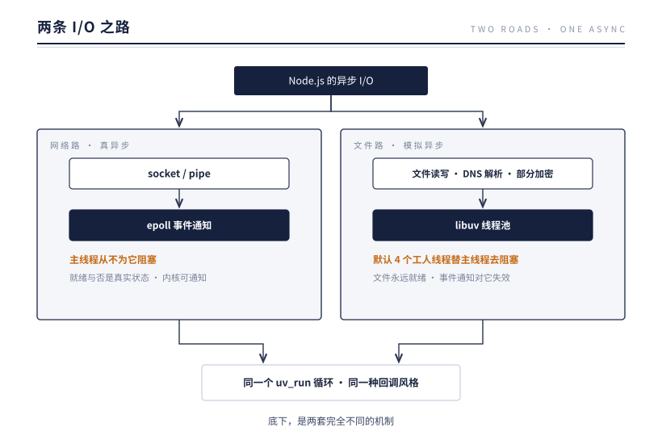
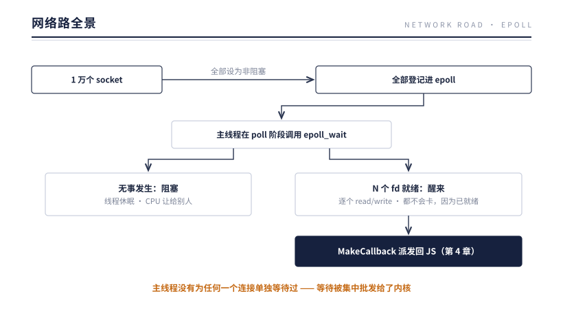
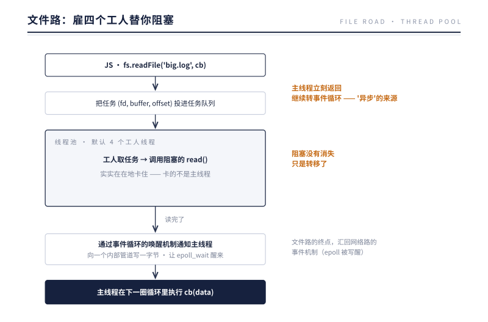

# 第 5 章 两条 I/O 之路

> **本章问题**：`fs.readFile` 和 `socket.on('data')` 在 JS 层看起来是同一种东西——传个回调，数据来了通知你。它们的底层也一样吗？

## 5.1 先揭晓答案

不一样，而且是天壤之别：



同一个 `uv_run` 循环，同一个回调风格，底下却是两套完全不同的机制。要理解为什么必须分两条路，得回到内核对"就绪"这个词的定义。

## 5.2 网络路：非阻塞 fd + epoll

### "就绪"对 socket 是个有意义的问题

socket 有内核缓冲区。对端发来的数据先进缓冲区，缓冲区有数据 = 可读就绪；缓冲区有空位 = 可写就绪。**就绪与否是一个真实存在、随时间变化的状态**，所以内核可以监控它、通知它。

配合两个内核特性，网络 I/O 实现了完美的异步：

1. **非阻塞模式**：把 socket-fd 设为 `O_NONBLOCK` 后，`read()` 在无数据时不再卡住线程，而是立刻返回"暂时没有"（EAGAIN 错误码）；
2. **epoll**：告诉内核"帮我盯着这 1 万个 fd，任何一个就绪就叫我"。

### epoll 的三个动作

```
epoll_create()   建一个监控站（返回的也是个 fd，很有意思，第 6 章会回味这一点）
epoll_ctl()      登记/注销要监控的 fd 及关心的事件（可读？可写？）
epoll_wait()     阻塞等待，返回就绪的 fd 列表
```

epoll 高效的关键在**它的返回值只包含就绪的 fd**。老一代的 select/poll 每次调用要传入全部 fd、内核线性扫一遍、返回后应用又要线性扫一遍找出谁就绪——连接数越大越慢。epoll 在内核里维护常驻的监控结构（红黑树 + 就绪链表），fd 就绪时由中断驱动地挂入就绪链表，`epoll_wait` 直接收割链表。**成本只与"就绪的事件数"相关，与"监控的连接总数"无关**——这就是 C10K 问题（单机一万并发连接）的钥匙，并继续铺平通往十万连接的路。

两个 libuv 用到的细节：

- 注册事件时，libuv 把每个 fd 对应的内部结构体指针塞进 epoll 的用户数据字段。事件返回时直接拿到指针，**无需再查一次"fd → 回调"的映射表**；
- libuv 使用**边缘触发**语义的读取策略：一次就绪通知后，循环 `read()` 直到返回 EAGAIN 才停手——确保把缓冲区读干净，不漏数据。

### 网络路全景



主线程全程没有为任何一个连接单独等待过。**等待被集中批发给了内核。**

## 5.3 文件路：一个装出来的异步

### "就绪"对文件是个无意义的问题

普通文件不一样。它没有"数据还没来"的状态——数据就躺在磁盘上，永远"可读"。你把文件 fd 注册进 epoll，它会立刻且永远返回就绪，毫无意义。文件读取的耗时不在"等数据到来"，而在**读取动作本身**（磁盘寻道、页缓存加载），这个耗时无法用"就绪通知"消除。

Linux 的经典 POSIX 接口没有为普通文件提供靠谱的非阻塞读。libuv 的选择很务实：**惹不起，躲得起——把阻塞丢给别的线程。**

### 线程池：雇四个工人替你阻塞



最后那步值得玩味：工人线程完工后，是靠**向一个内部 fd 写数据、触发 epoll 就绪**来唤醒主循环的——文件路的终点，又汇回了网络路的事件机制。两条路殊途同归于同一个 poll 阶段。

### 走线程池的不只是文件

DNS 域名解析（`dns.lookup`，底层是同步的 getaddrinfo）、部分 crypto 运算（如 pbkdf2）、zlib 压缩，都走线程池——共同点是"底层只有阻塞/耗 CPU 的接口可用"。

## 5.4 一条路的宽度：线程池只有 4 条车道

线程池默认 4 个线程，这是个藏得很深的性能开关：

```js
// 同时发起 8 个慢速文件读取
for (let i = 0; i < 8; i++) {
  fs.readFile(bigFile, () => console.timeEnd(`read-${i}`));
}
// 现象：前 4 个耗时 ~T，后 4 个耗时 ~2T —— 它们在排队
```

对照实验：8 个并发 HTTP 请求不会出现这种台阶——网络路没有车道数限制，epoll 监控多少 fd 都行。

实务要点：

- 文件 I/O 或 `dns.lookup` 密集的服务，用环境变量 `UV_THREADPOOL_SIZE`（上限 1024）加宽车道；
- 高并发下游调用时警惕 `dns.lookup` 占满线程池——它拖慢的将不只是 DNS，还有所有文件操作；可改用走网络路的 `dns.resolve`；
- 台阶状的文件 I/O 延迟分布，几乎总是线程池排队的指纹。

## 5.5 为什么 Node.js 不掩盖这个差异？

因为差异是真实的，掩盖只会误导容量规划：

| | 网络路 | 文件路 |
|---|---|---|
| 并发上限 | 内核内存与 fd 上限（数十万） | 线程池大小（默认 4） |
| 主线程阻塞风险 | 无 | 无（但任务会排队） |
| 延迟特征 | 与并发数基本无关 | 超过车道数出现台阶 |
| 内核机制 | epoll 事件通知 | 老实的阻塞 read/write |

JS API 层面的统一（都是回调/Promise）是**编程模型**的仁慈；底层的分野是**物理现实**的诚实。工程师两边都要懂。

## 5.6 实验：车道有多宽，排队有多长

5.4 说任务数超过车道数会出现台阶。把台阶摆出来看，顺便验证网络路是否受池子影响。同一个脚本做两组事：8 个并发 readFile 读同一个 256MB 文件（文件路），8 个并发 TCP 连接做本地回显往返（网络路）：

```js
// 文件组
await Promise.all(Array.from({ length: 8 }, () => fs.promises.readFile(FILE)));
// 网络组：连接本地端口，发一字节，收到回显即完成
```

用不同的 `UV_THREADPOOL_SIZE` 跑同一个脚本，实测输出（Node v24，文件已在页缓存）：

| UV_THREADPOOL_SIZE | 8 并发 TCP 往返 | 8 并发 readFile |
|---|---|---|
| 1 | 5.0 ms | 822 ms |
| 4（默认） | 7.2 ms | 145 ms |
| 8 | 6.2 ms | 104 ms |

先算一算文件组的账。单车道 822ms ÷ 8 ≈ 100ms 每任务，纯串行排队；4 车道 145ms ÷ 2 批 ≈ 72ms 每批，8 个任务分两波；8 车道 104ms ≈ 1 批，但已经压不动了——瓶颈从车道数转移到了内存带宽。三个台阶，把"排队"这个过程拍成了三帧照片：**线程池把"等多久"变成了"排几批"，批数就是任务数除以车道数。**

两个读数。其一，文件组的总耗时完全由车道数决定：单车道时 8 个任务串行排队，总耗时约等于单任务耗时的 8 倍；4 车道把 8 个任务分成两批，耗时降到近六分之一。这就是 5.4 预言的台阶，实测形状吻合。其二，**网络组从头到尾纹丝不动——epoll 没有车道数的概念**，线程池的宽度只是文件路的天花板。同一个进程、同一个 uv_run，两条路互不相干。

把对照组再放大一步想：网络组从 8 个连接涨到 8 万个，epoll 的账单只随就绪事件增长，不随连接数增长（5.2）；文件组甚至不用想——任务数超过 8，台阶只会再加一层。这是两条路在容量规划上的根本差别。

还有一个诚实的注脚：车道不是越宽越赚。8 车道只比 4 车道快四成——8 份 256MB 拷贝挤在一起抢内存带宽，线程栈与上下文切换也要付账。**加宽车道是缓解排队，不是消灭等待。** 也要提醒：表里的绝对值会随环境变化——页缓存冷热、磁盘速度、内存带宽，样样影响读数；但台阶的形状与网络组的纹丝不动，在任何机器上都能复现。可复现的是形状，不是数字。

## 5.7 反方案对比：为什么磁盘不上网络那条路

读完 5.2 和 5.3，一个自然的念头是：两条路太分裂了，能不能统一？把两个方向的统一各推演一遍。

**方向一：文件也走 epoll。** 5.3 已经回答了一半——文件永远就绪，epoll 监控它会立刻且永远返回就绪，毫无意义。那让内核真正提供"文件完成通知"呢？有人试过。Linux 2002 年的 Linux AIO（`io_submit`）长期有两个硬伤：只在 `O_DIRECT`（绕开页缓存）下是真异步，缓冲 I/O——最常见的读写方式——在内核里照样阻塞；而且要求文件系统专门适配，支持面不全。glibc 的 POSIX AIO（`aio_read`）干脆在内部用线程实现——伪装的线程池，libuv 只是把伪装撕掉了而已。真正的答案 io_uring 2019 年才成熟，而 Node.js 的架构在 2009 年就定型了：libuv 选了当时唯一跨平台稳妥的路。顺带一提，Windows 的 IOCP 倒是真能做异步文件，libuv 在 Windows 上接的就是它——抹平两个平台的差异，正是 libuv 存在的理由之一。

那为什么不后来换上 io_uring？两层原因。一是线程池方案足够正确——对基础设施来说，正确是最难挣来的东西，而 io_uring 自身也有过漏洞与接口演化的历史；二是 libuv 要支持没有 io_uring 的平台（macOS、Windows），双路维护的成本换不来多数场景的收益。截至 Node.js 24，Unix 上的文件 I/O 仍走线程池。这里的启示是：**基于物理约束做出的选型，不会因为技术进步而作废——进步只是让备选方案变香，不会改变原题。**

**方向二：网络也走线程池。** 这条路也走过，就是 C10K 之前的主流：一个连接一个线程。账很好算：一万连接就是一万线程，任何时刻绝大多数在等待，但每个等待都占着栈和调度实体，上下文切换的开销随线程数上涨。事件模型的红利恰恰是**等待不占线程**——epoll 的账单按就绪事件数算，不按连接数算。后来 Java 从 BIO 演进到 NIO，是沿着这个方向补课；Go 的答案是便宜的 goroutine——等待仍要占一个调度实体，只是实体便宜。Node.js 最极端：等待零实体。

两个方向收敛到同一个结论：两条路不是妥协，而是各自服从物理约束——网络有就绪状态，就用就绪通知；磁盘没有就绪状态，就必须有人替你去等，而最便宜的"有人"，是少数几条共享的线程。

这也是第 2 章命题的收口。第 2 章说，异步 I/O 的本质是把"等待"从线程身上剥离；本章展示了这次剥离的边界：网络的等待剥得掉，因为内核愿意接管（epoll）；文件的等待剥不掉，因为内核没有提供接管的机制——只能转移到几条线程里，付排队的账。**等待能剥离多远，不是运行时说了算，是内核说了算。**

## 5.8 生产案例：DNS 风暴压垮磁盘

某文件上传服务：请求先解析下游域名取回元数据，再写临时文件、rename 落盘。某个高峰，fs 操作的延迟陡然升高，出现台阶状超时。

**第一步，认指纹。** 延迟分布不是整体平移，而是清晰的台阶——5.4 的线程池排队指纹。嫌疑人先锁定车道数。

**第二步，排除磁盘。** iostat 显示磁盘利用率与队列深度都正常。堵点不在内核，在用户态的线程池。可 fs 任务本身并不慢——谁占着车道？

**第三步，找到真凶。** 看高峰期服务还在调什么：对下游的 HTTP 请求用的是域名，每条新建连接都触发一次 `dns.lookup`。它的底层 getaddrinfo 是同步阻塞调用，走线程池（5.3 早把它列进了乘客名单）。那天上游 DNS 短暂抖动，单次解析从毫秒级涨到秒级——4 条车道被 4 个 getaddrinfo 一占就是几秒，身后的 fs 任务全部排队。

这里藏着一个细节：Node.js 的 HTTP 客户端会复用连接，连接建好之后就不需要再解析——按说风暴成不了气候。问题出在高峰：并发连接数冲破了连接池的容量，必须新建连接，而每条新连接都是一次 getaddrinfo。**风暴不是常态，它只在连接池被击穿时现身**——这正是事故只发生在高峰的原因，也是它难排查的原因：低峰复现不出来。

**第四步，复现与处置。** 手动把 DNS 指到一个慢应答上复现：没有业务流量，fs 延迟照样出台阶，罪名成立。处置三板斧：换用 `dns.resolve4`（走 c-ares，网络路，不占池子）；开启 HTTP agent 长连接，让每条连接只解析一次；`UV_THREADPOOL_SIZE` 临时加宽车道争取时间。上线后延迟归位。

**第五步，防复发。** 三条教训进清单：`dns.lookup` 是 `http.request` 按域名请求时的默认解析方式——每一次 HTTP 调用都可能占用车道，只是平时没人察觉；5.3 的乘客名单（fs、dns.lookup、pbkdf2、zlib）同时是连带责任名单，谁的延迟先抬头，先查池子里还有谁；fs 与 DNS 的延迟曲线要画在同一张图上——物理上共享一条队列的指标，监控上就不该分居。

**两条路共享一个池：DNS 风暴压垮的不只是 DNS，还有每一次文件操作。** API 的统一表面掩盖了底层的共享关系，排查要追到物理路径这一层——这是 5.5 那句"API 统一是模型仁慈，底层分野是物理诚实"的生产注脚。

## 5.9 本质小结

> **一句话本质**：异步 I/O 不是一种技术而是两种——网络的异步是内核原生赠予的（epoll 事件通知），文件的异步是 libuv 用线程池演出来的（阻塞转移）；懂得分辨两条路，才能解释和规划真实系统的性能。

要点：

1. **"就绪"只对 socket 有意义**——socket 有缓冲区状态可监控；文件永远就绪，事件通知模型对它失效。
2. **epoll 三动作**：create/ctl/wait；成本与就绪事件数相关、与连接总数无关，这是 C10K 的答案。
3. **线程池 = 阻塞转移**：默认 4 工人替主线程去卡；完工后借内部 fd 唤醒 epoll，殊途同归。
4. **4 条车道是隐形瓶颈**——文件/dns.lookup/部分 crypto 共享；台阶状延迟是排队指纹；UV_THREADPOOL_SIZE 可调。
5. **API 统一是模型仁慈，底层分野是物理诚实。**

## 下一章引子

本章我们反复把"文件、socket、管道"并列讨论，它们都由一个整数（fd）代表，都能 read/write，都能（或不能）进 epoll。

停下来想想，这件事其实很奇怪：磁盘上的字节、网线上的报文、两个进程间的通道——物理形态毫无共同点的三种东西，凭什么共用同一套接口、同一种"号码牌"？

内核到底把 fd 当成什么？把这个问题挖穿，Node.js 剩下的一半机制（stdio、IPC、cluster 端口共享）会一次性变得透明。

下一章：fd——内核眼中的万物。

---

[← 上一章：事件循环](./ch04-event-loop.md) | [下一章：fd——内核眼中的万物 →](../part-3-data/ch06-fd.md)
