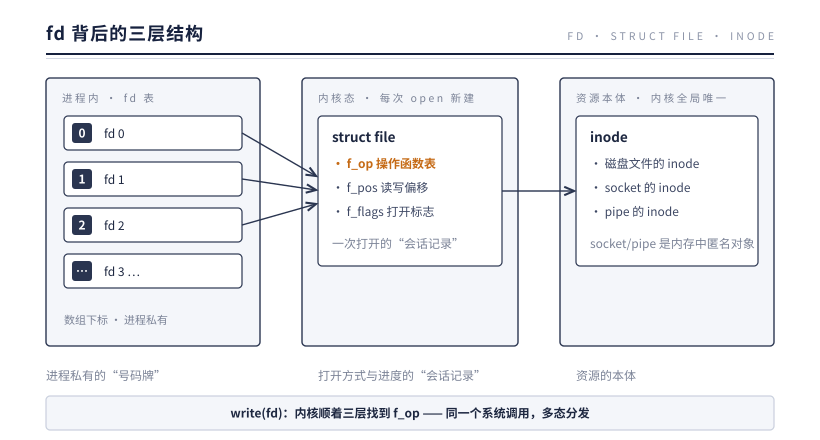
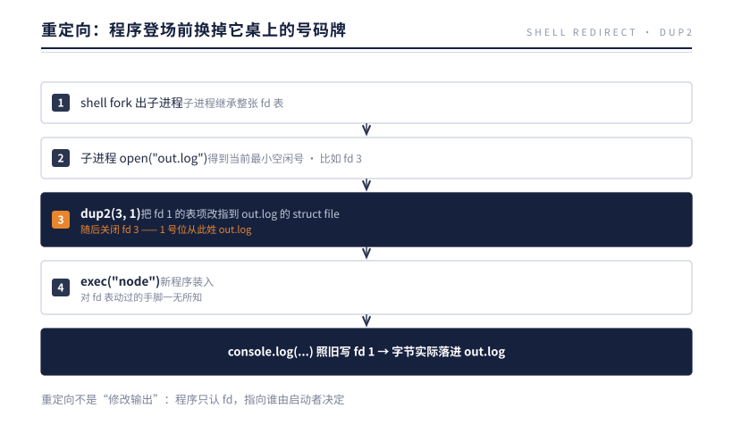
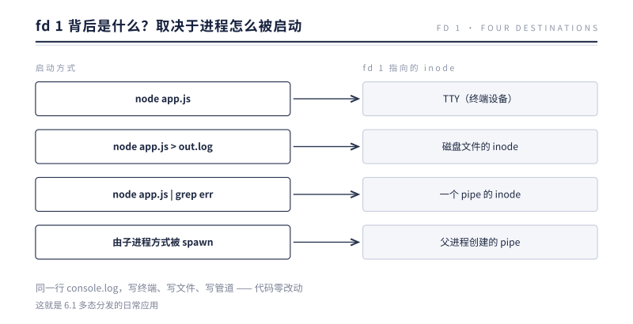
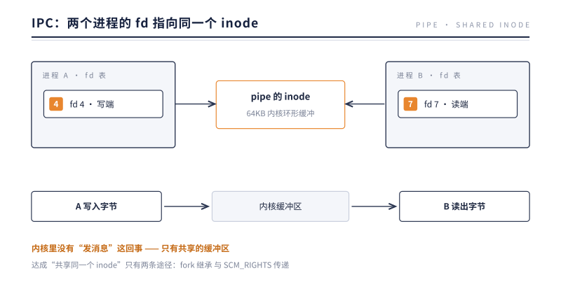
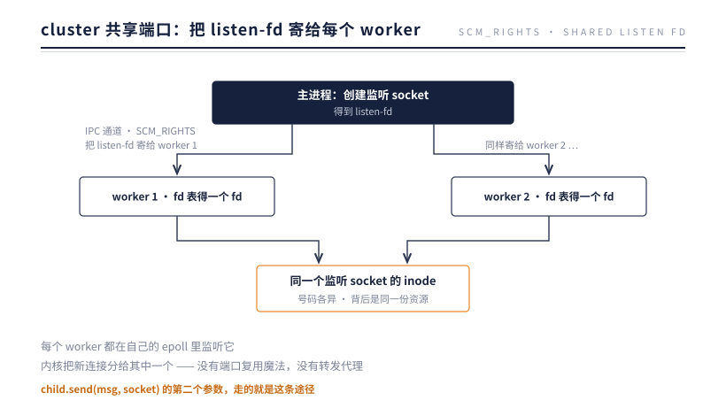
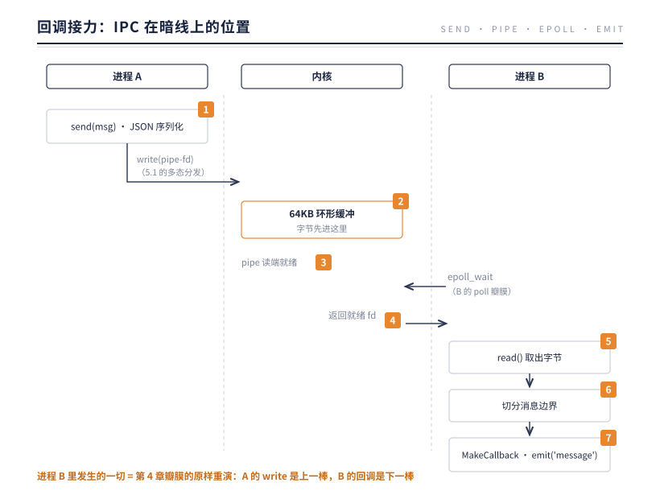
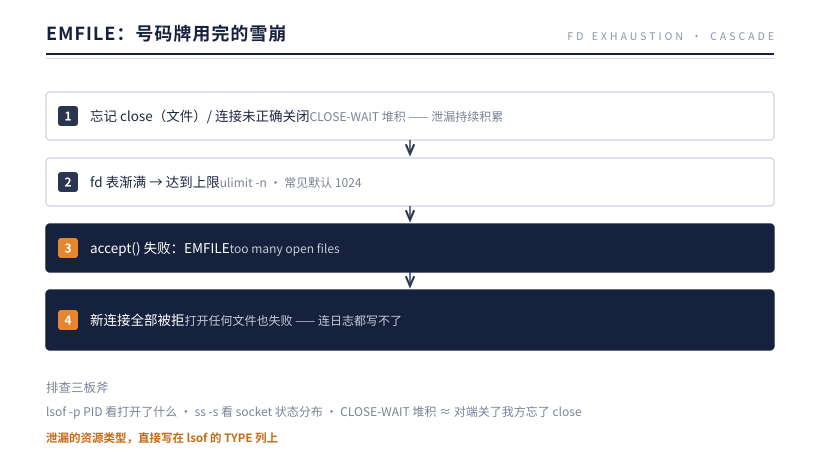

# 第 6 章 fd：内核眼中的万物

> **本章问题**：磁盘文件、网络连接、进程间管道——物理形态毫无共同点的三种东西，为什么在内核里共用同一种"号码牌"（fd）和同一套 read/write 接口？

## 6.1 fd 不是资源，是遥控器

先纠正一个直觉：fd（file descriptor，文件描述符）不是文件，也不是连接。**它只是一个整数**——你的进程内部一张表的下标。

真实的结构是三层：



| 层 | 归属 | 它是什么 |
|----|------|---------|
| fd | 进程私有 | 数组下标。你的 fd 3 和别的进程的 fd 3 毫无关系 |
| struct file | 内核，每次 open 新建 | 一次"打开会话"：记录读写位置、打开标志，最重要的是持有 **f_op——这类资源的操作函数表** |
| inode | 内核全局 | 资源本体。磁盘文件的 inode 在磁盘上；**socket 和 pipe 的 inode 是内核内存里的匿名对象**——它们没有磁盘实体 |

这就解开了本章问题的一半："**一切皆文件"不是说万物真是文件，而是说内核为万物提供了统一的访问协议。** 你调用 `write(fd)`，内核顺着三层找到 f_op 函数表，磁盘文件的表里挂的是文件系统的写函数，socket 的表里挂的是网络协议栈的发送函数——**同一个系统调用，多态分发**。这是 C 语言写就的"面向接口编程"。

## 6.2 三种通道，一套模型

管道、Unix 域套接字、TCP socket——三种进程间/机器间通道在内核里的差异，只在 inode 类型与寻址方式：

| 通道 | inode 背后是什么 | 怎么找到对方 | 数据走哪 |
|------|----------------|-------------|---------|
| 匿名管道（pipe） | 一块 64KB 的内核环形缓冲区 | 无名无址，靠 fork 继承 | 内核内存拷贝 |
| Unix 域套接字 | 内存中的 socket 对象 | 文件系统路径（如 `/tmp/app.sock`） | 内核内存拷贝，无协议栈开销 |
| TCP socket | 内存中的 socket 对象 | IP:端口 | 完整 TCP/IP 协议栈，可跨机器 |

看出规律了吗？**从 pipe 到 Unix socket 到 TCP，是同一个抽象在不断扩大寻址范围**：从"仅限父子进程"到"同机任意进程"到"全球任意机器"。而读写接口从头到尾没变过。

Node.js 在上层忠实地保留了这个统一性：`net.Socket` 一个类同时服务 TCP 与 Unix 域套接字（构造时给 port 就走 TCP，给 path 就走 Unix socket）；在 C++ 层，TCPWrap 与 PipeWrap（第 3 章见过的亲兄弟）都继承自同一个流式基类，共享同一套 libuv 读写代码。**内核统一了一次，libuv 又统一了一次，Node.js 再统一一次——三层统一叠加，所以你学一套 Stream API 就能操作所有通道。**

## 6.3 stdio：每个进程与生俱来的三个 fd

每个进程出生时自带三个打开的 fd：0（stdin）、1（stdout）、2（stderr）。`console.log` 的本质就是往 fd 1 写字节。

### 为什么恰好是 0、1、2？

这不是魔法数字，而是两条机制叠加的必然：

1. **`open()` 永远返回当前最小的空闲 fd**——号码牌从 0 发起，先来先得；
2. **进程启动时，启动者（shell 或父进程）按"输入、输出、错误"的顺序先开好三个通道**——它们自然落座 0、1、2。

这套约定来自 Unix 的创世年代：把"程序从哪读、往哪写、错误往哪喊"三件事提前固定，程序本身就无需关心答案。**stdio 是写在进程出生证明上的前三个条目。**

### 重定向的本质：fork 与 exec 之间的偷梁换柱

既然 fd 只是表项下标，那么"把输出送进文件"就不需要改程序——只需要改表。shell 执行 `node app.js > out.log` 的全过程：



管道同理：`node app.js | grep err` 是先把 fd 1 改指到管道写端。**重定向不是"修改输出"，而是在程序登场前换掉它桌上的号码牌**——5.1 的三层结构在这里第一次显出威力：程序只认 fd，指向谁由启动者决定。

于是那个有趣的问题有了完整的问法：**fd 1 背后的 inode 是什么？** 答案取决于进程怎么被启动：



同一行 `console.log`，写终端、写文件、写管道——代码零改动。这就是 6.1 节多态分发的日常应用。

### 缓冲：stdio 的脾气

三个 fd 之上，C 标准库还包了一层带缓冲的流（stdin/stdout/stderr 这两个名字就是它起的），缓冲策略按对面 inode 的类型分档：

| fd | 对面是 TTY | 对面是管道/文件 |
|----|-----------|----------------|
| stdout | 行缓冲（见换行就刷） | 全缓冲（攒够一块才刷） |
| stderr | 无缓冲（立刻就写） | 无缓冲（立刻就写） |

这套半个世纪前的策略至今仍在制造事故：日志走管道时被全缓冲攒住，进程崩溃前最后几行日志悄悄丢失——锅不在日志库，在缓冲。stderr 不缓冲的理由同样古老：错误是给人看的遗言，攒着不发可能永远发不出去。

Node.js 继承了这份遗产，又叠了自己的一层：内部按 inode 类型选择包装（TTY 用 TTYWrap，管道用 PipeWrap，文件直接写），并因此出现一个著名行为差异——**stdout 指向 TTY 时写入是同步的（保证你能看到日志），指向管道时可能是异步的**。

## 6.4 IPC 的全过程：共享 inode

现在到了本章最有杀伤力的推论。所谓"进程间通信"，听起来像进程 A 给进程 B "发消息"。但内核里根本没有"发消息"这回事，只有：

**两个进程的 fd 表里，各有一个 fd 指向同一个 inode。**



达成"共享同一个 inode"只有两条途径。我们把第一条的全过程完整走一遍。

### 途径一：fork 继承——child_process.fork 的四步诞生礼

**第一步·建管。** `pipe()` 系统调用一次返回**一对 fd**——读端与写端，指向同一个 64KB 内核环形缓冲区。此时它们还在父进程自己手里，自我对话毫无意义。

**第二步·分端。** fork 后，子进程复制父进程的整张 fd 表（5.1：复制的是"指向"）——父子各持这对 fd 的副本。父关掉自己用不到的一端、子关掉另一端，一条单向管道成形；要双向对话，就建两对。

**第三步·交接号码。** 子进程怎么知道"通道在几号 fd"？fd 号是进程私有下标，但 fork 继承保证了**同一号码指向同一对象**——所以父进程只需把这个整数当数据递过去。`child_process.fork()` 正是这么做的：fork 时设下环境变量 `NODE_CHANNEL_FD=3`，子进程启动时读这个变量，拿 3 号 fd 入座。交接的是号码，继承的是指向——5.1 三层结构的又一次直接应用。

**第四步·刻出消息边界。** 管道是字节流：内核只保证字节**不少、不乱序**，不保证"一次写"对应"一次读"。你调用的 `child.send({...})` 经 JSON 序列化后写进这个 fd，对端必须自己把字节流切回一条条消息（默认按行分隔的 JSON；advanced 序列化可携带更多类型）。**消息边界从来是应用层自己刻的，内核不管。**

### 途径二：SCM_RIGHTS 传递（把 fd 寄给别人）

更神奇的一条：Unix 域套接字允许把**一个已打开的 fd 本身**作为控制消息发给另一个进程。内核收到后，在接收方的 fd 表里新建一个条目，指向**同一个 struct file**。号码可能变了（你的 fd 5 到对方那里可能是 fd 9），但背后是同一份资源。

这就是 cluster 模块多个 worker 共享同一个 80 端口的全部秘密：



没有端口复用魔法，没有转发代理，只是**同一个内核对象被多个进程的 fd 指着**。你在 `child.send(msg, socket)` 里传入的第二个参数，走的就是这条途径：消息走数据通道，句柄走控制通道，同一次 send 里兵分两路。

### 回调接力：IPC 在暗线上的位置

把第 2、3 章的机制装进来，看一次 `child.send` 的完整旅程：



看明白了吗：**进程 B 里发生的一切，就是第 4 章七个瓣膜的原样重演**——poll 醒来、MakeCallback 三段式进场、回调执行。所谓 IPC，不是某种新机制，而是**回调在两个进程之间的接力**：A 进程的 write 是上一棒，B 进程的回调是下一棒，交接棒是那根共享 inode 的管子。回调一生的第三站"喂数"，喂的就是这棒数据。

再进一步：TCP 通信的本质，是两台机器的内核各维护一个 socket inode，通过网络协议同步彼此的缓冲区。所以——**网络通信就是跨机器的 IPC，IPC 就是同机器的网络**。第 5 章两条 I/O 路在这里合流成一句话：一切通信都是"往共享的内核对象里写字节"，而每一次写字节的终点，都是某个进程里一个等待放行的回调。

## 6.5 号码牌会用完：EMFILE

fd 表有上限（`ulimit -n`，常见默认 1024）。每个连接、每个打开的文件、每个管道都占一个号。泄漏的后果是雪崩式的：



排查三板斧：`lsof -p <pid>` 看进程打开了什么（类型一列直接暴露泄漏的是文件还是 socket）；`ss -s` 看 socket 状态分布；CLOSE-WAIT 大量堆积几乎总等于"对端关了，我方忘了 close"。这正是前言里那次线上事故的完整答案。

## 6.6 实验：一张表，三种东西

6.1 的三层结构听起来抽象。那就打开一个进程，让它同时持有三种资源，把 fd 号打印出来——不看示意图，看进程自己的账本：

```js
const fileFd = fs.openSync('demo.txt', 'w');      // 文件
const cat = spawn('cat');                          // 子进程 stdio → 三根 pipe
// 再建一个 TCP 监听 + 一次客户端连接，各自记下 fd 号
```

实测输出（Node 24）：

```
stdio 0/1/2：与生俱来
文件           fd = 11
listen         fd = 15
TCP client     fd = 17
TCP server 端  fd = 19
cat stdin/stdout/stderr pipe fd = 14, 16, 18
—— 全是整数，查的是同一张表 ——
```

三个观察。第一，文件、socket、pipe 的号码是**交错**的（11、14、15、16、17、18、19）——如果每种资源各有各的编号体系，号码不会交错；交错证明它们领号时查的是同一张表。第二，一次 TCP 连接占两个号——client 17、server 端 19——因为两端各是一次独立的打开会话，恰好同处一个进程、同一张表。

第三个观察最妙，要把号码的来龙去脉串起来看。`spawn('cat')` 建三根管道，`socketpair` 每根都成对发号：父进程留下的一端是 14、16、18，子进程那端先借坐了 15、17 等号，fork 之后在父进程里被关掉、腾出。随后建的 listen 恰好拿到 15，client 恰好拿到 17——**正是刚被腾出的那两个号**。一条规则同时被实证了两次：open 永远发当前最小的空闲号；号码只是座位，谁坐过不影响下一个入座。**fd 表记的是座位，不是资源**——这正是 6.1 "fd 不是资源，是遥控器"的字面含义。

顺带回答一个容易好奇的问题：0 到 10 这前十一个号被谁坐了？答案是引擎自己的家当——kqueue/epoll 实例、信号管道、内部计时器等。Node 进程出生时，stdio 三件套之外还有一批"内部 fd"先占了座，所以用户代码第一次 open 拿到的号往往不是 3。这也是为什么排查泄漏时要先记住进程的"基线 fd 数"：基线之上的增量才是你的账。

再实证一次"换牌"。spawn 子进程时把 fd 1 改指一个文件：

```js
const outFd = fs.openSync('child-out.log', 'w');
spawn('node', ['-e', 'console.log("我写进了 fd 1")'],
  { stdio: ['ignore', outFd, 2] });
```

```
child-out.log 内容 = "我写进了 fd 1"
```

子进程代码只管往 fd 1 写，字节落进哪个文件，是父进程发牌时决定的。**程序只认号码，号码的含义由启动者决定**——6.3 的 dup2 换表，这里是 Node API 形态的实证。同一招正是容器与守护进程的地基：systemd 把服务的 stdout 接到 journal，Docker 把容器的 stdio 接到日志驱动，被换牌的程序对此一无所知，也不需要知道。

最后摸表的上界。在子 shell 里把 fd 上限压到 64（改动仅限该子 shell，退出即恢复），让进程不停地打开 `/dev/null`：

```js
const held = [];
try {
  for (;;) held.push(fs.openSync('/dev/null', 'r'));
} catch (e) {
  console.log('已持有 fd 数:', held.length);
  console.log('错误:', e.code, '-', e.message.split(',')[0]);
  console.log('stdout 仍然可写（fd 1 早已在表里）');
}
```

```
已持有 fd 数: 53
错误: EMFILE - EMFILE: too many open files
stdout 仍然可写（fd 1 早已在表里）
```

64 个座位，stdio 与引擎内部先占掉 11 个（正好解释为什么用户首个 fd 是 11），第 54 次额外打开被拒。**EMFILE 不是"文件"用完了，而是号码牌表满了**——所以它爆发时 accept、socket、打开日志文件会一起失败，进程进入"什么都开不了"的瘫痪态。

两个补充事实。一，`ulimit -n` 有软硬两限：软限是进程当前受到的约束，硬限是软限能抬到的天花板；线上调 fd 上限，改的是 `/etc/security/limits.conf` 或 systemd 的 `LimitNOFILE`，临时 `ulimit` 只对当前 shell 生效。二，本机实验把上限压到 64 才撞墙，而很多发行版默认软限就是 1024——一台机器上跑几十个 Node 进程、每个进程上千连接时，1024 不是理论值，是真实的事故线。这是 6.5 的实验版，也是前言那次线上事故的案发现场。

回头把实验的收获折进 Node 的 API 设计。`fs.openSync` 返回的整数、`socket._handle.fd` 里的整数、child.stdio 背后的整数，是同一种东西——这就是为什么 Node 敢用同一套接口伺候它们：fs 模块读写它，net 模块读写它，child_process 传递它，libuv 把它们统统登记进 poll 的关注列表。若三种资源各有各的句柄类型，Node 就得造三套 API、三套事件循环适配层。**一个整数贯穿始终，才有了"一套 Stream 接口操作所有通道"的第 8 章**——统一性不是 Node 的设计品味，而是内核先递过来的底牌。

还有一个递归式的细节收尾。还记得实验开头那十一个被占掉的座位吗？其中就有 kqueue/epoll 自己的 fd——**负责"监视所有 fd"的那个机制，本身也是一个 fd，也坐在同一张表里**。第 4 章的事件循环靠 poll 驱动万物，而 poll 实例要被人监视（比如调试器、比如另一个 poll），照样得先领一个号。一张表管到底，没有例外——这种彻底性，正是本章标题"内核眼中的万物"的字面意思。

## 6.7 反方案对比：假如句柄不是整数

把"如果"认真推演一遍：假如内核不用小整数暴露资源，会怎样？推演反方案不是为了抬杠，而是为了看清手中这条路的形状——很多"理所当然"的设计，只有在对比里才显出它是被选出来的，而非唯一可能的。

历史给了镜子：Windows 的 HANDLE。Windows 句柄是对象管理器表格里的键——不透明的值，不保证是小整数，更不保证连续。代价随之而来：

| 能力 | POSIX fd（数组下标） | Windows HANDLE（不透明键） |
|------|--------------------|--------------------------|
| 批量等待 | fd 直接当位图下标，select/poll 天然成立 | select 只对 SOCKET 有效；WaitForMultipleObjects 上限 64 个对象 |
| 重定向 | dup2 一次调用把任意 fd 挪到任意号码 | 无对应物，子进程重定向只能在创建时经 STARTUPINFO 搭好 |
| 继承 | fork 复制整张表 + close-on-exec 标志，规则一条 | 继承属性在创建句柄时逐个标记，易误继承，是沙箱逃逸的常客 |

不透明句柄的收益是真实的：内核可以自由更换句柄背后的结构，调用者也难以凭号码猜出内部布局。但看 POSIX 用整数换回了什么：select/poll/epoll——第 4 章的七个瓣膜全部立在"fd 是下标"之上；dup2 重定向；fork 继承；6.4 的 SCM_RIGHTS 寄号码。**Unix 的 I/O 与 IPC 大厦，整体盖在"小整数"这块地基上。** 连 libuv 在 Windows 上运行时，都要为 Windows 句柄再造一层 fd 模拟，好让同一套事件循环代码跑起来。

值得多看一眼的是 Windows 自己的补救。WaitForMultipleObjects 的 64 上限把"批量等待"的路堵死之后，Windows 没有沿着"句柄下标化"的方向修补，而是另起炉灶：I/O 完成端口（IOCP）不再问"哪些句柄就绪了"，而是让内核直接把"完成的事件"投递到队列里。第 5 章说过两条 I/O 之路——就绪通知与完成通知——在操作系统层面，这正是两种哲学的原生样本：POSIX 押注"fd 可索引"，把就绪集合当成下标数组来回传；Windows 放弃索引，改发事件。Linux 近年的 io_uring 也在向完成通知演化，但它提交与完成用的环形队列，索引的仍是 fd——新瓶里装的还是旧编号。

公允地说，整数 fd 也有自己的账单。号码会被复用，close 之后的旧号码可能被新资源坐上——拿着过期 fd 写错对象，是经典的 ABA 事故，防御只能靠纪律（close 后置 -1、不长期缓存 fd）。号码还可预测，攻击者知道你的 fd 3 大概率是什么。这两笔账 Windows 用不透明句柄躲掉了，代价是前面那张能力表。设计世界里没有免费的午餐，只有明码标价的取舍。

还有一个不太被提起的红利：Unix 的"小工具 + 管道"哲学，整个长在整数 fd 上。shell 把 grep 的 fd 1 接到 sort 的 fd 0，两个互不相识的程序就能协作——组合不需要 API 约定，只需要"你把字节写进 1，我从 0 读"这一条契约。`ls | grep | wc` 之所以可能，正因为 fd 可继承、可重定向、可传递。Node 的 CLI 生态是这套哲学的直系后裔：从 stdin 读、往 stdout 写、错误走 stderr 的命令行工具，在 Node 世界里和 C 世界里一样自然——6.3 的 stdio 约定，在这里兑现成整个生态的可组合性。

收敛回本书的因果链：第 4 章说事件循环靠"一次 poll 拿到一批就绪 fd"驱动万物——"一批"之所以能用一个数组装下、用一次循环遍历，正因为 fd 是便宜的下标。**整数不是偷懒的设计，而是最好的接口：最便宜的比较、最便宜的索引、最便宜的传递。**

## 6.8 生产案例：每次 spawn 漏 3 个 fd

某图片处理服务，每个请求 spawn 一次压缩命令。某天起 EMFILE 告警，accept 开始拒连——症状与前言那次事故相同。按 6.5 的三板斧排查：

**第一步，lsof 看漏的是什么。** `lsof -p <pid>` 按类型分组：socket 数量平稳，无 CLOSE-WAIT 堆积——排除连接泄漏；异常增长的是 PIPE，单调上涨，从不回落。

**第二步，算增速。** PIPE 每秒增长约 3 个，与请求 QPS 完全吻合。**每个请求漏 3 个 fd——这个数字直接指向 child_process 的默认 stdio：stdin、stdout、stderr 各一根 pipe。**

这里值得停下来对比一下"另一种泄漏长什么样"。若是连接泄漏，lsof 涨的是 IPv4/IPv6 一行，`ss -s` 里 CLOSE-WAIT 堆积——对端已关、我方忘关，socket 卡在半个关闭态。而本案涨的是 PIPE，没有地址、没有状态机，`ss` 里干干净净——**泄漏的资源类型，直接写在了 lsof 的 TYPE 列上**。这一步的价值在于：它还排在"读代码"之前。很多排查一上来就扎进业务逻辑里猜，而 fd 的类型分布是免费的、确定的、一眼可读的证据，先把嫌疑范围从"全宇宙"缩到"进程间通道"，再往下查就快了。资源会说话，前提是你先问对问题。

**第三步，抓代码。** 罪魁一行：`spawn('sh', ['-c', 'convert input.jpg output.jpg &'])`。末尾的 `&` 本意是"后台跑快一点"。但机制无情：shell 立刻退出，真正的压缩子进程**继承**了 shell 的三根 pipe（6.4：fork 继承整张 fd 表）；pipe 是共享 inode，只要还有一个写端活着，父进程的读端永远等不到 EOF，三个 fd 永远不会关闭。每个请求埋掉 3 个号码牌，直到表满。

**处置**：去掉 `&`，让子进程正常退出，pipe 随 EOF 关闭；确需脱离的场景改用 `stdio: 'ignore'` 加 `detached` 加 `unref`。修复后压测验证：同等 QPS 下跑一小时，`lsof -p <pid> | wc -l` 稳定在基线附近轻微波动，不再单调上涨。曲线走平，案子才算结。

这个案例值得抽象一层。spawn 漏 fd 的同族形态至少还有两种：一是 `detached: true` 却保留默认 pipe stdio——子进程脱离控制了，管道却没脱离，父端的 fd 同样等不到 EOF；二是子进程活着但输出无人消费——stdout 的 64KB 内核缓冲写满后子进程阻塞，既不退出也不报错，fd 与子进程一起挂起，这是"僵尸进程 + 泄漏"的复合体。顺带解释"为什么恰好是 3"：stdout 走数据、stderr 走错误、stdin 走输入，三条通道各司其职——错误信息绝不能和数据流混在一根管子里，否则下游没法分辨哪段是结果哪段是遗言，这正是 6.3 里 stderr 不缓冲的同一条理由。一份设计决策，在三处留下指纹。**判别口诀只有一句：每根 pipe 的读端，最终能等到 EOF 吗？** 等得到，就会关；等不到，就是漏。

再往前一步是监控：fd 数是进程健康的一条生命线。把 `lsof` 计数或 `/proc/<pid>/fd` 目录长度做成指标，设两条线——缓慢上涨的斜率告警（泄漏在积累）、绝对值接近上限的水位告警（雪崩前夜）。等 EMFILE 告警响起来再查，服务已经拒连了。

点题：pipe 只是共享的 inode（6.4），fd 是有限的号码牌（6.5）。**发出号码牌时，永远要问一句：谁会把它还回来？** 第 13 章内存与诊断的句柄账，就是从这类案子开始记的。

## 6.9 本质小结

> **一句话本质**：fd 是进程手里的号码牌，inode 才是内核里的资源本体；"一切皆文件"是统一访问协议而非统一实体，一切进程间通信的本质都是让多个 fd 指向同一个内核对象——而通信的终点，是另一个进程里被瓣膜放行的回调。

要点：

1. **三层结构**：fd（进程私有下标）→ struct file（打开会话 + f_op 函数表）→ inode（资源本体）。
2. **write(fd) 是多态调用**——f_op 函数表按资源类型分发，这是 C 实现的面向接口编程。
3. **pipe / Unix socket / TCP 是同一抽象的三级寻址扩展**——Node 的 net.Socket 因此能一类通吃。
4. **stdio 的 0/1/2 不是魔法**——open 发最小号 + 启动者按序开三通道；重定向 = fork 后 exec 前的 dup2 换表；缓冲按对端类型分档，崩溃丢日志常是全缓冲的锅。
5. **IPC = 共享 inode**：fork 继承四步（建管、分端、NODE_CHANNEL_FD 交接号码、应用层自刻消息边界）与 SCM_RIGHTS 寄 fd 是唯二途径；cluster 共享端口 = 把 listen-fd 寄给每个 worker。
6. **IPC 是回调的跨进程接力**——对端的 poll 瓣膜醒来、MakeCallback 进场；A 的 write 是上一棒，B 的回调是下一棒。
7. **fd 是有限资源**——EMFILE 是雪崩式故障；lsof/ss 与 CLOSE-WAIT 是排查锚点。

## 下一章引子

fd 解决了"通道"的问题，但通道里流的是什么？

是字节。而这里有个断层：JS 语言里根本没有"字节"这个东西——字符串是 UTF-16 的抽象文本，数字是浮点数，对象是引用图。内核递过来的原始字节，JS 拿什么接？

下一章：Buffer——跨越两个世界的数据货币。

---

[← 上一章：两条 I/O 之路](../part-2-heartbeat/ch05-two-io-paths.md) | [下一章：Buffer →](./ch07-buffer.md)
