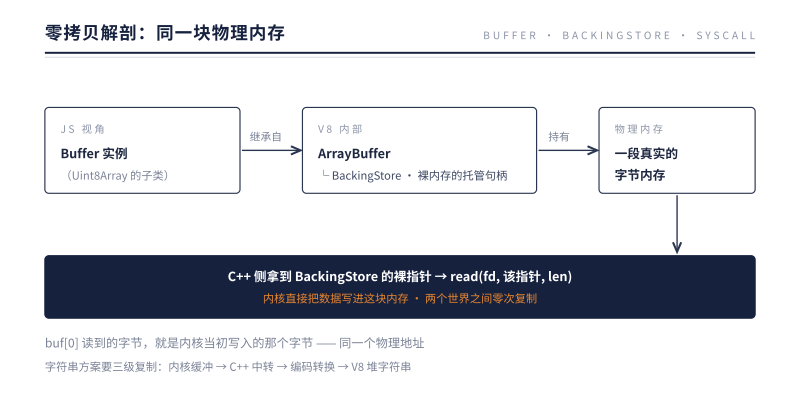
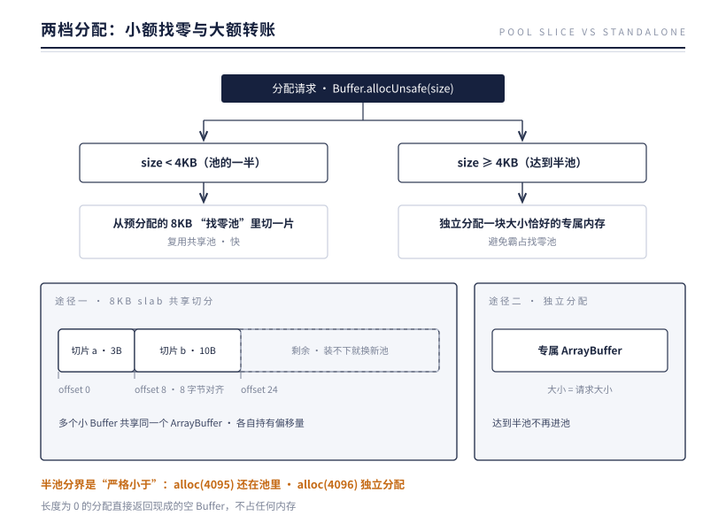

# 第 7 章 Buffer：跨越两个世界的数据货币

> **本章问题**：JS 里没有"字节"——字符串是抽象文本，对象是引用图。内核 read() 递出来的原始字节，JS 用什么接住？又怎么做到不拷贝？

## 7.1 两个世界的汇率问题

fd 的世界（内核）只认字节序列；JS 的世界只有字符串、数字、对象。两个世界要做生意，需要一种双方都认的"货币"。

字符串当不了这个货币。JS 字符串是不可变的 UTF-16 抽象——"字符"和"字节"之间隔着编码转换，而且每次转换都要新分配内存。拿字符串装二进制数据（图片、压缩包、TCP 报文），既失真又低效。这正是 Node.js 诞生之初（2009 年，早于 ES6 的 TypedArray 标准化）就自造 Buffer 的原因。

Buffer 就是那个货币：**一段定长的原始字节序列，JS 可以读写它，C++ 和内核也可以读写它——而且是同一块物理内存。**

## 7.2 零拷贝的解剖

现代 Buffer 建立在 V8 的类型化数组体系上：



关键在最后一行：C++ 层能从 BackingStore 拿到裸指针，**直接把这个指针交给 read/write 系统调用**。数据从内核到 JS 可见，中间零次复制——JS 里 `buf[0]` 读到的字节，就是内核当初写入的那个字节，同一个物理地址。

这与"字符串方案"的差距是本质性的：字符串方案每次 I/O 都要"内核缓冲 → C++ 中转 → 编码转换 → V8 堆字符串"三级复制；Buffer 方案一步到位。**Node.js 高吞吐 I/O 的物理基础就在这里。**

编码转换被推到了明确的边界上：只有你显式调用 `buf.toString('utf8')` 或 `Buffer.from(str)` 时才发生转换，转换成本可见、可控（内部使用 SIMD 加速的库做 UTF-8 转换，接近硬件极限速度）。

## 7.3 分配策略：小额找零与大额转账

高频 I/O 意味着高频分配 Buffer。为不同大小的分配逐一向系统要内存，开销与碎片都难看。Node.js 的对策是两档分级：



- **找零池（pool）**：Node 预先分配 8KB 的池子（`Buffer.poolSize = 8 * 1024`），小额请求直接从池里切片——多个小 Buffer 共享同一个底层 ArrayBuffer，各自持有偏移量，切片大小按 8 字节对齐；池内剩余空间装不下新请求时，换一个新池。
- **半池分界线（4KB）**：请求达到池的一半还从池里切，一刀下去池子所剩无几，其他小请求被迫频繁换池，边角料大量浪费——所以大额直接独立分配。
- 长度为 0 的分配直接返回现成的空 Buffer，不占任何内存。

### alloc 与 allocUnsafe：一字之差的安全含义

池里的内存是**复用的**——切给你的那片可能残留着上一个 Buffer 的旧数据（可能是别人的密码、令牌）。所以：

- `Buffer.alloc(size)`：清零后交付。安全，稍慢。
- `Buffer.allocUnsafe(size)`：直接交付，不清零。快，但**必须立刻完整覆写**，否则旧数据会泄漏——安全事故名单上有真实案例。

内部 I/O 路径大量使用 allocUnsafe（因为读操作马上会覆写全部内容），应用代码没有确定的覆写把握时，请用 alloc。

## 7.4 Buffer 的日常形态

```js
const b1 = Buffer.from('héllo', 'utf8');   // 字符串 → 字节（发生编码转换）
b1.length;                                  // 6（字节数，不是字符数！é 占 2 字节）

const b2 = b1.subarray(0, 2);               // 切片：共享底层内存，零拷贝
b2[0] = 0x48;                               // 改切片 = 改原 Buffer（同一块内存）

const b3 = Buffer.concat([b1, b2]);         // 拼接：这个必须拷贝（新内存）
b1.readUInt32BE(0);                         // 按大端序把前 4 字节读成整数（解析二进制协议）
```

三个高频误区：

1. **length 是字节数不是字符数**——多字节字符（中文、emoji）会让两者不同；按 length 截断 UTF-8 字符串可能把一个字符拦腰斩断，产生乱码。
2. **subarray/slice 共享内存**——省拷贝，但也意味着"保留一个小切片会拖住整个大 Buffer 不被回收"，长期持有请用 `Buffer.from(slice)` 复制出去。
3. **Buffer 的内存大部分在 V8 堆外**——BackingStore 是堆外分配，堆快照里看不到大头，要用 `process.memoryUsage().arrayBuffers` 观察。

## 7.5 实验：两档分配，逐一实测

7.3 的两档分级不是猜想，每一条都可以实测。在一个新进程里运行：

```js
console.log(Buffer.poolSize);                              // 池有多大
const a = Buffer.allocUnsafe(3);
const b = Buffer.allocUnsafe(10);
console.log(a.buffer === b.buffer);                        // 是否共享同一块底层内存
console.log(b.byteOffset - a.byteOffset);                  // 对齐留下的间隔
console.log(Buffer.allocUnsafe(4095).buffer.byteLength);   // 差一分到半池，还进池吗
console.log(Buffer.allocUnsafe(4096).buffer.byteLength);   // 恰好半池呢
```

实测输出（Node 24）：

```
8192
true
8
8192
4096
```

五个数字读出四件事。一，池确实是 8KB。二，`a.buffer === b.buffer` 为 true——**两个小额 Buffer 共享同一个底层 ArrayBuffer**，所谓"切片"，就是同一块 slab 上记下各自的 byteOffset。三，a 只要 3 字节，b 却从第 8 字节才开始：切片按 8 字节对齐，3 被抹成 8。四，也是最重要的一条分界线：4095 字节的请求，底层仍是 8192 的 slab——还在池里；4096 字节的请求，底层恰好是 4096——独立分配。**半池分界是"严格小于"：等于半池就不再进池。**

为什么对齐到 8 字节？因为同一块 slab 之后可能被当作别的视图打开——Float64Array 要求 8 字节对齐，Int32Array 要求 4 字节。如果切片从任意偏移开始，某些数值视图就会因对齐不合法而建不起来。8 是所有常见数值类型对齐要求的公倍数，一刀切到 8，任何视图都合法。代价是每次小额分配平均浪费几个字节——用几字节的边角料，换整个视图体系的成立，这笔账划算。

还有一条容易被忽略的统一性：这套两档路由对 `alloc` 与 `allocUnsafe` 一视同仁。alloc(3) 同样从池里切，allocUnsafe(4096) 同样独立分配——**分级路由管的是"内存从哪来"，alloc 与 allocUnsafe 的区别只在"切下来之后擦不擦干净"**。前者是性能问题，后者是安全问题，两条轴互不干涉。7.7 的事故，正是第二条轴失守的故事。

一个诚实的提醒：第一个小额 Buffer 的 byteOffset 绝对值每次运行都不同（实测有 0，也有 32），因为引擎启动过程自己也在用池。所以实验看的是上面这些不随运行漂移的相对关系。7.3 那张图，到此被数字逐条验收。

加餐一个反面实验，验收 7.4 的第二个误区——切片共享内存的代价（`node --expose-gc`）：

```js
let big = Buffer.allocUnsafe(16 * 1024 * 1024);   // 16MB
let slice = big.subarray(0, 1);                    // 只留 1 字节
big = null; global.gc();
console.log(process.memoryUsage().arrayBuffers);   // 大 Buffer 回收了吗
slice = null; global.gc();
console.log(process.memoryUsage().arrayBuffers);   // 现在呢
```

```
16777216    （big=null 且 gc 之后：16MB 纹丝不动）
0           （slice=null 且 gc 之后：全部归还）
```

1 字节的切片，拖住 16MB 的 slab 不放——因为切片不是复制，它就是原 Buffer 的一段视图，底层 BackingStore 只有一个，引用计数不关心你引用的是全貌还是一角。**共享是双刃：省拷贝的那一面朝性能，拖回收的那一面朝内存。** 长期缓存小片段，请用 `Buffer.from(slice)` 复制出去；而"arrayBuffers 居高不下"这笔账，正是第 13 章内存与诊断要翻的账。

最后验证一个隐藏事实：池的大小不是刻在石头上的。`Buffer.poolSize` 是一个普通属性，改了立即对后续分配生效：

```js
Buffer.poolSize = 64 * 1024;                      // 池改为 64KB
console.log(Buffer.allocUnsafe(30000).buffer.byteLength);
```

```
65536
```

30000 字节的请求在默认 8KB 池下会独立分配，池改到 64KB 后它小于新的半池线（32KB），于是回到池里切。**规则跟着参数走：变的从来不是"严格小于半池就进池"这条规则，只是半池的刻度。** 生产里很少需要动它——默认的 8KB 是小额高频场景的经验值——但这个开关的存在本身说明：两档分配是策略，不是宿命。

那为什么默认恰好是 8KB？两头都有墙。池开得太小，小请求三两口就把池吃光，频繁换新池等于把"复用"做没了，分配退化成一次次向系统要内存；池开得太大，一个用了一半的池会长期占着整块内存不放——7.4 说过，保留一个小切片就拖住整个底层 ArrayBuffer，池越大，这笔拖累的绝对值越高。8KB 落在中间：装得下一批典型的小 I/O 缓冲（HTTP 头部、日志行、协议帧），又不至于让任何一个半空的池成为内存钉子。而"半池分界"与它配套：请求达到池的一半就单飞，保证池永远留给真正的"小额找零"。**两个数字是一对：池的大小决定找零的抽屉多大，半池线决定多大的钱不找零。**

## 7.6 反方案对比：假如字节由字符串来装

Buffer 在今天看来理所当然，但把它放回 2009 年，认真推演两个"更顺理成章"的替代方案，才看得清它为什么必须是这个形状。

**方案一：用 JS 字符串装字节。** 三笔账。其一，编码歧义：字符串是文本，文本有编码，而二进制数据里任何字节组合都合法——一段 JPEG 里的 0xFF 序列按 UTF-8 解读是非法字符，强行进出字符串就被替换、被损坏。其二，不可变：I/O 是持续的追加与拼装，字符串每次拼接都要新建对象、全量复制；一个 1GB 的文件按块拼回字符串，总复制量是块数的平方级——数据还没读完，内存先被中间产物吃光。其三，UTF-16 税：JS 字符串按 UTF-16 存储，一字节的二进制数据要占两字节内存，直接翻倍。历史并非没有走过这条路：早期 Node 里 'binary' 编码的字符串与 Buffer 并存过一段时间，吞吐对比之后才全面倒向 Buffer；浏览器用字符串搬运 XHR 二进制响应的痛苦，最终催生的是 ES6 的 ArrayBuffer 与 TypedArray。**语言标准 2015 年补的课，正是 Node 2009 年独自走过的路**——而 7.2 说 Buffer 后来重建为 Uint8Array 的子类，就是两条路会师后的风景。

**方案二：字节容器照造，但每次 I/O 都拷贝一份给 JS。** 内核缓冲 → C++ 中转 → JS 私有副本，两次复制，吞吐对折，GC 还要负责搬运尸山。这方面的镜子是 Java：堆内 `byte[]` 由 GC 管理，地址会移动，JNI 拿不到稳定指针，做 I/O 前往往要先拷一份；于是 NIO 引入 DirectByteBuffer——堆外分配、地址稳定、可与内核直通。堆内 byte[] 与堆外 DirectByteBuffer 的二分，与"字符串与 Buffer"是同款二分。框架层也投了同样的票：Netty 高性能路径用的是池化的堆外 ByteBuf，理由与 Node 的找零池如出一辙——复用、直通、免拷贝。**不同语言、不同年代，高性能 I/O 反复收敛到同一个答案。** Java 也付了对应的代价：堆外内存不受 GC 直接管辖，漏了难查——与 7.4 那条"堆快照里看不到大头，要看 arrayBuffers"是同一种病，第 13 章内存与诊断的账本会专门对付它。

两个反方案从不同方向收敛到同一个结论：**两个世界做生意，必须有一种双方共享的货币——共享同一块物理内存不是性能优化，而是零拷贝的唯一解。**

推演到此会冒出一个新问题：既然 ES6 把 TypedArray 标准化了，Buffer 为什么没有退场？因为 TypedArray 只解决了"字节容器"，没解决"汇率"。`buf.toString('utf8')`、`Buffer.from(str, 'latin1')`、按大端小端读写整数的 readUInt32BE——这些编码边界的操作，Uint8Array 一概没有；找零池也不在标准的职责范围内。于是结局不是替换而是分层：**Buffer 成为 Uint8Array 的子类，物理层并入标准，汇率层继续由 Node 持有。** 反方案的终局不是淘汰胜者，而是被胜者收编。

## 7.7 生产案例：上一个请求的秘密，藏在你的响应里

先在实验室里复现（Node 24，`node --expose-gc`）：

```js
const SECRET = 'token=eyJhbGciOiJIUzI1NiJ9.PASSWORD';
let buf = Buffer.allocUnsafe(16 * 1024);
buf.write(SECRET);                       // 请求 A 写入敏感数据
for (let i = 0; i < 50; i++) {
  buf = null; global.gc();               // 释放——内存归还，但没人清零
  buf = Buffer.allocUnsafe(16 * 1024);   // 下一个请求重分配同尺寸
  if (buf.toString('latin1', 0, 6) === 'token=') {
    console.log('命中，第', i + 1, '次重分配');
    break;
  }
  buf.write(SECRET);                     // 这块也写脏，循环继续
}
```

```
命中，第 4 次重分配
```

新申请的 Buffer，开头正是上一个请求写入的 token——实测数次之内必然命中。**分配器归还的内存不清零，allocUnsafe 交付前也不清零，两个"不清零"叠加，残留直达用户。** 单次分配常常拿到全新的内存页（那是清零的假象），残留出现在内存被循环复用的路径上——而服务跑得越久，复用越频繁。

把它放大成一次真实事故。某文件代理服务这样转发小文件：

```js
const buf = Buffer.allocUnsafe(64 * 1024);
const n = fs.readSync(fd, buf, 0, buf.length, 0);
res.end(buf);                 // 漏洞：把整个 64KB 都发了出去
```

两个错误叠加：buffer 开得有富余；响应长度与实际读到的字节数脱钩。文件不足 64KB 时，尾部装的是池里残留的旧字节——**请求 B 收到的响应体里，混着更早的某个请求读过的文件内容**。安全团队抽查比对发现异常，并可稳定复现。

最初的线索来自用户投诉：下载的 PNG 图片"时好时坏"。坏图的特征很规律——文件头几个字节完全合法（魔数、尺寸、色深都对），校验工具却报尾部损坏。头对尾错，说明读取与封装分了两半：头是这次请求真实读到的，尾是别的什么东西。这个特征几乎是指着"buffer 有富余且没按实际长度截断"说的——**字节的分布形态，本身就是诊断信息。**

值得问一句：单元测试为什么没拦住？因为测试用例用的样本文件恰好都大于 64KB——buffer 每次都被填满，残留永远没有出头的机会。泄漏只在"文件比 buffer 小"的分支上出现，而生产流量里小文件占七成。**漏洞藏在上游数据形状与下游缓冲尺寸的关系里，不读代码、不量分布，测试用例是猜不到这个维度的。**

再给爆炸半径画个界。哪些字节会被泄？取决于分配路径：小于 4KB 的请求走池，残留来自 slab 本身——slab 是一次性 malloc 出来的 8KB 整块，从头到尾没人清零，这个块若是曾经装过别的数据，从它切出的每个切片都连带继承；达到 4KB 的独立分配，残留直接来自 malloc 归还的旧块。服务跑得越久、流量越大，内存复用越频繁，命中残留的概率越高——所以这类事故有个阴险的时间特征：**刚发布时一切正常，跑上几小时后开始零星出现**，重启还能"治好"，于是被误判为偶发。

它的学名不陌生：缓冲区越界读（buffer over-read）——响应声明的长度超过了真实数据的长度，多出来的部分由相邻内存顶替。著名的 Heartbleed 漏洞同属此族，只是那里越界读的是 TLS 心跳包的相邻内存，这里越界读的是池里上一个租客的遗留物。**机制上，这都是"长度字段与有效数据脱钩"的代价**——Buffer 的 length 只记录字节数，不记录哪些字节是"有效的"；有效性的边界，必须由使用它的人自己守住。

**处置白名单。** 一，只发读到的字节：`res.end(buf.subarray(0, n))`——残留仍在内存里，但不再上线。二，纪律：应用代码默认用 `alloc`（清零交付）；`allocUnsafe` 只用在能证明"拿到后立即完整覆写"的路径上——Node 内部 I/O 是这种场景，业务代码通常不是。三，把纪律工具化：lint 规则禁用裸的 Buffer 构造写法，代码评审把"谁负责覆写"列为 allocUnsafe 的必答题。

最后补一道回归防线，把这次的教训固化成一条不变式：**响应的 Content-Length 必须等于真实数据长度**。一行断言就能写进集成测试：`assert.strictEqual(res.getHeader('Content-Length'), fs.statSync(path).size)`。注意防线要设在服务自己身上——指望网关或代理去修剪多余字节，是把正确性外包给了你控制不了的组件。

点题：Buffer 是共享的物理内存（7.2），池是复用的内存（7.3）。**快，是从"不清零"借来的；覆写的债自己不还，就会由下一个请求替你还。** 而下一章你会看到，正是这些一块块的 Buffer，被装进流水线、在水位线的约束下流向下游——货币造好了，接下来看它怎么流动。

## 7.8 本质小结

> **一句话本质**：Buffer 是 JS 世界与内核世界共享的同一块物理内存——JS 拿它当数组读写，C++ 拿裸指针递给系统调用，数据穿越两个世界零次拷贝；这是 Node.js I/O 性能的物理地基。

要点：

1. **Buffer = Uint8Array 子类 + BackingStore 堆外内存**——JS 可见、C++ 可指、内核可写，三方同址。
2. **编码转换只在显式边界发生**——toString/from 才转换，I/O 全程走字节。
3. **两档分配**：小于半池（4KB）从 8KB 找零池切片；达到半池独立分配；零长度返回共享空 Buffer。
4. **allocUnsafe 的残留数据是真实安全风险**——池内存复用，不覆写就泄漏。
5. **切片共享内存**——快，但会拖住大 Buffer 的回收；length 是字节数。

## 下一章引子

Buffer 解决了"一块数据"怎么表达。但真实世界的数据常常不是"一块"：一个 2GB 的日志文件、一条永不结束的 TCP 连接、一个边生成边输出的报表。

把 2GB 读进一个 Buffer？内存直接告急。何况 TCP 连接根本没有"读完"的那一刻。

我们需要的不是更大的桶，而是**流水线**：数据分成小块，来一块处理一块，处理完就放手。而流水线立刻带来新问题——上游来水太快、下游处理不动时，怎么办？

下一章：Stream 与它的灵魂——背压。

---

[← 上一章：fd——内核眼中的万物](./ch06-fd.md) | [下一章：Stream →](./ch08-stream.md)
