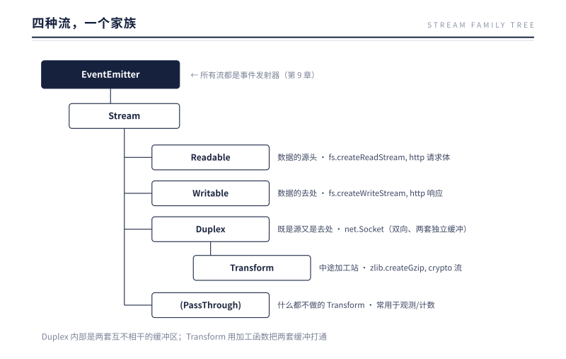
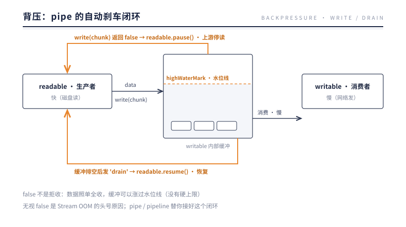

# 第 8 章 Stream：有限内存处理无限数据

> **本章问题**：一个 2GB 的文件、一条永不结束的 TCP 连接——数据比内存大、甚至没有尽头时，程序怎么处理它？以及：上游生产比下游消费快时，多出来的数据堆在哪？

## 8.1 从一次内存爆炸说起

一个文件下载服务最直观的写法：

```js
// 反面教材
http.createServer((req, res) => {
  fs.readFile('/data/2gb-video.mp4', (err, data) => {
    res.end(data);   // data 是一个 2GB 的 Buffer
  });
});
```

10 个并发请求 = 20GB 内存。进程死于 OOM。

问题不在 readFile，在于"**把数据当作一块**"的思维。数据其实可以是水流：从文件读一小块、发给客户端、放手、再读下一块——任何时刻内存里只有一小块。这就是 Stream：

```js
http.createServer((req, res) => {
  fs.createReadStream('/data/2gb-video.mp4').pipe(res);
});
// 内存占用：每连接几十 KB，与文件大小无关
```

fd 给了我们字节接口（第 6 章），Buffer 给了字节容器（第 7 章），Stream 在两者之上补齐五种能力：**分块、缓冲、背压、统一接口、标准事件**。前四个本章讲，"标准事件"的机制是下一章的主角。

## 8.2 四种流，一个家族



值得注意 Duplex 的结构：TCP socket 天然是双向的——你读到的和你写出的是两条独立的数据流。Duplex 因此内部持有**两套互不相干的缓冲区**，Readable 一套、Writable 一套。而 Transform 是特殊的 Duplex：写入侧进来的数据，加工后从读取侧出去——两套缓冲被一个加工函数打通。

每个流内部都有一个缓冲区和一条水位线（`highWaterMark`，字节流默认 64KB 或 16KB，视流类型而定）。缓冲区是"分块"与"背压"之间的减震器。

## 8.3 背压：Stream 的灵魂

### 问题

生产者和消费者速度几乎永远不相等。快磁盘读 → 慢网络发；快网络收 → 慢磁盘写。不加控制的话，差额会以每秒几十 MB 的速度在内存里堆积——OOM 只是时间问题。

### 机制

Stream 的解法是一套**自动的反向刹车信号**，核心只有两个约定：

```
约定一：writable.write(chunk) 有返回值
        true  = 缓冲区还有空位，继续来
        false = 缓冲区已到水位线，请停一停（数据我收下了，但别再发）

约定二：缓冲区排空后，writable 发出 'drain' 事件 = 可以继续了
```

pipe（以及现代的 `stream.pipeline`）把这两个约定接成了自动化闭环：



### 刹车一路踩到底层

真正精彩的是刹车不止步于 JS 层。`readable.pause()` 会向下传导：


**背压能穿透 JS、C++、内核，一路传到网线对面的发送端。** 从下载服务的慢客户端，到你的服务器，到上游的源站——整条链路上每一环的内存都被水位线约束着。这是"有限内存处理无限数据"的完整含义：不是靠更大的缓冲，而是靠**让整条流水线以最慢一环的速度运转**。

### 不用 pipe 时，你就是刹车

手写 write 循环时，忽略返回值等于剪断刹车线：

```js
// 反面教材：写入 1GB，无视返回值
for (const chunk of chunks) dest.write(chunk);   // 全部堆进内部缓冲区

// 正确姿势
const { once } = require('events');
for (const chunk of chunks) {
  if (!dest.write(chunk)) {
    await once(dest, 'drain');   // 等缓冲排空再继续
  }
}
```

内部缓冲区**没有硬上限**——highWaterMark 只是"建议停"的水位线，write 永远收下数据。所以"Stream 也会 OOM"的事故，几乎全是无视 false 造成的。

## 8.4 组装流水线

```js
const { pipeline } = require('stream/promises');

await pipeline(
  fs.createReadStream('access.log'),   // 源
  zlib.createGzip(),                   // 加工：压缩
  fs.createWriteStream('access.log.gz') // 汇
);
```

用 `pipeline` 而不是链式 `pipe` 的理由：pipe 不处理错误传播——链条中任何一环出错，其他环不会自动关闭，fd 与内存就地泄漏；pipeline 保证**任何一环失败，整条链全部正确销毁**，并把错误交给 await/回调。生产代码请默认 pipeline。

流水线上每个节点间流动的 chunk，就是上一章的 Buffer（objectMode 除外）。Buffer 管"数据是什么"，Stream 管"数据怎么流"——两章在此合拢。

## 8.5 实验：背压的两组实测

**第一组：write 什么时候返回 false。** 造一个慢速消费者，水位线 64 字节，连续写入 16 字节的块：

```js
const dest = new Writable({
  highWaterMark: 64,
  write(chunk, enc, cb) { setTimeout(cb, 50); },   // 每块消化 50ms
});
const rets = [];
for (let i = 0; i < 6; i++) rets.push(dest.write(Buffer.alloc(16)));
console.log(rets.join(' '));
console.log(dest.writableLength);                  // 内部缓冲实际长度
dest.on('drain', () => console.log('drain'));
```

实测输出（Node 24）：

```
true true true false false false
96
drain
```

前三块把缓冲垫到 16、32、48，都在水位线以下，返回 true；第四块垫到恰好 64，开始返回 false。注意第二行——**false 不是拒收**：六块数据全部被收下，缓冲涨到 96 字节，超出水位线的部分照样存在。false 只是一句"建议停"；什么时候恢复，由排空后的 drain 事件说了算。8.3 的两条约定，到此有了数字凭证。

为什么允许超过水位线？因为 write 的调用方形形色色，有人不看返回值——如果缓冲区设成硬上限，这些调用只能被拒绝或阻塞，数据就会丢或卡死在调用方。设计上选择了"全收 + 劝导"：数据不丢，压力通过返回值上报，是否响应由调用方决定。水位线的默认值也值得记一笔：net.Socket 是 16KB，fs 流是 64KB。这两个数字不是玄学——它们大致对应"一次系统调用批量搬运的合算尺寸"：太小则 syscall 次数爆炸，太大则内存与首字节延迟吃亏。8.6 会回到这个调参话题。

**第二组：无视背压与用好背压，内存差多少。** 生成一个 256MB 的文件，分别用两种姿势读完它：

```js
// 姿势 A：data 事件全攒进数组
for await (const c of fs.createReadStream(BIG)) chunks.push(c);

// 姿势 B：pipeline 直通 /dev/null
await pipeline(fs.createReadStream(BIG), fs.createWriteStream('/dev/null'));
```

实测输出（Node 24）：

```
全攒内存: 读入 256 MB, RSS = 312 MB
pipeline:  流过 256 MB, RSS = 75 MB
```

同样 256MB 的数据流过进程，内存占用相差四倍以上——而姿势 B 的 75MB 里大头还是进程自身的基线开销，流本身只占水位线规模。**内存占用与数据总量无关，只与水位线有关**：把实验里的 256MB 换成 8.1 那个 2GB 视频，就是事故与正常服务之间的距离。

两条曲线的形状才是重点。姿势 A 的 RSS 随文件线性上涨——文件多大，它就要多大，没有天花板；姿势 B 的 RSS 在爬过启动基线后走平，天花板就是水位线乘以在途的环数。**一个是斜率，一个是常数**。所以这个实验不必做到 2GB：256MB 时差四倍，2GB 时差的就是几十倍，趋势在第一个量级就已经定型。顺带说清 75MB 的构成——Node 进程本体约几十 MB、读写两侧各一条 64KB 水位缓冲、gzip 这类 Transform 再带自己的内部缓冲——全部加起来仍与文件大小无关，这正是"常数"二字的含金量。

还有一个容易被追问的细节：管道里流的那些 chunk，大小是谁定的？答案是——通常不由你定。fs 流的 chunk 来自底层一次 read 的实际返回，网络流的 chunk 来自内核一次交付的报文边界，都是"上游这一口喂多少就是多少"，水位线只决定攒到多少该劝停，不切割块本身。所以你会看到 chunk 忽大忽小，这正常。**块是水的自然形态，水位线是闸的刻度，两者不必一致。** 唯一的例外是 objectMode：开了它，chunk 不再是 Buffer 而是任意 JS 对象，水位线的计量单位也从字节换成"对象个数"——流水线还是那条流水线，只是流的不再是字节，而是值。这条支线本章不展开，知道它存在即可。

## 8.6 反方案对比：在"读完整"与"只管发"之间

Stream 的分块流动今天看来顺理成章，但把三个替代方案认真推演一遍，才知道它为什么恰好长成这样。

**方案一：读完整再发。** 8.1 已经算过这笔账：内存 = 数据量 × 并发数；而面对没有尽头的 TCP 连接、监控日志流，这个方案连起跑的资格都没有。

**方案二：分块，但无视下游，只管发。** 分块解决了"数据总量"，没有解决"速度差"。下游慢于上游时，差额在缓冲区里无上限堆积——OOM 只是换了个地点发生：从"一个大桶"换成"一个无底桶"。

**方案三：分块 + 同步等待。** 发一块，原地等下游消化完，再发下一块。内存是安全了，流水线也死了：每一环都在空转等待，吞吐退回串行水平。

Stream 的答案是中间道路：**highWaterMark 是"建议停"的水位线，不是堤坝**。write 永远收下数据——不丢；返回 false 只是劝上游暂停——不硬拒；drain 来了再恢复——留有余地。暂停与恢复之间有弹性，弹性才成其为流水线；而刹车之所以能真正生效，是因为它能逐层传导到底（8.3）：JS 的 pause → libuv 停读 → epoll 注销 → TCP 窗口收缩。

最后这一环暴露了背压的祖师。**TCP 滑动窗口就是背压本身**：接收方的通告窗口告诉发送方"我的缓冲区还剩这么多空间"，发送方的在途数据不得超过窗口；窗口缩到 0，发送方停发（零窗口），直到接收方腾出空间、重新打开窗口。write 返回 false，就是窗口缩到 0；drain，就是窗口重开。这套机制 TCP 已经运行了四十多年，Stream 只是把同一个思想从网线搬进了进程内存——8.3 里"刹车一路踩到底层"，正是进程内背压与 TCP 背压在 socket 处接通的那一刻。Node 没有发明背压，它认祖归宗。

再把镜头拉远一格，会发现背压不是某项发明的专利，而是一切可靠传输的公法。TCP 有滑动窗口；HTTP/2 有 stream 级的 flow control 帧，接收方用 WINDOW_UPDATE 逐个窗口地"续杯"；QUIC 把这套做得更细，流级与连接级双层限流。凡是"数据要完整、顺序要正确、内存又有限"的通道，最后都长出了某种形式的背压——**这不是设计品味问题，而是物理约束的必然形状**。Stream 的 write/drain 协议之所以显得"刚刚好"，正因为它是这条公法在进程内存里的一个特例。

落到实操，8.5 留的那个调参话题可以收口了。highWaterMark 的取值是一个三角权衡：调大，缓冲垫厚，吞吐更稳，代价是内存占用与首字节延迟一起涨；调小，内存省、延迟低，代价是上下游稍有速度抖动就频繁 pause/drain，切换开销占比升高。默认值（net 16KB、fs 64KB）是通用场景的折中；确需调整的判据只有一条——量，而不是猜：观察 drain 触发频率与内存水位，两头都舒服之前，每次只动一个参数。多数服务一辈子不需要碰它，需要碰的那一次，也请以测量为准。

这里藏着背压机制的一笔隐性开销，值得单独点名。每一次 pause 与 resume 都不是免费的：停读要下探到 libuv 与 epoll，恢复要重新登记，drain 本身也是一次事件分发——全都要过事件循环。水位线压得过低时，上游刚递一块就满、下游刚抽一口就空，流水线就在"停—走—停—走"里打摆子，吞吐没涨，事件循环先被切换本身喂饱了。**好的背压自带迟滞：攒到水位才停，排到水位以下才走，中间留出不打扰的余量。** 这与第 2 章忙循环的教训互为镜像——那边的代价是循环被独占，这边的代价是循环被琐碎占满，本质都是事件循环这份公共资源被低效消耗。

## 8.7 生产案例：打爆内存的下载接口

8.1 的反面教材，曾在生产中原样出现。某资源站的下载接口：

```js
fs.readFile(path, (err, data) => res.end(data));
```

**症状**：高峰期内存告警，RSS 锯齿状爬升到进程上限，OOM 被杀后自动重启；下载并发越大，死得越快——前言点过名的那场事故，主角就是它。

**第一步，拍片——堆快照居然干净。** 堆内对象没有异常大户。但 `memoryUsage()` 里 rss 高达数 GB——钱不在堆里花，花在堆外。这正是 7.4 的冷知识：**Buffer 的大头在 V8 堆外，堆快照看不见，要看 rss 与 arrayBuffers**。嫌疑人锁定：有人在堆外囤了大量字节。

**第二步，对账单。** 把 OOM 时间点与访问日志对齐：爬升段全部落在下载高峰；崩溃前活跃的请求指向同一个路由，文件都是 GB 级。并发数 × 单文件大小 ≈ RSS 增量——账对上了，每个下载请求都在内存里留了一整份文件。

这一步之后有个常见的歪路，值得点名。既然内存不够，那就加内存——把进程上限从 4GB 抬到 8GB，或者多铺两台实例分摊并发。症状确实会缓解几天，直到热门文件变大、并发再涨一档，同样的 OOM 原样复发，而且因为缓冲更深，崩溃前的爬坡期更长、牵连的请求更多。**内存泄漏型的故障，扩容只能改变爆炸的当量，不能拆除引信**——账单是按"并发 × 文件大小"复利记的，机器永远追不上。

**第三步，抓现行。** 该路由的代码就是上面那一行 readFile：先把整个文件读进一个 Buffer，再整体写回响应。十个并发下载 2GB 视频，就是 20GB 内存——比任何一台机器都大。8.1 说"10 个并发 = 20GB"，这里是它的实弹版。

**处置**：改一行。

```js
fs.createReadStream(path).pipe(res);
```

上线后单连接内存从"文件有多大"变成"水位线有多高"，RSS 从 GB 级回落到 MB 级并走平——机制与 8.5 第二组实测相同（312MB 对 75MB），而生产文件比实验文件大三个数量级。随后又升级成 pipeline 以堵错误路径上的 fd 泄漏（8.4），并加上 Range 支持断点续传——那是第 10 章 HTTP 的地盘。

验证要压着打才算数。修复后用 100 并发反复拉同一个 2GB 文件：RSS 爬过启动基线后锁死在百 MB 级，一小时无漂移；对照旧版本，同样压测下 4 分钟触顶 OOM。数据把"改对了"三个字钉死，才谈得上结案。

这个案子还留下一条监控经验：RSS 是进程级指标，看不出是哪个路由在吃内存——本案靠的是"OOM 时间点 × 访问日志"的交叉对账。更主动的做法是把内存观测做进请求级：慢请求日志里带上响应体大小，或对可疑路由做采样统计。**指标告诉你病了，账单告诉你病在哪——先量血压，再查账单**，第 13 章的这句口诀，本案从头到尾用了一遍。

最后看一眼生态的态度。express 的静态文件中间件、koa-send 这类成熟组件，内部无一例外是 createReadStream 加 pipe，还会顺手处理 Range、错误销毁与条件请求——它们不是凑巧这么写的，而是因为这一族事故在 Web 早期反复发生，答案早已沉淀进基础设施。**凡是"把文件交给响应"的场景，框架默认走流；手工 readFile 全量读，等于自愿放弃整个生态替你踩过的坑。** 这不是对 readFile 的否定——小文件、一次性读取、需要完整内容做解析时它仍是正解——边界只有一条：数据要直接穿过进程去往别处时，让它流过去，别让它留下来。

点题：**数据不是一块，而是一列；内存不靠扩容，靠流水。** 回看这三章的接力：第 6 章的 fd 给了通道，第 7 章的 Buffer 给了可以在通道里安全搬运的块，本章的 Stream 把块排成队列、装上水位线——三者合起来，才是"有限内存处理无限数据"的完整答案。

## 8.8 本质小结

> **一句话本质**：Stream 把"数据是一块"换成"数据是一列"，再用背压让整条流水线自动降速到最慢一环的速度——内存占用从此与数据总量无关，只与水位线有关。

要点：

1. **四种流一个家族**：Readable/Writable/Duplex/Transform，全部继承 EventEmitter；Duplex 两套独立缓冲。
2. **背压 = write 返回 false + 'drain' 事件**的自动闭环；pipe/pipeline 替你接好这个闭环。
3. **刹车穿透到 TCP 窗口**——pause 传导至 epoll 注销与内核缓冲，压力能传到网线对面。
4. **缓冲区没有硬上限**——无视 write 的 false 返回值是 Stream OOM 的头号原因。
5. **生产代码用 pipeline**——错误时全链销毁，pipe 不管这事。

## 下一章引子

数据在流水线里流动，靠什么驱动？翻开任何一个流的代码：`'data'`、`'end'`、`'drain'`、`'error'`——全是事件。而流只是继承者之一：socket、server、子进程、process 对象本身，Node.js 里几乎每个 I/O 对象都在 emit 和 on。

是时候看看这个所有对象共同的祖先了。它出人意料地简单——简单到它的核心是一个同步 for 循环；也出人意料地危险——一个没人监听的 'error' 事件，就能让整个进程当场死亡。

下一章：EventEmitter。

---

[← 上一章：Buffer](./ch07-buffer.md) | [下一章：EventEmitter →](./ch09-eventemitter.md)
