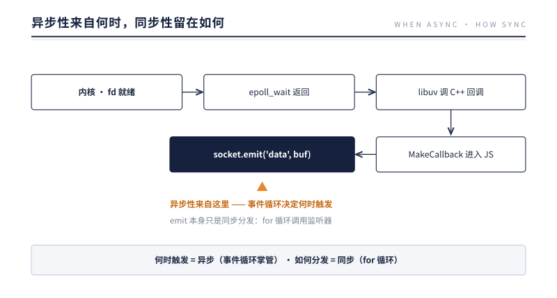
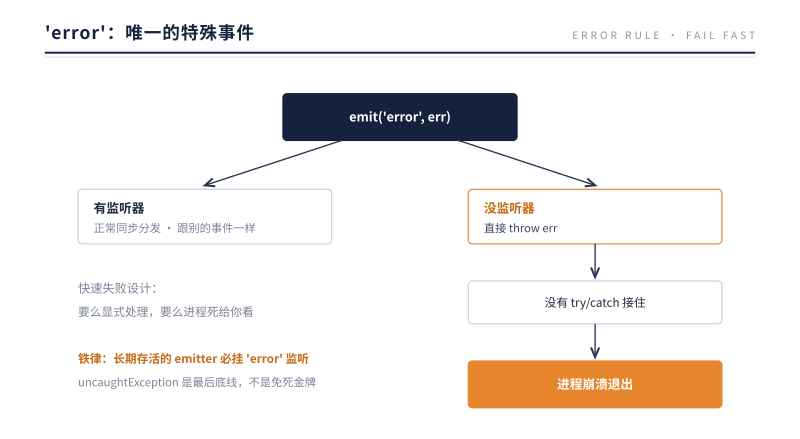
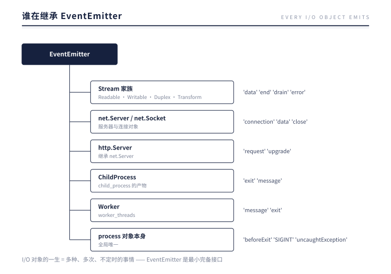

# 第 9 章 EventEmitter：事件驱动的字面实现

> **本章问题**：Node.js 号称"事件驱动"，那 `emit()` 一个事件时到底发生了什么？是异步派发？消息队列？还是……比想象中简单得多的东西？

## 9.1 意料之外的答案

先做实验：

```js
const { EventEmitter } = require('events');
const ee = new EventEmitter();

ee.on('ping', () => console.log('B: 监听器执行'));

console.log('A: emit 之前');
ee.emit('ping');
console.log('C: emit 之后');
// 输出：A → B → C
```

如果 emit 是异步的，输出应该是 A → C → B。但事实是 A → B → C——**监听器在 emit 的调用栈里同步执行完毕，emit 返回时一切已经结束**。

EventEmitter 的核心简化到伪代码只有几行：

```js
// 本质示意（省略边界处理）
class EventEmitter {
  #listeners = {};                    // { 事件名: [函数数组] }
  on(name, fn)  { (this.#listeners[name] ??= []).push(fn); }
  emit(name, ...args) {
    for (const fn of this.#listeners[name] ?? []) fn(...args);  // 同步 for 循环！
  }
}
```

没有队列，没有调度，没有线程——**一个存回调的字典，加一个同步 for 循环**。这就是"事件驱动"的字面实现。

那"异步"从哪来？从**谁在什么时候调用 emit**。第 4 章的链路现在可以补全最后一环：



**异步的是"事件何时发生"，同步的是"事件如何分发"。** 分不清这两层，就会误判执行顺序、误解性能问题。

## 9.2 同步分发的推论

推论一：**监听器阻塞 = 全体阻塞**。emit 的 for 循环里某个监听器耗时 100ms，后面的监听器、emit 的调用方、乃至整个事件循环（第 4 章）都等着这 100ms。

推论二：**监听器按注册顺序执行**，且 emit 返回后所有监听器保证已执行完——可以依赖这个顺序做逻辑。

推论三：**事件没人听，就当没发生**。emit 返回布尔值告诉你"有没有人听到"。错过了就是错过了，EventEmitter 不存历史消息——它是喇叭，不是信箱。（唯一的例外，是下一节的 'error'。）

常用 API 一览：

| 方法 | 语义 |
|------|------|
| `on(name, fn)` / `off(name, fn)` | 订阅 / 退订 |
| `once(name, fn)` | 只触发一次，自动退订 |
| `emit(name, ...args)` | 同步分发，返回"是否有监听器" |
| `events.once(ee, name)` | Promise 化的一次性等待（配合 await） |

## 9.3 'error'：唯一的特殊事件

EventEmitter 对 `'error'` 有一条独有的硬规则：



一个真实的事故模式：服务运行数月，某晚对端网络抖动，一个平时不出错的 socket 发出 `'error'`——没人监听——进程消失。日志里只有一行 `Unhandled 'error' event`。

为什么这样设计？因为 I/O 错误发生在异步回调里，普通 try/catch 根本包不住（栈早就切换了）。如果 EventEmitter 默默吞掉没人听的 error，错误就**彻底消失**——连接悄悄坏死、数据悄悄丢失，比崩溃可怕得多。Node.js 选择了**快速失败**：要么你显式处理，要么进程死给你看。

工程铁律由此而来：**每个 socket、每个 stream、每个长期存活的 EventEmitter，必须挂 'error' 监听**。第 8 章推荐 pipeline 的原因之一，正是它替流水线上每个流接管了错误。至于 `process.on('uncaughtException')`——它是记录现场、优雅退出用的最后底线，不是"继续运行"的免死金牌（进程状态已不可信）。

## 9.4 谁在继承 EventEmitter

第 8 章说 Stream 继承 EventEmitter，其实继承者遍布整个运行时：



为什么大家都继承它？因为它恰好是**回调世界的组织范式**：I/O 对象的一生会发生多种、多次、不定时的事情（连上了、来数据了、出错了、关闭了），"为每类事情注册任意多个处理函数"正是 EventEmitter 提供的最小完备接口。它是 Node.js 编程模型的地基，比 Stream 更底层。

## 9.5 遗留问题：事件把"来龙去脉"弄丢了

同步分发有个隐蔽的副作用。看一个 Web 服务的常见困境：

```js
server.on('request', (req, res) => {
  // 这里知道请求 ID 是 42
  db.query(sql, (err, rows) => {
    // 这个回调由 db 连接的 emit 触发
    // ——它怎么知道自己属于请求 42？
    log('查询完成');   // 想在日志里带上请求 ID，带不上
  });
});
```

回调被 emit 调用时，调用栈属于"数据到达"这个事件，**不属于任何请求**。跨越异步边界后，"我在为谁工作"这条信息断了。

Node.js 为此提供了两层机制：

- **asyncId 因果链**：每个异步资源（第 3 章 AsyncWrap 的那个"身份证"）记着自己的 id 和"是谁创建了我"（triggerAsyncId），串成完整的异步族谱，`async_hooks` 可以观测它——这是诊断工具的地基；
- **AsyncLocalStorage**：应用层的解法。`als.run(store, fn)` 之后，fn 引发的**整条异步调用链**里，任何位置调用 `als.getStore()` 都能拿回 store：

```js
const als = new AsyncLocalStorage();

server.on('request', (req, res) => {
  als.run({ reqId: nextId() }, () => handle(req, res));
});

// 任意深度的异步回调里：
function log(msg) {
  console.log(`[req ${als.getStore()?.reqId}] ${msg}`);   // 拿到 42 了
}
```

现代实现依托 V8 的原生上下文延续机制（AsyncContextFrame），开销已低到可默认用于生产。全链路日志、分布式追踪（trace id 透传）都建立在它上面。

这里只给出结论性的全貌。这套机制凭什么成立？它能不能进一步穿过第 14 章的线程与进程边界，把不同执行现场串回同一条主线？——完整推导留给第五部收尾的第 15 章。

## 9.6 实验：同步分发与 error 铁律的两份实证

9.1 的 A → B → C 只是同步分发最朴素的一角。把实验往前推一步，量出三个更细的性质：嵌套、顺序、返回值。

```js
const ee = new EventEmitter();
ee.on('job', () => {
  console.log('1: 监听器一开始');
  ee.emit('inner');                 // 嵌套 emit
  console.log('3: 监听器一结束');
});
ee.on('job', () => console.log('4: 监听器二'));
ee.on('inner', () => console.log('2: inner 监听器'));
console.log('heard =', ee.emit('job'));
console.log('heard =', ee.emit('没人听'));
```

实测输出（Node v24.12.0）：

```
1: 监听器一开始
2: inner 监听器
3: 监听器一结束
4: 监听器二
heard = true
heard = false
```

输出里读出三件事。其一，嵌套的 emit 在外层监听器的调用栈里就全部跑完——"2" 排在 "3" 之前；如果分发是异步的，内层 emit 会先入队，"2" 该出现在 "4" 之后。其二，监听器严格按注册顺序执行，"1" 在 "4" 前。其三，emit 的返回值告诉你有没有人听到：true / false。这三条合起来，就是"分发是一个同步 for 循环"的完整证据——任何一个环节都找不到调度的缝隙。

再量 'error' 铁律。这次不手工构造 EventEmitter，让一个真实的 socket 出错：连向一个无人监听的端口，连接被拒的错误会沿着 fd（第 6 章）以 'error' 事件回来，我们故意不挂监听：

```js
const net = require('node:net');
const sock = net.connect(1);     // 1 号端口，几乎必然无人监听
sock.on('data', () => {});
// 没挂 'error' 监听
```

进程当场消失，退出码 1。现场留下这样一段栈：

```
node:events:486
      throw er; // Unhandled 'error' event
      ^

AggregateError [ECONNREFUSED]:
    at internalConnectMultiple (node:net:1134:18)
Emitted 'error' event on Socket instance at:
    at emitErrorNT (node:internal/streams/destroy:170:8)
    at process.processTicksAndRejections (node:internal/process/task_queues:89:21)
```

栈里有两条排查时要用到的线索。一条是抛出点在 `node:events`——动手 throw 的正是 EventEmitter.emit 本身，这就是 9.3 那条规则的字面实现：没监听器就当场 throw。另一条是 `Emitted 'error' event on Socket instance`，它指出了是谁发出的——一个 Socket。**error 铁律不是一句约定，它是一次真实的 throw 加退出码 1，而且栈会告诉你"谁抛出"与"谁发出"。**

两个实验收敛到同一句话：同步分发让"现场"得以保留——事件在哪条栈上发出、错误在哪条栈上抛出、责任归谁，都还在同一条调用栈里。这正是下一节反方案推演的前提。

## 9.7 反方案对比：假如 emit 被做成异步分发

把反方案认真推演一遍：假如当年 EventEmitter 把事件异步分发——emit 时把事件丢进一个队列，由某个调度器稍后取出、逐个调用监听器——会怎样？这个设计听上去很诱人：监听器不会阻塞 emit 的调用方，慢监听器拖不垮快监听器。事实上消息队列就是这种形态的成熟实现。但 Node.js 没有选它，为什么？

第一个失去的是异常归属。今天，监听器里抛出的异常会沿着 emit 的调用栈向上冒泡：emit 的调用方能用 try/catch 接住，运行时能把这次崩溃归因到发出者。这个"谁 emit 谁负责"的语义，只有在分发是同步的时候才成立——异常必须能顺着原路回去。error 铁律更是完全依赖它：emit('error') 没人监听时是"当场 throw"，抛在调用者的栈上，调用者才有机会 catch，进程才会带着完整现场崩溃。假如 emit 只是入队，等队列被消费时，调用者的栈早就退完了——这个 error 将无人可抛，只能退化成两种机制：要么静默吞掉（那正是本章最怕的"连接悄悄坏死"），要么交给某个全局兜底处理器（责任从"发出者"转移到"全局善后"，因果链断了）。

第二个失去的是顺序。同步 for 循环保证了注册顺序与"emit 返回即全部执行完"，你可以放心地依赖这个顺序写逻辑。一旦引入队列，就必须额外承诺排序、背压、重试语义——等于在一个单线程进程里再造一个小型消息中间件，而换来的"监听器不阻塞调用方"，在单线程里其实无处可逃：反正还是同一个线程，阻塞依旧。

历史给了两面镜子。镜子一是 DOM：浏览器的 dispatchEvent 同样是同步分发，监听器跑完才返回。浏览器与 Node 不约而同选了同一边，因为两者都要在单线程里保住异常归属与顺序。镜子二是跨 document 的 postMessage：它是真正的消息队列式分发，异步。它付出的代价正是上面两条——发送方无法接住接收方的异常，消息顺序只能靠队列自身保证。但 postMessage 别无选择：两个 document 可能隔着进程与线程，根本没有共享的栈，消息传递是唯一通道。

两面镜子收敛回本书的因果链：**分发是同步还是异步，不是品味问题，而是由"双方是否共享同一条调用栈"决定的。** 共享栈（单线程事件循环内），同步分发是免费的，也是因果保真的；跨越栈（线程、进程边界），就只能退化成消息队列。Node 的 emit 属于前者，第 14 章 Worker 之间的消息传递属于后者。EventEmitter 没有拒绝异步——异步在"何时触发"那一侧，由第 4 章的事件循环掌管；分发这一侧守住同步，正是为了保住"谁负责"。

## 9.8 生产案例：一个未监听的 'error' 让整进程消失

前言点过这场事故，这里完整走一遍。某电商的支付回调服务，平日稳定，某晚整个进程突然退出，K8s 自动拉起后恢复，业务受损窗口约 90 秒。容器日志里只有一行：

```
Error: read ECONNRESET
Emitted 'error' event on Socket instance ...
```

按本章的链条排查。

**第一步，读退出栈。** 栈顶是 `throw er; // Unhandled 'error' event`，抛出点在 `node:events`——标准的 9.3 铁律现场：某个 'error' 事件没人监听，被直接升级成 throw。退出码 1，不是 OOM、不是 SIGKILL，是"自杀式"崩溃。

**第二步，定位谁发出。** `Emitted 'error' event on Socket instance` 指向一个 Socket，错误本体是 `ECONNRESET`——对端复位了连接。对照时间点查网关日志：当时下游银行通道网络抖动，主动断开了一批长连接。

**第三步，定位代码。** 该服务用 `net.connect` 维持到通道的长连接，只监听了 'data' 与 'close'，理由是"连接一直很稳，不会出错"。平时确实无错——直到对端断线的那一刻。Socket 发出 'error'，无人监听，铁律生效：整进程为一个没人听的事件陪葬。

**第四步，修复，三层。** 其一，补监听：凡长连接的 socket / stream，创建时必挂 'error' 监听，做日志加重连或降级——把 9.3 的铁律变成纪律。其二，用 pipeline（第 8 章）组织 I/O 链路，让它替沿途每个流接管错误传递，避免手工漏挂。其三，`process.on('uncaughtException')` 作为最后底线，只用来记录现场并触发优雅退出（第 12 章），绝不拿来吞错续命。

修复后再做一次断线演练，进程不再退出，重连在 200ms 内完成。回头看：**这场事故的根因不是网络，网络只是点了引线；真正的问题是代码对一个长期存活的 emitter 抱有侥幸，没挂 'error' 监听。** 本章讲的同步分发与 error 铁律不是纸面上的琐碎规则，它们正是在那个夜晚决定"一次连接故障"会不会升级成"一次进程消失"的规则。

## 9.9 本质小结

> **一句话本质**：emit 是一个同步 for 循环——异步性来自事件循环决定"何时 emit"，而非 emit 本身；理解这一点，加上"error 没人听就崩溃"的铁律，就理解了 Node.js 事件模型的全部脾气。

要点：

1. **EventEmitter = 回调字典 + 同步 for 循环**——无队列无调度；emit 返回时监听器已全部执行完。
2. **异步在"何时触发"，同步在"如何分发"**——两层分清，执行顺序不再神秘。
3. **'error' 无监听即 throw、即崩溃**——快速失败设计；长期存活的 emitter 必挂 error 监听。
4. **事件是喇叭不是信箱**——不存历史，emit 时没人听就永远错过（once/queueing 需自建）。
5. **异步边界会弄丢上下文**——asyncId 链是观测地基，AsyncLocalStorage 是应用层标准解法。

## 下一章引子

到这里，前三部的零件全部到齐：V8 执行、Binding 破壁、事件循环心跳、双路 I/O、fd 通道、Buffer 载体、Stream 流动、EventEmitter 分发。

零件各自讲透了，但在去看"谁把它们装配成机器"之前，先看一场合练——Node.js 的成名之作，正是这些零件搭出的第一个完整应用：**HTTP 服务**。你每天在写的 `http.createServer`，底下调动的正是前面九章的每一样东西，一样不多，一样不少。

下一章：HTTP——七个机制的第一次合练。

---

[← 上一章：Stream](./ch08-stream.md) | [下一章：HTTP →](../part-4-http/ch10-http.md)
