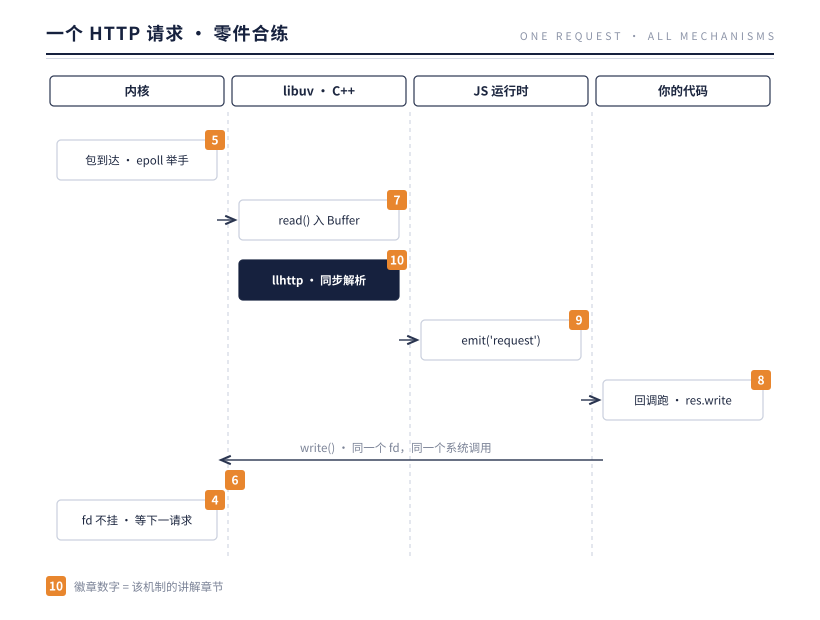

# 第 10 章 HTTP：七个机制的第一次合练

> **本章问题**：零件各自讲透了，可它们还没一起工作过。当一个真实的 HTTP 请求到达时，fd、Buffer、Stream、EventEmitter、事件循环、两条 I/O 路、Binding——谁先动、谁后动、谁在旁边等？本章拿一个请求当主线跑一场合练。你会看到一个略带反直觉的事实：**HTTP 层几乎没有新增任何机制，它只是七个机制的第一个完整应用**。

## 10.1 合练开始：一个请求的全体点名

先立一个最小的靶子：

```js
const http = require('http');

const server = http.createServer((req, res) => {
  res.writeHead(200, { 'Content-Type': 'text/plain' });
  res.end('hello');
});
server.listen(3000);
```

然后 `curl http://localhost:3000/`。从网卡收到第一个字节，到 curl 打印 `hello`，中间发生了什么？把前九章的零件按出场顺序点名，就是图 10-1：



逐个徽章读一遍：

**[5] 包到达，epoll 举手。** 连接早已在 `listen()` 时建立好（或经三次握手进入 accept 队列），请求字节到达时，内核通过 epoll 通知 libuv——第 5 章的两条 I/O 之路里，网络走的是这一条。

**[7] poll 阶段收割，`read()` 把字节读进 Buffer。** 第 4 章的心脏在主腔里醒来，第 6 章的 fd 是它下手的把手，第 7 章的 Buffer 是字节的落点——注意这一步读进的是 C++ 层分配的缓冲区，稍后才交给 JS。

**[10] llhttp 同步解析。** 这是本章的新面孔，也是全章唯一"新"的东西：一个用 C 写的 HTTP 协议状态机。注意它的位置——**它跑在 JS 线程上，同步地**消费刚读到的字节。

**[9] `emit('request')`。** 解析器认完一个完整请求头，C++ 层通过 Binding（第 3 章）进入 JS，对 Server 对象调用 `emit`——第 9 章的同步分发引擎。你的回调就是被这次 `emit` 当场叫起来的。

**[8] 回调跑，`res.write`。** 你的代码面对的不是裸 socket，而是一条 Writable Stream——第 8 章的分块与背压在此待命。

**[6] `write()` 落回内核。** 响应字节最终走的是第 6 章那个统一的系统调用：对 fd 写，和网络写，是同一个 `write()`。

**[4] fd 不挂。** 请求结束，连接不关（keep-alive），socket 句柄继续登记在事件循环上，循环因此还活着，等下一个请求——第 4 章的存活判据。

点名完毕。除了 llhttp 这个协议解析器，**没有一个机制是 HTTP 层自己的**。下面分四站细看。

## 10.2 Server：listen fd 的包装器

`http.createServer(fn)` 的真实身份：

```js
function createServer(opts, requestListener) {
  return new Server(opts, requestListener);
}
```

而 `Server` 的声明第一行就交代了一切：`class Server extends EventEmitter`。你传给 `createServer` 的那个函数，只是 `server.on('request', fn)` 的语法糖。**第 9 章说"所有事件的分发引擎"，这里就是它的主场：整个 HTTP 服务器对象，首先是一个 EventEmitter。**

`server.listen(3000)` 做的事，把第 6 章的剧本原样演一遍：创建 TCP socket → `bind()` → `listen()`，拿到一个 listen fd；然后把这个 fd 注册进 epoll（第 5 章）。从这一刻起：

- 进程不死了。listen fd 是一个活跃句柄，第 4 章的存活判据每圈清点时它都在；
- 每个新连接到达，内核完成三次握手，libuv `accept()` 出一个**新 fd**，包成一个 `net.Socket`——一条 Duplex Stream（第 8 章），触发 Server 的 `'connection'` 事件；
- 每个连接上的每个请求，解析完成后触发 `'request'` 事件。

所以"服务器"在底层的最小描述是：**一个 listen fd，加上每个连接一个 fd**。第 1 章实验里五千条连接在 JS 堆里零对象，这里就是同一个故事的 HTTP 版本：连接活在 fd 表里，不活在你的代码里。

## 10.3 llhttp：住在 C 里的解析器

HTTP 是文本协议：请求行、头部、空行、可选的 body。把字节流切成这些结构，需要一个解析器。Node 的解析器三代同堂的历史值得一句带过：Dahl 手写的 C 解析器 → 独立成库的 `http_parser` → 2018 年 Fedor Indutny 重写的 **llhttp**（源码在 `deps/llhttp/`，JS 侧接口在 `src/node_http_parser.cc`）。

关于 llhttp，本书只关心一个性质：**它是同步的，且跑在 JS 线程上**。

时序是这样的：poll 阶段 `read()` 读到一批字节（比如 8KB），libuv 把这批字节交给绑定在 socket 上的解析器实例，llhttp 在**当前这次回调里**同步地啃完这批字节——状态机推进、字段切割、chunk 计数。啃到关键节点（头部结束、body 一段、消息完成），它调用 C++ 层的回调，C++ 再通过 Binding 调进 JS：于是 `req` 的 `'headers'` 就绪、`'data'` 事件触发、最终 `'request'` 被 `emit`。

这个"同步"是理解 Node HTTP 性能特性的钥匙：

**解析成本记在循环的账上。** 一个 1MB 的 body 到达，解析它的时间就占住 JS 线程 1MB 的份额——第 2 章"一段长代码卡死全体"在 HTTP 层的具体形态，就是大 body、巨量头部的解析。异步的只有"等字节到达"，解析本身从不异步。

**那为什么解析器还要用 C 写？** 正因为它是同步跑在 JS 线程上的，它必须便宜。llhttp 的设计目标是让每字节处理成本逼近硬件下限：状态机用查表推进、避免分支、对 CPU 指令缓存友好。如果解析器用 JS 写，每字节成本高出数倍，等于给第 2 章的枷锁主动加锁。**把贵的部分下沉到 C，把语义的部分上交给 JS**——这正是第 3 章 Binding 哲学的又一次应用。

## 10.4 req 与 res：同一个 fd 上的两条 Stream

你的回调签名 `(req, res)`，两个参数的真身：

- `req` 是 `IncomingMessage`，一条 **Readable**：请求 body 的字节以 `'data'` 事件分块送达，每块是一个 Buffer（第 7 章）；`'end'` 表示 body 读完。GET 请求没有 body，`req` 立刻可读结束。
- `res` 是 `ServerResponse`，一条 **Writable**：`res.write(chunk)` 分块写，`res.end()` 写最后一块并宣告完成。

关键结构：**req 和 res 共享同一个 socket，也就是同一个 fd**。一个 fd 的两个方向，被拆成两条方向相反的 Stream——第 8 章说 Stream 是"有限内存处理无限数据"的答案，HTTP 是它最经典的用例：请求 body 可能是一个 GB 的上传，你应当 `req.pipe(上传目标)`，而不是攒在内存里；响应同理 `fs.createReadStream(file).pipe(res)`。第 8 章的背压在这里双向生效：

- **req 方向**：你不读 `req`，Readable 的缓冲满了会暂停 socket 的读取，内核接收缓冲区随之填满，TCP 窗口收缩，发送方被节流——背压一路传回对方的网卡。
- **res 方向**：客户端收得慢时，`res.write()` 返回 `false`，等你收到 `'drain'` 再写。不遵守这个约定，就是把第 8 章警告过的"内存打爆"请进门。

还有一个容易忽略的细节：`res.writeHead()` 之前，头部还没发出去；`write()` 第一次调用会隐含冲刷头部。HTTP 的"头部一次、body 分块"的报文结构，被 Stream 的"先元数据后数据块"自然承接。

## 10.5 'request' 是一次同步 emit

把 10.3 与 10.4 接起来：你的回调运行在哪一刻？**llhttp 认完请求头的那次同步调用栈里**，经 C++ 的 `MakeCallback` 进入 JS，`server.emit('request', req, res)`，回调当场执行（第 9 章：`emit` 是同步的）。

这意味着两件事：

**回调里阻塞，全体陪葬。** 在 `(req, res)` 回调里写一个 3 秒的 `while` 循环，这 3 秒内所有连接的读写、所有定时器全部排队——第 2 章的实验在 HTTP 层重演。"Node 不适合 CPU 密集"这句流行语的精确版本是：**任何线程上的同步长任务都不适合，而 Node 只给你这一个线程**。

**回调里抛错，按第 9 章的铁律处理。** `emit` 同步调用回调，回调抛出的异常会沿 `emit` 的调用栈上抛，最终成为未捕获异常——默认让进程退出。HTTP 层没有替你吞错误的义务；要兜底，用 `try/catch`、或进程级 `'uncaughtException'`、或干脆让进程死给集群看（第 14 章）。**error 铁律在 HTTP 层没有特例。**

顺便认领暗线：这个 `(req, res)` 回调，就是全书暗线的主角"一个回调"在 HTTP 世界的化身。它被封装（第 3 章）、被瓣膜放行（第 4 章）、日后还要穿越进程边界（第 6、14 章）、被验明来龙去脉（第 15 章）。合练的意义之一，是让暗线第一次站在聚光灯下。

## 10.6 keep-alive 的 fd 经济学

请求结束，`res.end()` 写完，连接关吗？**HTTP/1.1 默认不关**——keep-alive。fd 继续活着，socket 回到"等下一个请求"的状态，llhttp 重置状态机准备解析下一段字节。

这就把第 1 章的经济学直接搬进了 HTTP：新建一条 TCP 连接要三次握手（一个 RTT 起步），高延迟网络里可能几十毫秒；keep-alive 让这笔成本在多个请求间摊薄。**keep-alive 不是 HTTP 的客套，是 fd 经济学**——复用一个 fd，比新建一个 fd 便宜一个握手。

但空闲连接不是免费的：它占着两端各一个 fd、一份内核结构、循环里一个句柄。于是三个守卫参数（Node 24 实测默认值）：

```
keepAliveTimeout: 5000      // 空闲 5 秒，服务器主动挂断
headersTimeout:   60000     // 头部 60 秒读不完，挂断
requestTimeout:   300000    // 整个请求 5 分钟不完，挂断
```

逐个读它们的经济学含义：`keepAliveTimeout` 是服务器对"复用红利"的止损线——5 秒等不到下一个请求，这个 fd 的红利期结束，回收；`headersTimeout` 与 `requestTimeout` 防的是慢客户端：对方以每秒一字节的速度喂你，你的 fd 与循环句柄就被占多久——**超时设置是 fd 经济学的护栏，不是洁癖**。慢速攻击（Slowloris）的本质就是用最少的流量占满你的 fd 表，前言那场 `EMFILE` 事故是同一张表的另一种爆法。

客户端一侧的经济学由 **Agent** 管理：`http.Agent` 维护一个 socket 空闲池，请求结束 socket 还池，下一个请求优先取旧 socket。Node 19 起，`http.globalAgent` 默认 `keepAlive: true`、`maxSockets: Infinity`——默认开启复用，是社区用十年生产事故换来的共识。

关于复用，有一个值得亲手验证的时机细节（10.7 的实验）：**socket 是在响应 `'end'` 事件的收尾阶段才还池的**。如果你在 `'end'` 回调里同步地发下一个请求，会眼睁睁看着它新建连接；隔一个 tick 再发，就复用同一 fd。池的归还发生在同一次事件的尾巴上——事件循环的微观时序（第 4 章），在 HTTP 层依然说了算。

再往前走一步就是 HTTP/2：一条连接（一个 fd）上多路复用多个流，把 keep-alive 的"串行复用"升级成"并行复用"。那是另一套报文与流控机制，本书把它放在附录定位——地基（fd、Stream、背压）你已经在前三部全部见过。

## 10.7 实验：看 fd 复用与守卫参数

```js
// ch10-keepalive.js
const http = require('http');

const server = http.createServer((req, res) => {
  console.log('[server]', req.url, 'remote=', req.socket.remotePort);
  res.end('ok');
});

server.listen(8462, () => {
  console.log('keepAliveTimeout:', server.keepAliveTimeout);
  console.log('headersTimeout:', server.headersTimeout);
  console.log('requestTimeout:', server.requestTimeout);

  http.get({ port: 8462, path: '/a' }, (res) => {
    res.resume();
    res.on('end', () => {
      setTimeout(() => {           // 隔一个 tick，socket 已还池
        http.get({ port: 8462, path: '/b' }, (res2) => {
          res2.resume();
          res2.on('end', () => server.close());
        }).on('socket', (s) =>
          s.on('connect', () => console.log('[client] b localPort', s.localPort)));
      }, 100);
    });
  }).on('socket', (s) =>
    s.on('connect', () => console.log('[client] a localPort', s.localPort)));
});
```

实测输出（Node 24）：

```
keepAliveTimeout: 5000
headersTimeout: 60000
requestTimeout: 300000
[client] a localPort 55200
[server] /a remote= 55200
[server] /b remote= 55200
```

两个请求，同一个 `localPort`——**同一个 fd，两次请求**。把 `setTimeout` 去掉、在 `'end'` 里同步发第二个请求再跑一次，会看到两个不同的端口：还池发生在事件收尾，同步抢跑扑了个空。一个数字（端口号）把 keep-alive 的复用与事件循环的时序同时照了出来。

## 10.8 本质小结

**一句话本质：HTTP 层几乎不新增机制——Server 是 EventEmitter、listen 是 fd 登记、llhttp 是跑在 JS 线程上的同步 C 状态机、req/res 是同一 fd 上的两条 Stream、keep-alive 是 fd 复用经济学；所谓"web 服务器"，是七个机制的第一次合练。**

1. `createServer(fn)` = `new Server()` + `on('request', fn)`；Server 首先是 EventEmitter。
2. llhttp 同步解析、成本记在循环账上；等字节是异步的，解析永远同步。
3. req 是 Readable、res 是 Writable，共享一个 fd；背压在两个方向都生效。
4. `'request'` 回调被同步 `emit` 叫起：回调阻塞 = 全体阻塞，回调抛错 = 按 error 铁律办。
5. keep-alive 的本质是 fd 复用；三个守卫默认 5s / 60s / 300s，是 fd 经济学的护栏。
6. Node 19 起 globalAgent 默认 keepAlive；socket 在 `'end'` 事件收尾还池，同步抢跑不复用。

## 下一章引子

合练结束，零件们配合无间。但仔细看会发现一个悬而未决的问题：这些零件——Server、解析器、Stream、循环——是谁在启动时把它们逐一装配起来的？`process` 这个不用 require 就存在的对象，到底是谁造的？我们口口声声说的"一个 Node.js 实例"，在 C++ 层面对应什么实体？

第四部收尾时埋的问题，第五部来答。我们打开容器。

---

[← 上一章：EventEmitter](../part-3-data/ch09-eventemitter.md) | [下一章：运行时容器 →](../part-5-container/ch11-runtime-container.md)
