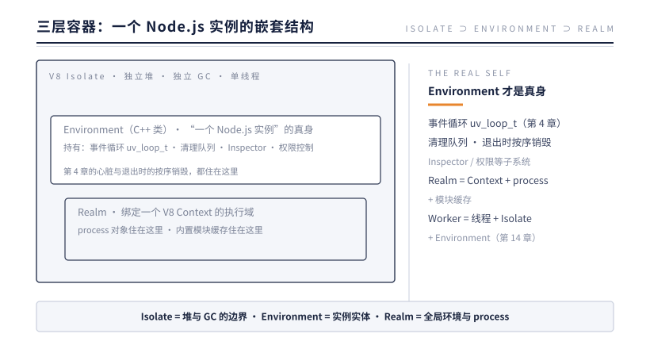

# 第 11 章 运行时容器

> **本章问题**：`process` 这个不用 require 就存在的对象，是谁造的？"一个 Node.js 实例"在底层对应什么实体？前十章的零件，装在什么里面？

## 11.1 从 process 的身世查起

每个 Node.js 程序员每天都在用 `process`——`process.env`、`process.exit()`、`process.on('SIGINT')`。它无处不在，却没人 require 过它。全局对象里凭空出现的东西，一定有人在你的代码运行之前把它放好了。

顺着这条线索深挖，会挖出 Node.js 运行时的三层容器结构：



| 容器 | 来自谁 | 装什么 |
|------|--------|--------|
| Isolate | V8 | JS 堆、GC——语言层的隔离单位 |
| Environment | Node.js（`src/env.cc`） | 事件循环、资源清理队列、各子系统——"**一个 Node 实例"的实体** |
| Realm | Node.js | process 对象、模块缓存——一个 Context 里的运行状态 |

**Environment 才是"一个 Node.js"的真身。** V8 只提供了 JS 的执行与内存（Isolate），Node 把自己的一切——心脏（事件循环）、门（Binding 注册表引用）、生命周期管理——全部聚合进 Environment 这个 C++ 对象。所谓"启动一个 Node 实例"，就是创建一个 Environment 并把它跑起来。

这个设计的深意在第 14 章才完全显形：既然"一个 Node 实例"被干净地封装成了一个 C++ 对象，那么**在同一个进程里创建第二个、第三个实例**就成为可能——这正是 Worker Threads 的实现前提。一个 Worker = 一个新线程 + 一个新 Isolate + 一个新 Environment。

## 11.2 process：Environment 伸进 JS 的手

回到开头的问题。process 对象在启动早期（下一章会看到确切时机）由引导代码创建，挂到全局。它的本质是：**Environment 里各种 C++ 状态与能力，以 JS 属性和方法的形式露出的投影。**

| 你调用的 | 背后发生的 |
|---------|-----------|
| `process.env.HOME` | 读进程环境变量表（C++ 侧持有） |
| `process.memoryUsage()` | 穿过 Binding 查询 V8 堆统计与系统内存信息 |
| `process.exit(1)` | 调 Environment 的退出流程：跳过事件循环、执行清理、终止进程 |
| `process.on('SIGINT')` | 注册信号监听——底层通过 libuv 的信号句柄挂进事件循环 |
| `process.nextTick(fn)` | 往第 4 章那个最高优先级队列里塞回调 |

留意最后两行：process 同时是一个 EventEmitter（第 9 章的继承者名单里见过它）。信号（SIGINT/SIGTERM）、生命周期节点（beforeExit/exit）、兜底错误（uncaughtException）都以事件形式从它身上发出。**process = Environment 的状态投影 + 进程级事件的发射器**，两种身份合一。

## 11.3 为什么需要 Realm 这一层？

Isolate 和 Environment 之间再隔一层 Realm，初看多余，其实对应着一个真实需求：**同一个 Node 实例里可以有多个 JS 全局环境**。

第 2 章提过 `vm` 模块能创建"干净的全局环境"（新 Context）。每个 Context 需要配套的状态——它自己的内置模块缓存、它自己的错误处理设施。Realm 就是"一个 Context + 它的配套状态"的打包。主 Realm 装着你的 process 和主模块；`vm` 或内嵌场景可以有附属的 Realm。对日常开发，你只需要记住：**你的代码活在主 Realm 里，process 是主 Realm 的住户。**

## 11.4 容器的边界就是隔离的边界

三层容器各自划出一条隔离边界，边界决定了"什么能共享、什么不能"：

```
线程边界   = Isolate 边界    两个 Isolate 不共享 JS 堆
                             → Worker 之间不能直接传对象（第 14 章）
实例边界   = Environment 边界 两个 Environment 各有事件循环
                             → 各自的定时器、I/O 互不干扰
全局边界   = Realm 边界       两个 Realm 各有全局对象
                             → vm 沙箱里改 global 不影响主环境
```

这张表值得收藏：Node.js 中一切"为什么 A 看不到 B"的问题——Worker 里拿不到主线程的变量、vm 里的全局污染不出来、两个子进程互不影响——答案都是"它们隔着某层容器边界"。

## 11.5 实验：造第二个 Realm，量它的边界

11.3 说 Realm 是"一个 Context 加它的配套状态"，太抽象。用 `vm.createContext` 真的造一个第二 Realm，把边界量出来。

```js
const vm = require('node:vm');

const bare = vm.createContext();                                    // 纯净新 Realm
console.log('bare 里 typeof process    =', vm.runInContext('typeof process', bare));
console.log('bare 里 typeof setTimeout =', vm.runInContext('typeof setTimeout', bare));

const sandbox = vm.createContext({ process, setTimeout, console }); // 显式递钥匙
console.log('Object 构造器是同一个吗:', vm.runInContext('Object', sandbox) === Object);

const arr = vm.runInContext('[1, 2, 3]', sandbox);
console.log('跨界数组 instanceof Array:', arr instanceof Array);
console.log('Array.isArray 仍认得     :', Array.isArray(arr));

console.log('sandbox 看到的 pid:', vm.runInContext('process.pid', sandbox));
console.log('主 Realm 看到的 pid :', process.pid);

vm.runInContext('setTimeout(() => console.log("sandbox 定时器触发"), 20)', sandbox);
console.log('主代码结束，等事件循环排空');
```

实测输出（Node v24.12.0）：

```
bare 里 typeof process    = undefined
bare 里 typeof setTimeout = undefined
Object 构造器是同一个吗: false
跨界数组 instanceof Array: false
Array.isArray 仍认得     : true
sandbox 看到的 pid: 49915
主 Realm 看到的 pid : 49915
主代码结束，等事件循环排空
sandbox 定时器触发
```

逐行读。前两行：新 Realm 是真正干净的——不显式注入，process 与 setTimeout 都不在那里，全局是全新的一套。第三、四行：Object 构造器不是同一个，于是 instanceof 当场断裂——arr 确实是数组，但拿主 Realm 的 `Array` 判它得 false，因为它的原型链通向那个 Realm 自己的 Array.prototype；而 Array.isArray 依然为 true——它不看原型链，查的是对象的内建标记，所以跨 Realm 不失真。第五、六行：把 process 这把钥匙递进去，两个 Realm 看到的是同一个 pid——process 是全进程共享的容器级对象，不是哪个 Realm 的私产。最后两行：sandbox 的定时器真的跑在同一个事件循环上，主代码退场后，进程一直等它触发、排空才退出。

边界清楚了：**Realm 隔离的是"语言的全局环境"——Object、Array、原型链，各过各的；Realm 共享的是"容器"——同一个进程、同一个事件循环、同一个 Isolate 堆。** 这就是"Realm = 全局环境，进程 = 容器"的实证版。它也埋下一个警示：那个断裂的 instanceof，正是 11.7 事故的主角。

## 11.6 反方案对比：假如一个全局对象走天下

把反方案推演一遍：假如 Node.js 只有一个全局对象，不允许第二个 Realm 存在，会失去什么？

最直接塌掉的是多租户与插件安全。今天你能用 `vm.createContext` 开一个新 Realm，把不受信任的代码放进去跑——全局是独立的，它把自己的 Object.prototype 改出花来，也溅不到宿主。若只有一个全局，任何插件、任何租户脚本都能直接改写宿主的内建原型、直接读写你的模块缓存，隔离就成了空话。这正是 vm 模块存在的理由：它需要"同一进程里再来一套全局"的机制，这个机制在 V8 层叫 Context，在 Node 层由 Realm 打包承接。

浏览器是同款问题，而且踩坑更早。同源窗口与 iframe 各有各的全局——于是跨 frame 传对象会遇到和 11.5 一模一样的病：`arr instanceof Array` 为 false，因为两个窗口各有各的 Array。这个跨窗口 instanceof 断裂曾是前端经典陷阱，ECMA-262 后来给出 `Array.isArray` 这种不看原型链、只查标记的判定，就是为跨 Realm 场景准备的——与 11.5 实验里 Array.isArray 为 true 完全同构。两个运行时在同一个伤口上收敛到了同一种创可贴。

第二个问题：Environment 为什么按实例封装，而不是把事件循环、模块缓存做成进程级单例？因为嵌入方需要"一个进程里跑多个实例"。Electron 在主进程与渲染侧各跑一套 Node 环境；边缘运行时与 Serverless 平台在一个进程里开几百个互相隔离的实例跑不同租户的代码。假如 Node 的状态是进程级单例，两个实例就会抢同一个事件循环、同一份模块缓存，当场打架。**把"一个 Node 实例"封装成可整体创建、整体销毁的 C++ 对象——Environment——"一进程多实例"才从口号变成能力。**

这颗果实到第 14 章完全成熟：Worker Threads 就是"一个线程 + 一个 Isolate + 一个 Environment"。能在同一个进程里横向开新实例，正因为 Environment 从一开始就不是进程本身，而是进程里装着的对象。反方案若成立——一个全局走天下、状态全是单例——这些都将无处安放：想做隔离只能多开进程，为每一点隔离付出完整的内存与启动代价。

## 11.7 生产案例：跨 Context 的 instanceof 断裂

某 SaaS 平台允许租户提交数据清洗脚本，脚本跑在按租户隔离的 vm 沙箱里。某天租户投诉：脚本返回一组 Date 对象后，平台侧校验全部报"类型非法"；同样的脚本在本地直接跑，一切正常。

按本章的边界表排查。

**第一步，复现。** 沙箱里跑该脚本，校验确实失败；但报错是类型校验不通过，不是运行时报错——值拿到了，判错了。

**第二步，看校验代码。** 平台侧的门禁是一句 `if (!(v instanceof Date)) return reject()`。打印 v：确实是个日期，`Object.prototype.toString.call(v)` 也返回 `[object Date]`。值是对的，instanceof 说不认识。

**第三步，量身份。** 比较构造器：`v.constructor === Date` 为 false，而 `v.constructor.name` 为 `'Date'`。同名不同身——真相浮出：脚本里的 Date 是沙箱 Realm 自己的 Date 构造器，门禁用的 Date 是主 Realm 的。两个构造器各带各的原型链，instanceof 只在链内有效，当然判负。这就是 11.5 实验第四行输出在生产里的重演。

**第四步，处置。** 这不是 bug，是拓扑：单进程多 Realm，跨界对象不能靠 instanceof 识别。门禁改成原型无关的判定——`Object.prototype.toString` 或对象自带的品牌字段；确需跨界传递的值，用 structuredClone 克隆回主 Realm 再判。顺手排查全仓库，又起获两处同款隐患：一处 `instanceof Buffer` 跨界判定，一处用 instanceof 识别插件协议里的自定义类。统一改为品牌判定后，租户脚本通过。

回头看：**这类事故的诊断钥匙只有一句话——instanceof 是 Realm 内的判定，跨 Realm 必失真。** 认清单进程多 Realm 的拓扑之后，这条规则应该出现在所有沙箱、插件、Electron 跨 Context 代码的审查清单里；11.5 的实验就是它的物证。

## 11.8 本质小结

> **一句话本质**：Environment 是"一个 Node.js 实例"的 C++ 真身——它把事件循环、Binding、清理队列聚合成一个可整体创建/销毁的容器；process 只是它伸进 JS 世界的手。

要点：

1. **三层容器**：Isolate（V8 的堆与执行隔离）⊃ Environment（Node 实例：事件循环 + 子系统）⊃ Realm（Context + process + 模块缓存）。
2. **process 是投影不是本体**——它的每个方法背后都是 Environment/Binding 的 C++ 状态与操作。
3. **process 兼任进程级 EventEmitter**——信号、生命周期、兜底错误都从它 emit。
4. **Realm 支撑多全局环境**——vm 沙箱的实现基础；你的代码住在主 Realm。
5. **容器边界 = 隔离边界**——"谁看不到谁"的问题，答案总在某层容器的边界上。

## 下一章引子

容器的结构清楚了，但还是静态的图纸。从你敲下 `node app.js` 回车，到你的第一行代码执行，中间这几十毫秒里，这套容器是怎么被搭建起来的？`process` 具体在哪一步出现？为什么 Node.js 的启动能这么快？

而进程的另一头——退出——同样值得琢磨：为什么有时 `beforeExit` 会触发多次？为什么 `process.exit()` 会丢日志？

下一章：生命周期，从出生到退场。

---

[← 上一章：HTTP](../part-4-http/ch10-http.md) | [下一章：生命周期 →](./ch12-lifecycle.md)
