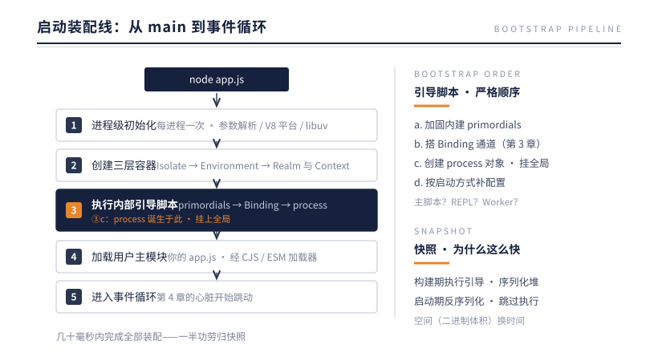
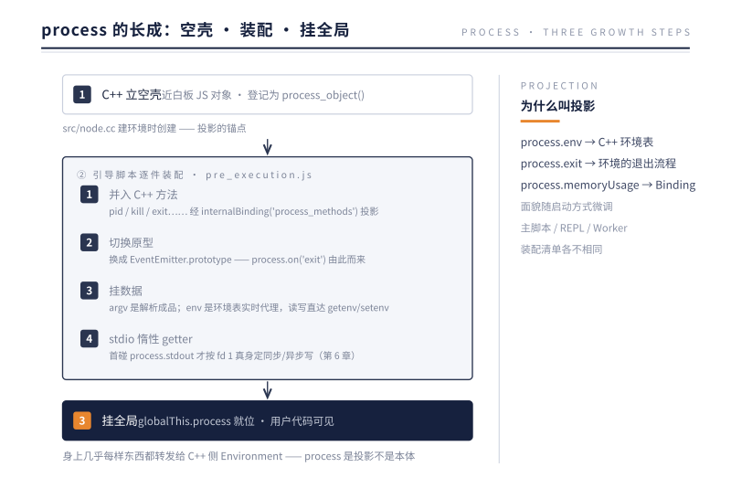
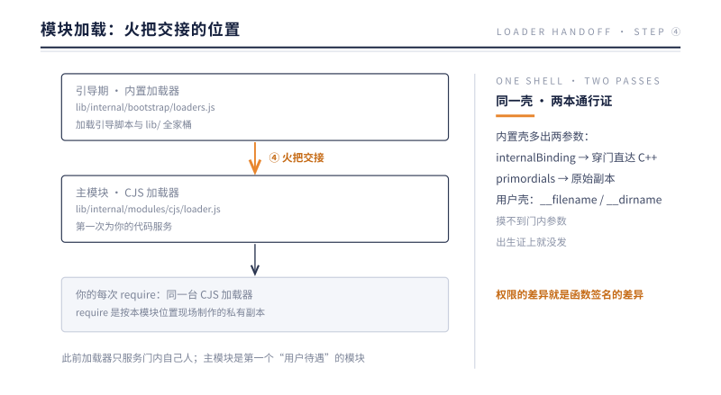
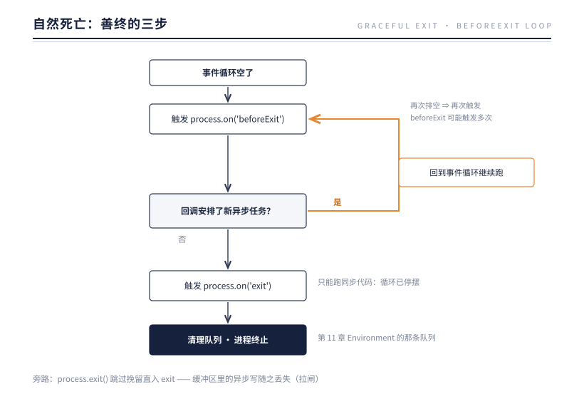

# 第 12 章 生命周期：从 Bootstrap 到优雅退出

> **本章问题**：`node app.js` 回车之后、你的第一行代码之前，那几十毫秒里发生了什么——process 是谁造的？app.js 又是被谁、用什么方式包起来执行的？进程的最后一口气（退出前）又能做什么、不能做什么？

## 12.1 出生：装配流水线

从 main 函数到用户代码，是一条固定的装配线：



装配线上，这几站值得放大看。

### 加固内建：primordials

引导脚本做的第一件事出人意料：**把 JS 内建对象的原始版本抄一份存起来**（内部称 primordials）。为什么？因为用户代码可以改写内建原型：

```js
// 恶意或无意的用户代码
Array.prototype.push = function () { /* 被劫持 */ };
```

如果 Node 内部实现也用 `arr.push()`，就会被这种改写波及甚至攻击。因此内部代码一律使用启动时抄好的原始副本，与用户的原型改写彻底隔离。这是"运行时自我保护"的教科书案例——**平台代码不能信任它所承载的应用代码**。

### process 的诞生：空壳、装配、挂全局

③c 这一小步拆开，是三步生长：



第 11 章的结论在此落地：**process 是 Environment 的 JS 投影**。它身上几乎每样东西最终都转发给 C++ 侧的环境对象——所以 process.exit() 等于拉整个环境的电闸（12.3 节）。也所以 process 的面貌随启动方式（主脚本/REPL/Worker，装配线 ③d）而微调：装配清单不同。

### 模块加载：火把交接的位置

装配线第 ④ 步是全书最容易被低估的一次交接。**主模块是第一个被"用户待遇"加载的模块**——在它之前，加载器服务的一直是门内自己人：



加载的五步流水线（解析 → 缓存 → 建模块 → 包壳执行 → 登记返回）第 3 章已经走过，这里只补两个在启动视角下才看得清的事实。

**其一，require 是私有的**。每个模块拿到的那本 require，在制作时记住了本模块的位置：相对路径从它算起，node_modules 从它所在目录逐级上溯。所以"require 相对谁"的答案是——相对制作这本 require 时所属的那个模块。它不是全局函数，是加载器按模块现场发放的。

**其二，同一个壳，两本通行证**。内置模块与用户模块都被包进函数壳，但参数名单不同：

| | 内置 JS 模块（lib/*.js） | 用户模块 |
|---|---|---|
| 加载器 | 内置加载器 | CJS 加载器 |
| 源码来源 | 构建期打包进二进制，零磁盘 I/O | 运行时从磁盘读取 |
| 包壳参数 | exports, require, module, **internalBinding, primordials** | exports, require, module, __filename, __dirname |
| 缓存 | 内置注册表，编译期名单即定 | Module._cache，首次加载才登记 |

第 3 章的门在此闭环：**权限的差异就是函数签名的差异**。内置模块的壳多出两个参数——internalBinding 让它穿门直达 C++；primordials 则把上一节"抄好的原始副本"直接发放到每个内置模块手里。用户模块的壳里没有这两个参数，所以你的代码无论怎么写都摸不到 internalBinding：不是被运行时拦下，是出生证上就没发这本通行证。

### 快照：为什么启动这么快

装配线第 ③ 步要执行一大堆内部 JS，本应耗时可观。但 Node.js 玩了个漂亮的手法：**在构建 Node 二进制的时候，就把这些脚本执行一遍，把执行完的 V8 堆序列化成快照（snapshot），嵌进可执行文件**。

```
构建期（Node 官方构建机上）：
  执行引导脚本 → 得到"已初始化的堆" → 序列化 → 嵌入二进制

启动期（你的机器上）：
  反序列化快照 → 直接得到初始化完成的堆 → 跳过脚本执行
```

用空间（二进制体积）换时间（启动毫秒数）。你每次 `node -e "1"` 能在几十毫秒内完成，一半功劳归这里。

## 12.2 活着：心跳与呼吸

启动完成后，进程的"活着"就是第 4 章的事件循环在转。这里只补充生命周期视角的一条规则：

**进程存活 = 事件循环里还有"让它活着"的东西**（活跃句柄/未完成请求）。`server.listen()`、未到期的定时器、进行中的文件读写，都是"活着的理由"。有些句柄可以被"除名"——`timer.unref()` 表示"你继续跑，但别为了你不退出"，常用于不该阻止进程退出的后台心跳。

## 12.3 退场：三种死法

### 死法一：自然死亡（善终）

事件循环发现无事可做——没有活跃句柄、没有待办回调——进程走完退出流程，exit code 0。

在彻底断气前，有一个反悔的机会：



`beforeExit`："循环空了，还有活吗？"——可以挽留进程。`exit`：遗言时刻——**此时安排任何异步操作都不会执行**，只能做同步收尾。

### 死法二：主动退场（process.exit）

`process.exit()` 是跳过排队直接拉闸：不等事件循环、不等未完成的 I/O。经典事故：

```js
console.log(hugeReport);   // stdout 指向管道时是异步写（第 6 章）
process.exit(0);           // 写操作还在缓冲区里排队——被拉闸，日志丢失
```

正确的优雅退出不是调 exit，而是**撤掉所有"活着的理由"**：关服务器、清定时器、断连接，然后让进程自然死亡。

```js
process.on('SIGTERM', () => {
  server.close(() => {            // 停止接新连接，等存量请求完成
    clearInterval(heartbeat);     // 清掉定时器
    // 什么都不剩了，进程自然退出，缓冲区自然排空
  });
});
```

### 死法三：意外身亡（未处理错误）

第 9 章见过：没人监听的 `'error'`、没 catch 的异常，最终到达 `uncaughtException`；Promise 的对应物是 `unhandledRejection`。再没人接，进程崩溃。

重申第 9 章的立场：这两个钩子是**记录现场 + 触发优雅退出**的最后底线，不是"吞掉错误继续跑"的续命符——异常撕开的状态窟窿（半写的文件、悬着的事务）不会自己愈合。

## 12.4 信号：与操作系统的死亡协议

容器与编排系统（Docker/K8s）用信号与进程沟通生死，Node 把它们变成 process 上的事件：

| 信号 | 约定含义 | Node 默认行为 | 可否监听 |
|------|---------|-------------|---------|
| SIGINT | Ctrl+C | 终止进程 | 可（监听后默认行为取消） |
| SIGTERM | 请你退出（K8s 停 Pod 第一步） | 终止进程 | 可 |
| SIGKILL | 立刻死（K8s 宽限期后补刀） | 强制终止 | **不可监听、不可阻止** |

K8s 的标准剧本是"SIGTERM → 等宽限期（默认 30s）→ SIGKILL"。所以生产服务的必修课：**监听 SIGTERM 执行 12.3 节的优雅退出，并确保能在宽限期内完成**——否则等来的是不讲道理的 SIGKILL，效果等同于 process.exit 的丢数据。

## 12.5 实验：退出顺序的实证

12.3 画了退出的流程图，图不算证据。把三个结论全部量一遍：beforeExit 可多次触发、exit 钩子只许同步、process.exit 与自然退出是两条路。

实验一，挽留与遗言：

```js
process.on('beforeExit', () => {
  console.log('beforeExit, loop empty at', Date.now() % 100000);
  if (!global.__rearmed) {
    global.__rearmed = true;
    setTimeout(() => console.log('rescheduled work'), 5);   // 挽留一次
  }
});
process.on('exit', (code) => {
  console.log('exit hook, code =', code);
  setTimeout(() => console.log('这行永远不会打印'), 0);       // 异步无效
});
```

实测输出（Node v24.12.0）：

```
beforeExit, loop empty at 20241
rescheduled work
beforeExit, loop empty at 20248
exit hook, code = 0
```

beforeExit 触发了两次：第一次回调里塞进的 setTimeout 把进程拉回循环，跑完之后循环再次排空，beforeExit 再次触发。exit 钩子只触发一次、code 为 0；它内部那个 setTimeout 永远没有打印——事件循环已经停摆，异步任务无人认领。这就是"遗言只许同步"的实证版。

实验二，process.exit 与自然退出的差异。同一份钩子，两种死法：

```js
process.on('beforeExit', () => console.log('beforeExit 触发'));
process.on('exit', (code) => console.log('exit 钩子, code =', code));
console.log('主代码结束');
if (process.argv[2] === '--force') process.exit(42);
```

```
$ node exit.js                 # 自然退出
主代码结束
beforeExit 触发
exit 钩子, code = 0            （shell 里 $? = 0）

$ node exit.js --force         # process.exit(42)
主代码结束
exit 钩子, code = 42           （shell 里 $? = 42）
```

两份输出的差别只有一处：**process.exit 这条路上，beforeExit 根本没有触发**。自然退出走完整的"循环排空 → beforeExit → exit"流水线，给了你挽留的机会；process.exit 直接拉闸，跳过挽留、直入遗言，退出码取你传的值。这就是 12.3 里"拉闸死"与"善终死"的实证分界——也再次解释了为什么优雅退出永远不该以 process.exit 开场。

## 12.6 反方案对比：为什么 exit 只许同步

把反方案推演一遍：假如 'exit' 钩子里允许安排异步工作——刷一块日志缓冲、发一通报备、写一次磁盘——听起来合情合理：临终之前把事办完。但 Node.js 不允许，浏览器也不允许，为什么？

因为 exit 时刻有两件事已经不可逆。其一，事件循环已经停摆——异步任务赖以执行的机制本身不存在了。异步任务能跑，前提是循环还有转下去的理由；而 exit 的定义就是所有理由都已撤销。其二，内核与父进程在等——shell、systemd、K8s 的 kubelet 都阻塞在 waitpid 上，等收你的退出状态；你在里面"再办点事"，外面就得陪你在门口等。一个允许异步的 exit，意味着死亡时间无人能承诺，退出码变成一张可能永远无法兑现的支票。

浏览器是同款问题，而且演进得更早。beforeunload 从历史上就只许同步：要不要弹"确认离开"的对话框，必须当场同步决定，不能"等一个异步结果回来再说"；在那里安排的异步工作，没有任何机制保证它在页面消失前执行。平台吃够苦头后补上了 pagehide 与 visibilitychange——把可靠的清理挪到"页面还活着"的更早时机，而不是赌死亡那一刻。这个演进与 Node 的分工完全同构：Node 的 beforeExit 就是那个"更早时机"——循环还在转，异步允许，挽留允许；exit 则是最后的同步时刻，只许当场能说完的遗言。

收敛回本书的因果链：**"死亡"必须是同步且有限的，因为它的定义就是"没有理由再活"**——一旦允许在死亡时刻安排异步，等于当场复活一个活下去的理由，死亡从此可以推迟，而可以推迟的退出就可能永远不退。所以 Node 把两刀切得干净：要办异步的事，去 beforeExit 办；exit 时刻，只许同步。下一节的生产剧本，靠的正是这份分工。

## 12.7 生产案例：一次优雅退出演练

某 API 服务跑在 K8s 上，优雅退出这件事他们走了两步弯路，又走回正道。

版本 A：没有任何 SIGTERM 处理。每次发版，网关日志都会多出一片 502 与连接复位。排查：K8s 停 Pod 时发 SIGTERM，Node 不监听就走默认行为——立即终止（12.4），在途请求被拦腰斩断，keep-alive 连接被直接复位。"不处理"等于最粗暴的一次拉闸。

版本 B：工程师补了处理，却掉进另一个坑：

```js
process.on('SIGTERM', () => {
  server.close();          // 停止接新连接，等存量完成
});
```

发版后出现新症状：Pod 停得特别慢——每次都卡满 terminationGracePeriodSeconds 的 30 秒，最后被 SIGKILL 收走。按本章的标尺排查。第一步，看事件：kubelet 记录"宽限期耗尽，发送 SIGKILL"。第二步，问进程为什么不自杀——用 12.2 的判据，进程活着 = 还有让它活着的理由。`server.close()` 只是不接新连接，存量还在：几个 keep-alive 长客户端迟迟不断开，一个没清的 `setInterval` 心跳，一个没释放的数据库连接池——个个都是活着的理由。事件循环永远排不空，beforeExit 永远不触发，进程只能等 SIGKILL。第三步，看后果：SIGKILL 不给任何钩子，缓冲日志丢失、在途写入被断，每个 Pod 还白白耗掉 30 秒发版时间。

正确的关停剧本，把 12.3 与 12.4 合起来，四个节拍：

```js
process.on('SIGTERM', () => {
  server.close(() => {                        // ① 停接新连接，存量跑完后回调
    clearInterval(heartbeat);                 // ② 清定时器
    db.end();                                 // ③ 释放连接池——活着的理由逐个撤掉
  });
  server.closeIdleConnections?.();            // 踢掉空闲 keep-alive，加速 drain
  setTimeout(() => process.exit(1), 25_000).unref(); // ④ 兜底：宽限期内自己拉闸
});
```

第一步，停接新连接；顺手踢掉空闲 keep-alive，让 drain 不白等。第二步，等在途请求跑完，但必须设截止——截止时间要小于 K8s 的宽限期。第三步，逐个关闭句柄：定时器、连接池、文件句柄，把"活着的理由"全部撤掉，让进程走自然死亡（12.3 的正道）。第四步，兜底：万一 drain 不完，宁可自己 process.exit(1)——退出码 1 留下"超时"的含义，exit 钩子的同步遗言还能执行，好过 SIGKILL 什么都不剩。

修复后的两个数字：发版期单次停 Pod 从 30 秒降到约 3 秒，发版窗口内的 502 归零。回头看：**优雅退出不是技巧，是本章两条判据的直接应用——撤掉所有活着的理由，让进程自然死亡（12.3）；并且一切收尾必须在操作系统的死亡协议宽限期内完成（12.4）。** K8s 不是敌人，它只是一个按截止时间收卷的监考。

## 12.8 本质小结

> **一句话本质**：启动是一条"容器装配 → 引导脚本 → 用户代码 → 事件循环"的流水线（用快照抄了近道）；退出的正道不是杀循环，而是撤掉所有让循环活着的理由。

要点：

1. **五步启动**：进程初始化 → 建三层容器 → 引导脚本（primordials 加固、Binding 就位、process 诞生）→ 加载主模块 → 进循环。
2. **快照换启动速度**——构建期预执行引导脚本，启动期直接反序列化堆。
3. **beforeExit 可挽留进程（可能多次触发）；exit 只许同步遗言。**
4. **process.exit 是拉闸**——异步缓冲区里的数据说没就没；优雅退出 = 撤活跃句柄 + 自然死亡。
5. **SIGTERM 是生产必修**——在编排系统宽限期内完成收尾，否则 SIGKILL 不容商量。
6. **process 三步长成**：C++ 空壳 → 引导脚本装配（C++ 方法并入、原型切成 EventEmitter、env 实时代理、stdio 惰性 getter）→ 挂全局；它是 Environment 的投影。
7. **主模块是火把交接点**——此前一直是内置加载器在门内服务；此后 CJS 加载器接管，每个模块拿到私有 require，解析起点就是本模块。
8. **权限即签名**——内置模块的包壳比用户模块多 internalBinding 与 primordials 两个参数；门内门外，出生即定。

## 下一章引子

至此，出生与死亡都讲清了。但"活着"的过程里还有一笔没算完的账：第 2 章说过，GC 暂停直接计入请求延迟——而 GC 的账单，是堆上的内存一笔一笔攒出来的。

这些内存到底住在哪？为什么只涨不降？进程赖着不退出时，怎么查出是哪个句柄在续命？这些问题不靠猜，靠的是把本书的机制当体检仪器用。

下一章：内存与诊断——给运行时做一次体检。体检完，再谈多核。

---

[← 上一章：运行时容器](./ch11-runtime-container.md) | [下一章：内存与诊断 →](./ch13-memory-diagnosis.md)
