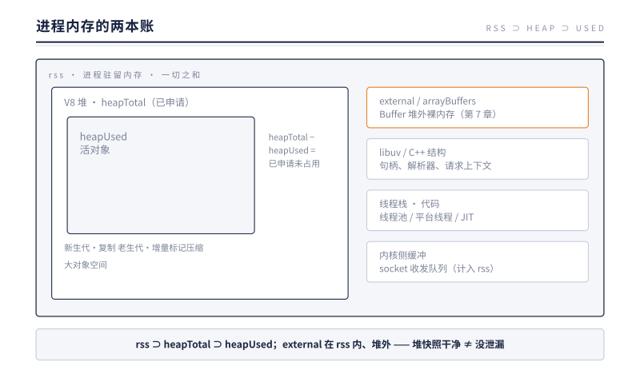

# 第 13 章 内存与诊断：给运行时做体检

> **本章问题**：第 12 章结尾留下了"GC 的账单"。问题随之排成一队：一个 Node 进程的内存到底住在哪几本账上？rss 一直涨就是泄漏吗？heapUsed 不降就是 GC 坏了吗？真怀疑泄漏时，第一只手伸向哪个工具？本章先分账本，再给泄漏画四副面孔，最后把三件诊断器械按使用顺序交到你手里。

## 13.1 两本账：堆内与堆外

体检第一步是知道指标在量什么。`process.memoryUsage()` 是化验单，Node 24 上一个刚启动进程的典型读数：

```js
{
  rss:         41926656,   // ≈40MB  进程驻留内存：一切之和
  heapTotal:    5341184,   // ≈5MB   V8 已申请的堆
  heapUsed:     3595624,   // ≈3.4MB V8 堆上的活对象
  external:     1283573,   // ≈1.2MB 堆外：C++ 侧关联内存
  arrayBuffers:   10511    // 其中 ArrayBuffer/Buffer 部分
}
```

五个字段，两本账，一张包含关系图（图 13-1）：



**第一本账：V8 堆**（`heapTotal` ⊃ `heapUsed`）。所有 JS 对象住在这里，内部再分：新生代（小对象，Scavenger 复制式回收，快）、老生代（长寿对象，增量标记-压缩，慢但容量大）、大对象空间。`heapTotal` 是 V8 向操作系统**已申请**的堆，`heapUsed` 是其中**活着**的对象。两者之差不是泄漏，是"已圈未用的地"——V8 不会每次 GC 后就把地还给操作系统，它留着下次用。

**第二本账：堆外**。`external` + `arrayBuffers` 记的是 Buffer 的 BackingStore 那种堆外裸内存（第 7 章：Buffer 的字节从来不在 V8 堆上）。但这本账还不完整——`memoryUsage` 看不见的部分同样计入 `rss`：libuv 的 C++ 结构、线程池与平台线程的栈、JIT 代码、以及内核侧的 socket 缓冲。

于是三个最常见的误诊：

**误诊一：rss 涨 = V8 泄漏。** rss 是总和。堆外 Buffer 堆积、socket 缓冲积压、甚至线程数变多，都涨 rss 而 heapUsed 纹丝不动。先对账：rss 的涨幅和 heapUsed 的涨幅对得上吗？对不上，去查堆外。

**误诊二：heapUsed 不降 = GC 坏了。** GC 的纪律是"需要时才收"，不是" eager 地收"。第 12 章讲过，回收发生在分配压力到来时；两次 GC 之间 heapUsed 单调上升是**正常形态**——健康的 heapUsed 曲线是锯齿：涨、GC、落、再涨。**判断泄漏的标准从来不是"涨"，而是"锯齿的底部一次比一次高，且没有上界"**。

**误诊三：堆快照干净 = 没泄漏。** 堆快照只照第一本账。第 7 章那种 Buffer 堆积在堆外，快照里只有一个小小的 JS 壳对象指向它——壳不可疑，字节在账外。

## 13.2 泄漏的四副面孔

把生产里见过的泄漏归类，面孔只有四副。

**面孔一：无界增长的全局集合。** 最直白的一副：一个模块级 `array` 或 `map`，只 push 不删。它甚至不算 bug，算遗忘——写的时候"先记下来"，写完之后没人负责"忘掉"。

**面孔二：闭包持有。** 更隐蔽。一个 `setInterval` 的回调引用了外层的"大对象"，定时器活着，回调活着，闭包链上的一切都活着。EventEmitter 版本同样经典：`on` 了不 `off`——监听器数组持有回调，回调持有闭包（第 9 章：监听器存在 `events` 对象里，生命周期与 emitter 同寿）。**这一副的诊断要点是：你以为自己泄漏的是数据，其实泄漏的是"一条没剪断的引用链"**。

**面孔三：无淘汰的缓存。** 它与泄漏的区别只在意图：缓存是故意持有的。判断标准因此也简单——**有上界的是设计，无上界的是泄漏**。给缓存装上界是 LRU 库的事；语言层给的工具是 `WeakRef` 与 `FinalizationRegistry`：弱引用不阻止 GC 回收目标，适合"有则用之、无则拉倒"的缓存语义。注意定位：它们是逃生门，不是默认答案——大多数缓存需要的是明确的容量策略，而不是把责任推给 GC。

**面孔四：堆外堆积。** Buffer 在队列里排着等消费、Stream 没被 `destroy`、半死的 socket 挂着收发缓冲。这一副的指纹最特别：**rss 与 external 涨，heapUsed 不涨**——对应 13.1 的误诊三。第 8 章的背压是它的预防医学：消费跟不上生产时，背压把刹车踩回去；背压被忽略（不检查 `write` 返回值、不监听 `drain`），队列就变成泄漏。

四副面孔，两张账本：一、二、三记在堆内账上，四记在堆外账上。诊断时先问"涨的是哪本账"，面孔就排除了一半。

## 13.3 句柄泄漏：进程不死，fd 耗尽

内存之外还有第三本账：**句柄与 fd**。第 4 章的存活判据说，循环每圈清点活跃句柄，有一个在，进程就不死。于是句柄泄漏的症状与内存泄漏不同，它有两个专属表现：

**进程不肯退出。** 一个"应该跑完就退"的脚本挂着不退，十有八九是某个 `setInterval` 没 `unref`、某个 server 没 `close`、某个 socket 没 `destroy`。定时器与服务器都是活跃句柄——循环清点时它们举手，进程就陪着。

**fd 表耗尽。** `EMFILE: too many open files`——前言那场事故。fd 泄漏的雪球比内存更硬：内存泄漏往往先被 OOM 或重启策略截住，fd 泄漏则安静地涨到内核上限，然后一次性雪崩。

诊断入口有两个。JS 侧：`process.getActiveResourcesInfo()`（Node 16+ 的公开 API）返回活跃资源的类型清单，比如 `['TCPSocketWrap', 'TimeoutWrap', 'FSReqCallback']`——一眼看出是哪类句柄在堆积。系统侧：`lsof -p <pid> | wc -l` 看 fd 总数随时间的曲线。**单调上涨不回头，就是泄漏；随负载起伏，就是健康。**

把三本账并排，会发现一个统一的本质：**内存泄漏是"分配了不释放"，句柄泄漏是"登记了不注销"，fd 泄漏是"打开了不关闭"——同一副面孔在三本账上的投影**。诊断思路因此也统一：找到那个"只进不出"的集合。

## 13.4 诊断三件套

器械按使用顺序出场：先量血压，再查账单，最后拍片子。

**第一件：循环延迟——血压计。** `perf_hooks.monitorEventLoopDelay()` 持续测量"回调应该跑和实际跑之间隔了多久"：

```js
const { monitorEventLoopDelay } = require('perf_hooks');
const h = monitorEventLoopDelay({ resolution: 20 });
h.enable();
// 一段时间后：
h.percentile(99) / 1e6;  // p99，毫秒
```

健康进程的 p99 在 1ms 量级。p99 抬高，说明循环被什么东西占住了——第 2 章的长任务，或 13.2 面孔带来的 GC 风暴。它是体检的第一项，因为它回答"病没病"，不回答"病在哪"。

**第二件：GC 日志——账单。** `node --trace-gc` 把每次回收打成一行：

```
Mark-Compact 4.1 (5.6) -> 3.6 (6.6) MB, 2.21 / 0.00 ms
```

读法：回收前堆 4.1MB（已申请 5.6MB），回收后 3.6MB（已申请 6.6MB）。**看两个趋势：频率（分配压力）与回收后的底部（活对象基数）**。底部一轮比一轮高，就是 13.1 的锯齿底部上移——泄漏在堆内账上的指纹。Scavenge 行同理，管新生代。

**第三件：堆快照——片子。** `node --inspect` 起进程，Chrome DevTools 的 Memory 面板拍 Heap snapshot。单张快照看"谁最大"（按 retained size 排序）；但泄漏诊断的标准姿势是**两张快照看差值**：操作前后各拍一张，切到 Comparison 视图，按 `# Delta` 排序——"+60 000 的 (string)" 比"某个大对象"更说明问题。选中嫌疑对象，沿 **retainer 链**往下走，回答那个唯一重要的问题："**是谁拿着它不放？**" retainer 链的尽头，通常就是 13.2 某副面孔的现行现场：一个全局数组、一个定时器闭包、一个没 off 的监听器。

三件套的分工：血压计告诉你病没病，账单告诉你病在哪本账，片子告诉你病在哪一行引用。顺序不可颠倒——直接拍快照是新手最常见的浪费：没有前两件定向，快照只是一张没有对照的片子。

## 13.5 实验：一次双泄漏的现行

下面这个程序同时养两种泄漏：堆内（对象数组，每 50ms 一批）与堆外（1MB Buffer，每 50ms 一个），3 秒后体检：

```js
// ch13-leak.js
const { monitorEventLoopDelay } = require('perf_hooks');
const h = monitorEventLoopDelay({ resolution: 20 });
h.enable();

const heapLeak = [];
const bufLeak = [];
const t0 = process.memoryUsage();

setInterval(() => { heapLeak.push(new Array(12500).fill(heapLeak.length)); }, 50);
setInterval(() => { bufLeak.push(Buffer.alloc(1048576)); }, 50);

setTimeout(() => {
  if (global.gc) global.gc();
  const m = process.memoryUsage();
  console.log('heapUsed grew MB:', ((m.heapUsed - t0.heapUsed) / 1048576).toFixed(1));
  console.log('external grew MB:', ((m.external - t0.external) / 1048576).toFixed(1));
  console.log('rss grew MB:', ((m.rss - t0.rss) / 1048576).toFixed(1));
  h.disable();
  console.log('loop delay p99 ms:', (h.percentile(99) / 1e6).toFixed(1));
  process.exit(0);
}, 3000);
```

实测输出（Node 24，`--expose-gc`）：

```
heapUsed grew MB: 5.5
external grew MB: 59.0
rss grew MB: 67.7
loop delay p99 ms: 21.5
```

逐行读：

**heapUsed +5.5MB，且发生在显式 `gc()` 之后**——回收过了，没收回。这就是"锯齿底部上移"的现行：对象被 `setInterval` 的闭包链牢牢持有，面孔二。

**external +59MB**——60 个 1MB Buffer，堆外账。注意比例：这 3 秒里堆外泄漏是堆内的 10 倍。**如果只看 heapUsed 下结论，你会说"几乎没漏"；rss 说：你漏了 68MB。** 误诊三的反面教材。

**p99 21.5ms**——刚启动 3 秒的进程，血压已经高了：密集分配推着 GC 频繁出手，每次出手都占循环时间。血压计在第一秒就能告诉你"病了"，比快照早得多。

治愈只需两行：`clearInterval` 剪断引用链、`bufLeak.length = 0` 放开 Buffer——再跑，锯齿归锯齿，底部归零。

## 13.6 生产案例：前言那场 EMFILE 的闭环

把工具用回前言的事故，完成全书的第一次闭环。

症状回顾：进程周期性拒绝新连接，日志刷满 `EMFILE`，重启缓解、数小时后复发。

**第一步，血压计与 fd 曲线。** `lsof -p <pid> | wc -l` 每 10 秒采样一次：曲线单调上涨，与负载无关——句柄泄漏，不是流量问题。

**第二步，资源类型。** `process.getActiveResourcesInfo()` 里 `TCPSocketWrap` 数量与 fd 曲线同步增长——漏的是 socket。

**第三步，片子与代码对照。** 堆快照里 socket 的 JS 壳沿 retainer 链追到一个"出错连接登记表"——面孔一与面孔二的复合：某条错误分支把"出错的连接"记进全局数组以待重试，却从不 `destroy` 也不移除。**第 9 章的 error 铁律在这里以另一种方式被违反：错误被"处理"了一半——记录在案，尸体不埋。** 半死的 socket 占着 fd，占着内核缓冲，直到表满。

修复是两行：错误分支补 `socket.destroy()`，登记表加上限与重试退避。上线后 fd 曲线随负载起伏，事故闭环。

这个案例把三本账串成了一句诊断口诀：**先看哪本账在涨（内存/堆外/句柄），再找只进不出的集合，最后沿引用链剪断它**。全书至此，"内存"不再是孤立的一章——它是 fd（第 6 章）、Buffer（第 7 章）、背压（第 8 章）、监听器生命周期（第 9 章）、存活判据（第 4 章）在诊断视角下的合流。

## 13.7 本质小结

**一句话本质：内存诊断是先分账本再找集合——rss 是总和、V8 堆是锯齿、堆外另册、句柄第三本账；泄漏的唯一指纹是"只进不出"，诊断的唯一问题是"谁拿着它不放"。**

1. 五个字段两本账：rss ⊃ heapTotal ⊃ heapUsed；external/arrayBuffers 在堆外、rss 内；线程栈与内核缓冲连 external 都不在。
2. 健康形态是锯齿；泄漏指纹是锯齿底部上移、无上界。
3. 四副面孔：无界全局集合、闭包持有、无淘汰缓存、堆外堆积；第四副的指纹是 heapUsed 不涨。
4. 句柄泄漏两症状：进程不退（存活判据）、EMFILE（fd 账）；`getActiveResourcesInfo()` 与 `lsof` 是入口。
5. 三件套按顺序：monitorEventLoopDelay 量病没病，--trace-gc 看病在哪本账，堆快照 Comparison + retainer 链看病在哪行引用。
6. 堆快照干净 ≠ 没泄漏；heapUsed 不降 ≠ GC 坏；rss 涨 ≠ V8 泄漏。

## 下一章引子

体检做完，容器健康：血压正常、账单干净、没有只进不出的集合。

于是可以抬头看那件一直悬着的事了——top 里另外 63 个核心还在围观。第 2 章立下的约束说，一个 Isolate 只有一个线程跑 JS；本章的血压计也提醒你，连这一个线程都经常不够用。单线程的容器，如何吃满多核的机器？

答案只有一种姿势：复制容器。

---

[← 上一章：生命周期](./ch12-lifecycle.md) | [下一章：多核之路 →](./ch14-multicore.md)
