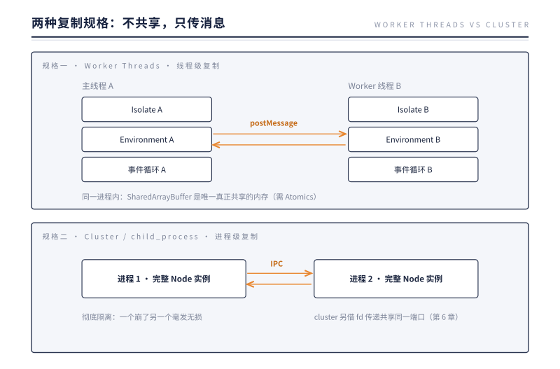

# 第 14 章 多核之路：复制容器，而非共享内存

> **本章问题**：单线程只能用一个核。Node.js 想吃满 64 核机器，在"不打破单线程约束"的前提下，路在哪里？

## 14.1 只有一种答案的选择题

传统多线程语言（Java/C++）的答案是共享内存：多个线程读写同一堆数据，用锁维持秩序。这条路 Node.js 走不了——第 2 章的 Isolate 规则堵死了它：**JS 堆不允许第二个线程进入**。

那就只剩一种答案：**不共享，复制。** 把第 11 章封装好的"容器"整个再造一份，让每份容器独占一个核，容器之间只靠**传递消息**协作。

这个答案有两种规格，对应两层容器边界：



第 11 章的伏笔在此兑现：正因为"一个 Node 实例"被干净封装成 Environment，Worker Threads 才可能实现——`new Worker()` 的本质就是：**新线程 + 新 Isolate + 新 Environment + 新事件循环**，四件套一起造。

## 14.2 Worker Threads：同屋分居

```js
const { Worker, isMainThread, parentPort } = require('worker_threads');

if (isMainThread) {
  const w = new Worker(__filename);
  w.postMessage({ n: 45 });
  w.on('message', (result) => console.log('fib =', result));
} else {
  parentPort.on('message', ({ n }) => parentPort.postMessage(fib(n)));
}
```

主线程照常处理请求，Worker 在另一个核上算 fib(45)——第 2 章那个"CPU 密集卡死一切"的困局，在这里解开。

### postMessage 传的不是引用

两个 Isolate 堆互不相通，所以 `postMessage(obj)` 实际执行的是：**结构化克隆**——把对象序列化、穿越线程边界、在对方堆里重建副本。改副本不影响原件。这也标出了 Worker 的成本模型：

- **创建贵**：四件套（线程/Isolate/Environment/循环）不是轻量协程，常驻 Worker 池是标准用法；
- **传输贵**：大对象克隆耗时可观。两条省钱通道：
  - **Transferable**：ArrayBuffer 可以"过户"——内存所有权移交对方，本侧失效，零拷贝；
  - **SharedArrayBuffer**：唯一的例外，一块**真正共享**的裸内存。多线程同时读写它会怎样？欢迎回到锁与竞态的世界——需要 Atomics 原子操作配合。它是留给极致性能场景的后门，不是常规通道。

### 何时用 Worker

一条实用判据：**任务的计算时间 >> 数据的克隆时间**，Worker 才划算。压缩、加密、图像处理是典型正例；"每个请求开个 Worker 算个 JSON.parse"是典型反例（克隆比计算还贵）。

## 14.3 Cluster：分身服务同一个端口

CPU 密集用 Worker，而 Web 服务的诉求不同：请求本身是 I/O 密集的，单实例就够快，问题是**一个实例只吃一个核**。答案是进程级复制——cluster 模块：

```js
const cluster = require('cluster');
const http = require('http');
const os = require('os');

if (cluster.isPrimary) {
  for (let i = 0; i < os.availableParallelism(); i++) cluster.fork();
} else {
  http.createServer(handler).listen(8080);   // 所有 worker 听"同一个"端口？
}
```

8 个进程同时 `listen(8080)` 却不报端口冲突——第 6 章已经给过谜底：**主进程创建监听 socket，把 listen-fd 通过 SCM_RIGHTS 寄给每个 worker**；所有 worker 的 fd 指向同一个内核监听队列，内核负责把新连接分给某一个 worker。cluster 只是把第 6 章的 fd 传递机制包装成了三行代码。

进程级隔离还带来免费的容错：一个 worker 崩溃（毕竟第 9 章说过没人听的 error 会杀进程），其余 worker 不受影响，主进程监听 `'exit'` 事件补招一个新的——**自愈式架构**用 cluster 十行代码就能搭出来。

## 14.4 两种规格怎么选

| | Worker Threads | Cluster / 多进程 |
|---|---|---|
| 复制粒度 | 线程（同进程） | 整个进程 |
| 隔离强度 | 中：崩溃可能拖累进程 | 高：彻底隔离，单点崩溃不扩散 |
| 通信 | postMessage 克隆 / Transferable / SharedArrayBuffer | IPC 管道（JSON 序列化）/ 传 fd |
| 内存开销 | 较低（共享进程资源） | 较高（每进程完整实例） |
| 适合 | CPU 密集计算的卸载 | Web 服务吃满多核 + 容错 |

经验法则：**算东西，Worker；扛流量，Cluster**；两者可叠加（每个 cluster worker 内部再养 Worker 池）。生产部署中，K8s 单 Pod 单进程 + 副本数扩展，是把 cluster 的思路上移到编排层——原理同一个：复制实例，分发流量。

## 14.5 实验：把加速比量出来

理论说完了，"复制容器"到底换来多少真东西，得跑一遍才知道。设计一个纯 CPU 任务：统计 [0, 100000000) 内的素数个数（分段筛，不碰 I/O、不碰锁）。先单线程跑一遍，再切成四份交给 4 个 Worker；顺手挂一个 100ms 的心跳定时器，数它在任务期间跳了几次——这是第 2 章留下的血压计：

```js
// worker 分支：收到区间就开算，算完回传
parentPort.on('message', ({ lo, hi }) =>
  parentPort.postMessage(countPrimes(lo, hi)));

// 主线程：把 [0, N) 切四份，一份给一个 Worker
for (let i = 0; i < 4; i++)
  new Worker(__filename, { workerData: { lo, hi } })
    .on('message', collect);

const hb = setInterval(() => beats++, 100);  // 心跳
```

实测输出（Node v24.12.0，macOS 10 核，N = 100_000_000）：

```
single     566 ms   （心跳 0 次）
4 workers  221 ms   （心跳 2 次）
warm pool  200 ms   （Worker 常驻，随到随算）
```

三组数字，三件事。

第一，加速比：566 → 221，约 2.6 倍，不是天真的 4 倍。差额很诚实：四件套有启动开销、分段筛有一半是内存带宽活、四份任务也不完全均分。但方向不容置疑——**CPU 的墙，是靠复制打破的，不是靠优化打破的**。单线程里把筛法磨出花来，也换不出 2.6 倍。

第二，心跳：单线程跑的那 566ms 里，100ms 的心跳一次都没跳——事件循环被整段霸占，定时器和回调全进不了门；同样的任务交给 4 个 Worker，主线程的心跳照常跳了 2 次。这就是第 2 章 2.6 那个 /busy 的实验形态：**Worker 不只是把计算变快，更是把事件循环还了回来**。计算进行中，API 还能接请求——这一句，才是 Worker Threads 存在的全部理由。

第三，常驻池：预热好 4 个 Worker 再派活，221ms 降到 200ms 上下——四件套是一次性的固定资产，不是随用随弃的耗材。这正是 14.2 "常驻 Worker 池是标准用法"的工程注脚，也是那条划算判据的另一面：创建贵，所以要摊薄。

最后把期望值摆正。2.6 倍不是失望，是阿姆达尔定律的本来面目：只要任务里有一丝不可并行的部分——任务分发、结果合并、消息克隆——加速比就有天花板，核数再多也顶不破。工程上要问的从来不是"能不能逼近核数"，而是"这个天花板够不够把 p99 救出水面"。对这个例子，够了。

## 14.6 反方案对比：假如当初选了共享内存

按惯例，把"如果"认真推演一遍。多核最顺手的想法是共享内存多线程——Java/C++ 的姿势：N 个线程、一个堆、锁来维持秩序。Node 为什么走不了？

答案在第 2 章就写死了：**V8 的 Isolate 同一时刻只允许一个线程进入**。这不是 Node 的偏好，是 JS 引擎的执行模型。共享内存这条路，第一步就撞墙——除非做两件事之一：给 JS 堆里每个对象上锁，重写引擎，顺带埋掉"JS 程序员从不写锁"这份馈赠；或者给整个堆加一把大锁，N 个线程排队进门，多核沦为幻觉。两个方向殊途同归：共享不值。所以 14.1 说这道选择题只有一个答案——不是挑出来的，是排除出来的。

历史给了一面镜子：Go。Go 也要解"单线程的简洁 vs 多核的性能"，但它走了另一侧——goroutine 共享内存，运行时里藏着一整套 M:N 调度器：工作窃取、可增长栈、跨核协同的 GC。程序员写出来的代码看上去还是单线程的，并行的复杂度**内爆在运行时里**。这条路有它的好处，但注意它的形状：调度器由运行时扛，竞态由运行时查，复杂度没有消失，只是搬进了你看不见的地方。Node 的选择恰好相反：运行时死守一根线程，把并行推上应用层，用显式的容器复制与消息传递买单。复杂度同样没有消失——只是从"运行时里难看见"变成了"代码里写明白"。

再看 cluster 内部的分岔。N 个进程服务同一个端口，新连接谁接？历史上有两种姿势：

| 姿势 | 机制 | 代价 |
|------|------|------|
| 主进程分发 | master accept() 后轮询，把连接 fd 递给某个 worker（Node 默认 SCHED_RR） | master 成为单点与吞吐上限，但可做均衡与统计 |
| 内核分发 | 各进程自己 listen，内核挑醒谁（SCHED_NONE；Linux 可配 SO_REUSEPORT） | 无中心、扩展好，但负载不均、用户态没有策略位 |

Node 默认选了前者，底气还是第 6 章的 listen-fd 传递：master 把 fd 递出去，worker 的内核结构指向同一个监听队列，三行代码封装完毕。代价是 master 成为分发中心——而 14.4 的经验法则恰好补上了后半句：在 K8s 这类编排器下，"master"这个位置常常整个让给编排层，单 Pod 单进程，副本数即横向扩展。**Node 不必把每一层都造出来，它只需把每一层都留得自洽。**

两条岔路最后都收束回本书的因果链：因为 Isolate 堵死共享，所以只能复制容器；因为复制容器，所以第 11 章的边界成了并行单位；因为边界干净，才有 fd 传递、IPC、以及第 15 章的"携带 + 重新 run"。**多核之路不是被选出来的，是从第 2 章一路推出来的。**

## 14.7 生产案例：一个路由拖垮一个进程

某电商中台 API，Node 单进程部署，p50 稳定在 30ms，p99 却间歇性顶到 3 秒。没有报错——所有请求最终都成功，只是慢。按第 13 章的器械链走：

**第一步，量血压。** `monitorEventLoopDelay` 的 p99 曲线与毛刺时间轴严丝合缝：每次毛刺，循环占用都顶到秒级；`--trace-gc` 对齐无相关，排除 GC。结论：有同步任务在霸占循环。

**第二步，抓现行。** `node --prof` 采样，热点落在 /export 路由：它对一个数 MB 的报表结果做同步 `JSON.stringify`，外加一层同步压缩，单次占用 1 秒以上。这就是第 2 章 2.6 那个 while 循环换了身业务制服——它运行的那一秒，全进程的健康请求都在陪等。这是 14.5 里"心跳 0 次"的生产形态。

**第三步，迁移。** 计算省不掉（导出是真实需求），但执行地点可以换：起一个常驻 Worker 池，/export 改为把序列化与压缩 postMessage 给 worker，拿到结果再回话。传输的是大 buffer，用 Transferable 过户，绕开克隆开销（14.2）。

**第四步，复测。** 上线后 p99 回落到 45ms：/export 自己慢了几毫秒（多一跳消息），却不再向所有路由收税；血压 p99 回到个位数毫秒。**卸载的不是计算量，是它对事件循环的独占权。**

事故还有第二幕。某次发版，一个 worker 因 uncaughtException 退出，退出码 1——第 12 章的异常退场。接下来发生的是 cluster 的肌肉记忆：primary 收到 `'exit'`，补 fork 一个新 worker，其余 worker 全程在线，用户无感。值班同学第二天看告警才知道昨夜死过进程。**容器复制的红利不只在多核的账上，也在可用性的账上**——崩溃被关进单个容器的边界里，自愈只是"监听 exit、补一个"的十行代码。

两幕合起来，恰好把 14.4 的判据演了一遍：/export 是"算东西"，归 Worker；整个 API 是"扛流量"，进程级复制兜底。判据不是口号，是两次真实事故各付了一遍学费之后，才长成的肌肉记忆。

## 14.8 回望：约束的完整答卷

至此可以回望全书的推导链。第 2 章的约束（一个 Isolate 一个线程）从未被打破，Node.js 对它的完整答卷是：

```
纵向榨干一个核：事件循环 + 异步 I/O        （第 2、3、4 章）
     —— 让唯一的线程永不空等

横向复制到多核：Worker / Cluster          （本章）
     —— 容器随便复制，消息传递协作

数据层的配合：fd 通道 + Buffer 载体 + Stream 流控 + EventEmitter 分发
                                          （第 5、6、7、8 章）
容器层的支撑：Environment 封装 + 生命周期管理
                                          （第 9、10 章）
上下文的串联：asyncId 族谱 + AsyncLocalStorage 跨边界传播
                                          （第 15 章）
```

**单线程从来不是 Node.js 的弱点宣言，而是它的架构公理**——所有机制都从它推导出来，所有机制也都在补偿或放大它。

## 14.9 本质小结

> **一句话本质**：多核之路只有一条——复制容器、传递消息；Worker 在线程级复制（可选共享内存后门），Cluster 在进程级复制（借 fd 传递共享端口），共享内存的多线程模型被 Isolate 从根上排除。

要点：

1. **Worker = 新线程 + 新 Isolate + 新 Environment + 新循环**——第 11 章容器封装的直接兑现。
2. **postMessage 是克隆不是引用**——大数据用 Transferable 过户或 SharedArrayBuffer（需 Atomics）。
3. **Worker 划算判据：计算时间 >> 克隆时间**；常驻池是标准用法。
4. **cluster 共享端口 = SCM_RIGHTS 传 listen-fd**（第 6 章机制的三行封装）；进程隔离免费送容错。
5. **算东西 Worker，扛流量 Cluster**——可叠加，也可上移到 K8s 编排层。

## 下一章引子

十四章读罢，零件与容器基本就位。是时候兑现前言的承诺了——

把所有机制串成一部完整的电影：一个 HTTP 请求，从网卡上的电信号，到你的回调函数，再到响应字节离开网卡。每一帧，都是前面某一章的机制在工作。

不过，在开拍之前还有一个悬而未决的问题。第 9 章留下过它：回调跨过异步边界后，"我在为谁工作"就断了；本章又立起线程、进程一道道高墙。那么"来龙去脉"还能找回来吗？上下文能不能穿过 Worker 的边界？

下一章，先把这条贯穿全书的暗线——异步因果链——接上。

---

[← 上一章：内存与诊断](./ch13-memory-diagnosis.md) | [下一章：异步上下文 →](./ch15-async-context.md)
